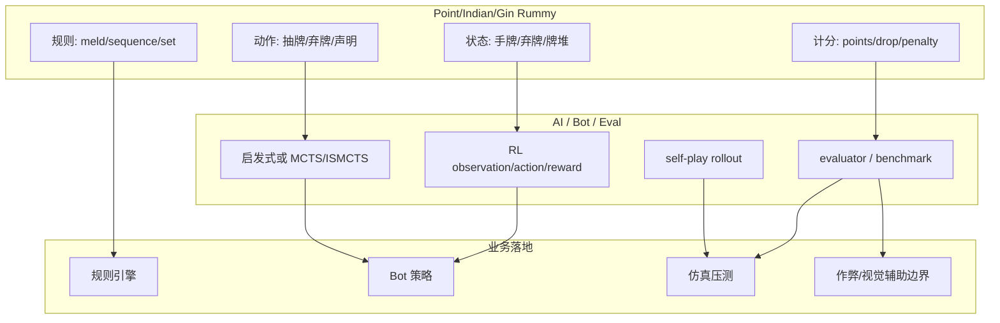

# rickgorman/gin-rummy-ai - Point Rummy 业务候选 (2026-08-10)

## 一句话结论
A hand-rolled neuroevolution AI for gin rummy.

## TL;DR
- 来源：GitHub Search Point Rummy 主题扫描。
- 可用方向：规则建模、AI opponent、计分/evaluator、仿真环境或前后端原型。
- 可信度：小 repo 为主，适合参考，不建议直接生产复用。

## 元信息表
| 字段 | 内容 |
|---|---|
| Repo | `rickgorman/gin-rummy-ai` |
| 来源类型 | GitHub Repository / Point Rummy theme scan |
| Stars/Forks | 13 / 5 |
| Language | Python |
| Updated | 2025-03-25T13:47:09Z |
| Topics | 无 |
| 原文 | https://github.com/rickgorman/gin-rummy-ai |

## 业务机制图

## 业务可用性判断
| 模块 | 可用性 | 说明 |
|---|---|---|
| 规则/计分 | 中 | 可抽 meld 判定、round 结算、分数跟踪结构 |
| AI opponent | 中低 | 小 repo 的策略可作 baseline，不宜生产照搬 |
| RL 环境 | 中低 | 可参考 observation/action/reward 命名，需重写稳定环境 |
| 前后端 | 低到中 | 可看 UI/房间/scoreboard 思路 |

## 我应该如何跟进
1. 先抽象 13-card Indian Rummy 状态机和动作空间。
2. 建 gym-like evaluator，导入 2-3 个规则实现作对照。
3. 将 bot 分成 heuristic / MCTS / RL 三条 baseline。

## 相关链接
- 原文：https://github.com/rickgorman/gin-rummy-ai
- Daily：[[Daily/2026-08-10]]

#ai-radar #point-rummy #game-ai #rl
