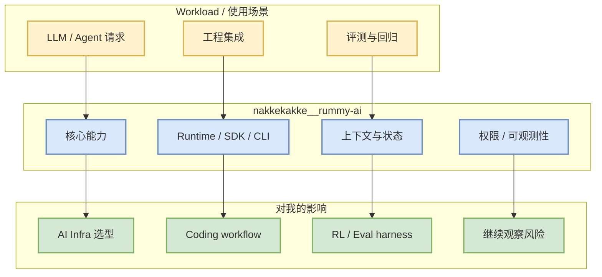

# nakkekakke/rummy-ai

> 日期：2026-08-12
> 类别：PointRummy

## 一句话结论
nakkekakke/rummy-ai 是今日 AI Radar 的 watched/direct fallback 条目；由于 GitHub Search 限流，本文把它作为可验证的工程观察点，而非完整全网排名。

## TL;DR
- repo / 来源：[nakkekakke/rummy-ai](https://github.com/nakkekakke/rummy-ai)
- stars/forks：11 / 5
- language：Java
- updated_at：2026-04-17T10:02:59Z
- topics：ai, card, card-game, game, ismcts, mcts, monte-carlo-tree-search, rummy
- 摘要：Text based classic Rummy game with an AI that uses ISMCTS. Data Structures and Algorithms course project, University of Helsinki

## 元信息表
| 字段 | 值 |
|---|---|
| 来源 | GitHub |
| 来源类型 | Repository / direct watched fallback |
| repo | `nakkekakke/rummy-ai` |
| stars_delta | 0 |
| 增长依据 | historical_snapshot |
| 原文 | https://github.com/nakkekakke/rummy-ai |

## 信息压缩图示

## 影响矩阵
| 维度 | 判断 | 原因 |
|---|---|---|
| AI Infra | 中 | 与 serving/training/runtime/tooling 的工程选型相关。 |
| Agent / Coding Loop | 中 | 影响 CLI/TUI、IDE 集成、MCP、权限模式、上下文管理。 |
| RL / Eval | 高 | 可作为 post-training 或 game/eval harness 的组成。 |
| 可信度 | 中 | direct /repos 可验证元数据，但不是完整 GitHub Search 全网榜。 |

## 专业解读
Text based classic Rummy game with an AI that uses ISMCTS. Data Structures and Algorithms course project, University of Helsinki。对用户而言，重点不是“又一个热门项目”，而是它在 runtime、agent loop、模型生态、训练/推理栈中的接口位置。今天 broad Search 被限流，因此该条目承担连续监控作用：看 stars、updated_at、topics、release/docs 是否出现会改变工程工作流的信号。

## 通俗解释
可以把它当成今天雷达里的一个“固定观测哨”。即使全网搜索被限流，我们仍能用 GitHub 直连确认它是否活跃，以及它是否继续影响 AI 工程实践。

## 关键机制拆解
1. 入口：GitHub repo / docs / releases。
2. 工程接口：API、CLI、SDK、runtime、examples。
3. 可落地性：是否能接入现有 serving、training、agent 或 eval workflow。
4. 风险：direct fallback 不是全网排名，需要结合后续搜索补验。

## 对我的影响
- 若是 serving/training 项目：后续关注 KV cache、batch scheduler、parallelism、kernel/runtime 更新。
- 若是 coding agent：后续关注权限、MCP、远程执行、上下文窗口、review workflow。
- 若是 Rummy/Game AI：后续抽状态机、reward、evaluator、self-play harness。

## 我应该如何跟进
- 查看 releases / changelog。
- 对关键模块做代码 diff 或运行最小 demo。
- 把可复用接口沉淀到 AI Infra / Loop Engineer / Point Rummy 主题页。

## 相关链接
- 原文：https://github.com/nakkekakke/rummy-ai
- 今日日报：[[Daily/2026-08-12]]

#ai-radar #pointrummy
