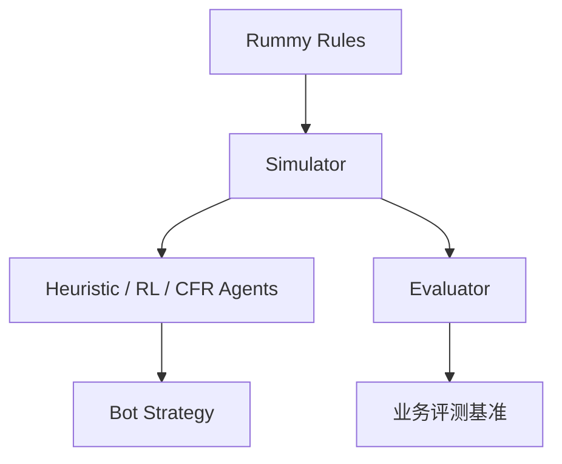

# SaiMahitVaddadi/GinRummySimulator

> 日期：2026-08-15
> 来源类型：GitHub repository / Point Rummy watchlist
> 原文：https://github.com/SaiMahitVaddadi/GinRummySimulator

## 一句话结论
GinRummySimulator 是今日 Point Rummy / Game AI 低到中置信线索：描述中包含 heuristic / RL / CFR / LLM / GNN / hybrid evaluator，值得作为仿真和评测框架候选审计。

## TL;DR
- 可能价值：card-game AI simulator、evaluator、RL/CFR baseline、LLM-agent 对照。
- 业务意义：可拆 state/action/reward/evaluator，用于 Point Rummy bot 与规则评测。
- 限制：需要代码审计，不能仅凭描述复用。

## 信息压缩图示

## 影响矩阵
| 方向 | 可用性 | 下一步 |
|---|---|---|
| 仿真 | 中低 | 审计环境接口 |
| Bot | 中低 | 抽取 action/reward |
| 评测 | 中 | 看 PAPER.md / tests |

## 相关链接
- Daily：[[Daily/2026-08-15]]
- 原文：https://github.com/SaiMahitVaddadi/GinRummySimulator

#ai-radar #point-rummy #game-ai
