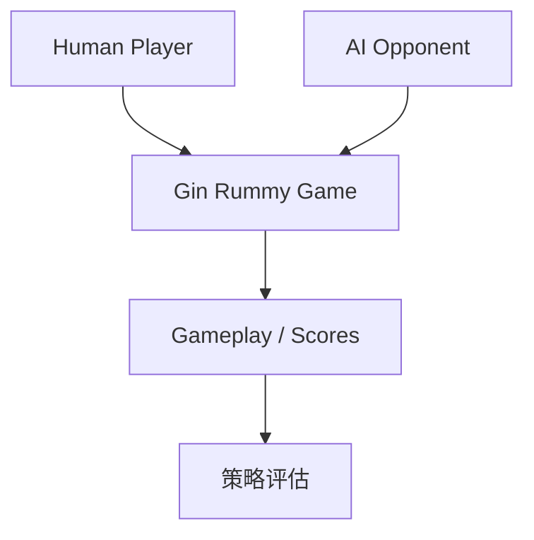

# rawbeen248/Gin-Rummy-AI-vs-Human

> 日期：2026-08-15
> 来源类型：GitHub repository / Point Rummy watchlist
> 原文：https://github.com/rawbeen248/Gin-Rummy-AI-vs-Human

## 一句话结论
这是 Gin Rummy AI vs Human 的低置信工程线索，可用于观察人机对局 UI、规则实现和简单策略 bot。

## 信息压缩图示

## 业务判断
| 方向 | 判断 |
|---|---|
| UI / 对局流程 | 可参考 |
| Bot 策略 | 需代码审计 |
| Point Rummy 复用 | 规则差异较大，需改造 |

## 相关链接
- Daily：[[Daily/2026-08-15]]
- 原文：https://github.com/rawbeen248/Gin-Rummy-AI-vs-Human

#ai-radar #point-rummy
