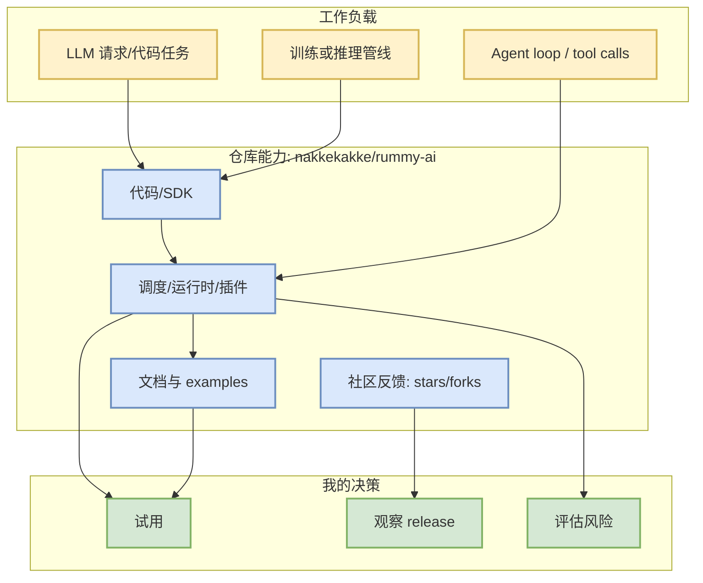

# nakkekakke/rummy-ai

> 类型：GitHub
> 大类：GitHub
> 小类：AI Infra / Agent / Tool
> 推荐等级：低置信
> 创建日期：2026-08-16
> 原文链接：https://github.com/nakkekakke/rummy-ai
> 网页详情：https://github.com/dyt27666-oss/AI-news-report-obsidians/blob/main/GitHub/PointRummy/2026-08-16/nakkekakke__rummy-ai.md
> 返回日报：[[Daily/2026-08-16]]

## 一句话结论
nakkekakke/rummy-ai 是今日 AI Radar 的 GitHub 观察项；本次使用 direct watched repo fallback / snapshot 生成，增长不是完整全网排名。

## TL;DR
- **它是什么**：Text based classic Rummy game with an AI that uses ISMCTS. Data Structures and Algorithms course project, University of Helsinki
- **为什么重要**：它处在 LLM infra、agent loop 或 coding workflow 的高频依赖链上，可作为工程选型/竞品观察基线。
- **和我相关的点**：stars=11，forks=5，language=Java，delta=0。
- **建议动作**：高 star 基础设施/工具先看 release、docs、benchmark；低置信项只入观察列表。

## 元信息
| 字段 | 内容 |
|---|---|
| repo | nakkekakke/rummy-ai |
| stars / forks | 11 / 5 |
| language | Java |
| updated_at | 2026-04-17T10:02:59Z |
| topics | ai, card, card-game, game, ismcts, mcts, monte-carlo-tree-search, rummy |
| 增长依据 | historical_snapshot |
| 原文 | [GitHub](https://github.com/nakkekakke/rummy-ai) |

## 信息压缩图示

### 影响矩阵
| 维度 | 影响 | 建议动作 |
|---|---|---|
| AI Infra | 若涉及 serving/training/runtime，可作为架构参考 | 看 README + benchmark |
| LLM 工程 | 若涉及 agent/tool/coding，可影响日常研发闭环 | 跟踪 release |
| RL / Game AI | 仅在环境/仿真/评测相关时有直接价值 | 低优先级观察 |
| 风险 | 今日 GitHub Search 被 403，广义排名不完整 | 不把 delta 当全网真实增长 |

## 专业解读
该条目的价值主要来自生态位置和工程可替代性。对 AI Infra 工程师而言，高 star/高增长仓库常代表事实标准或新兴工作流；但本日 broad GitHub Search 受限，direct watched repo fallback 只能覆盖固定观察集合，适合做连续监控，不适合宣称全网 Top。

## 通俗解释
把它当成“今天仍值得盯的工具/项目”。如果它的 release 或 star 增长持续上升，再投入时间试用。

## 关键机制拆解
| 机制 | 解决的问题 | 为什么有效 | 可能的坑 |
|---|---|---|---|
| 社区热度 | 判断生态采用 | stars/forks 是弱信号但连续可比 | 容易受营销影响 |
| release/docs | 判断工程成熟度 | 有文档和版本说明更可落地 | docs 可能滞后 |
| direct fallback | 避免 Search 403 断报 | REST /repos 可保留核心项目数据 | 覆盖不完整 |

## 我应该如何跟进
1. 若进入 Top 3 或 delta 异常，打开 release notes。
2. 对 serving/training 项目跑最小 demo；对 coding agent 工具观察权限/MCP/上下文变化。
3. 和昨日 snapshot 对比，避免单日噪声。

## 相关链接
- 原文：https://github.com/nakkekakke/rummy-ai
- 网页详情：https://github.com/dyt27666-oss/AI-news-report-obsidians/blob/main/GitHub/PointRummy/2026-08-16/nakkekakke__rummy-ai.md

## 标签
#ai-radar #github #ai-infra #agent
