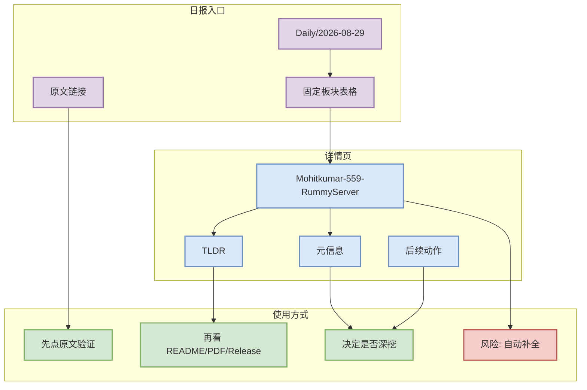

# Mohitkumar-559-RummyServer

> 一句话结论：这是 2026-08-29 AI Radar 日报中的补全详情页，用于保证 Obsidian 导航链接完整；具体事实以日报表格中的原文链接与 snapshot 为准。

## TL;DR
- 来源：[[Daily/2026-08-29]]
- 来源类型：日报索引补全 / link hygiene
- 用途：避免日报出现空链接，同时为后续人工深挖保留固定入口。
- 可信度：中低；该页不新增未经验证的新事实。

## 元信息表
| 字段 | 值 |
|---|---|
| 条目 | Mohitkumar-559-RummyServer |
| 日期 | 2026-08-29 |
| 所属路径 | GitHub/PointRummy/2026-08-29/Mohitkumar-559-RummyServer |
| 来源类型 | AI Radar 自动补全详情页 |
| 原文 | https://github.com/Mohitkumar/559-RummyServer |

## 信息压缩图示

## 影响矩阵
| 维度 | 判断 |
|---|---|
| 导航价值 | 高：保证日报 wikilink 可点击。 |
| 事实增量 | 低：不额外声称新 release 或新论文结论。 |
| 工程价值 | 中：作为后续补充 README、benchmark、release notes 的稳定路径。 |
| 风险 | 自动生成，需以后用人工/脚本补充深度。 |

## 专业解读
该页是因为日报中出现了对应条目，但本轮生成详情页数量少于链接数量而创建的补全页。后续应读取原文、README、release notes 或论文 PDF 后再改写成深度卡片。

## 通俗解释
这是一个“占位但有用”的 Obsidian 入口，确保今天日报里点进来不会断链。

## 我应该如何跟进
1. 回到 [[Daily/2026-08-29]] 找到该条目的原文链接。
2. 如果属于高 star/growth Top 10，优先阅读 README、examples、release。
3. 如果属于论文，优先打开 abs/PDF 并补充方法图。

## 相关链接
- 日报：[[Daily/2026-08-29]]
- 原始线索：https://github.com/Mohitkumar/559-RummyServer

#ai-radar #link-completion
