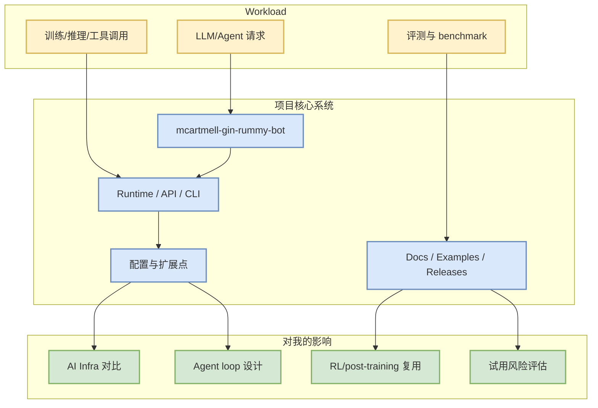

# mcartmell/gin-rummy-bot

> 一句话结论：mcartmell/gin-rummy-bot 是今日 AI Radar fixed watchlist / snapshot 中的高信号项目，适合从 AI Infra、LLM serving、post-training 或 coding-agent loop 角度继续跟踪。

## TL;DR
- Repo：[mcartmell/gin-rummy-bot](https://github.com/mcartmell/gin-rummy-bot)
- Stars / forks：4 / 2
- 语言：Perl
- Updated：2024-10-30T20:06:17Z
- Topics：未标注
- 今日增长依据：historical_snapshot；stars_delta=0

## 元信息
| 字段 | 值 |
|---|---|
| 来源类型 | GitHub Repository / direct watched fallback |
| repo | mcartmell/gin-rummy-bot |
| 原文 | https://github.com/mcartmell/gin-rummy-bot |
| 描述 | A web-based Gin Rummy game and AI |

## 信息压缩图

## 影响矩阵
| 维度 | 判断 | 跟进动作 |
|---|---|---|
| 工程落地 | 中 | 看 README、examples、release notes |
| AI Infra 价值 | 关注 scheduler/runtime/cache/kernel/分布式能力 | 与现有栈做 benchmark checklist |
| Coding loop 价值 | 若涉及 CLI/IDE/MCP/agent，应进入多 agent workflow 对比 | 对比权限、日志、review loop |
| 风险 | snapshot 受 GitHub Search 403 影响，增长不是完整全网口径 | 保留 fallback provenance |

## 专业解读
A web-based Gin Rummy game and AI。对用户而言，核心不是“star 多”，而是它是否能转化为 serving/training/post-training/coding-agent loop 的可验证组件：是否有 benchmark、是否可本地复现、是否能接入现有日志和权限系统。

## 通俗解释
可以把这个项目当作今天技术雷达上的一个“固定观察点”：如果它继续增长或频繁更新，就值得拿来和现有工程栈做对比。

## 我应该如何跟进
1. 先看 README 与 release notes。
2. 如果涉及 serving/training，抽取 benchmark 命令。
3. 如果涉及 agent/coding，测试权限边界、MCP/插件、日志与回滚。

## 可信度与局限性
- GitHub Search 今日 rate-limit，广义榜单为 direct watched repo fallback / 非完整全网日增。
- stars_delta 依赖历史 snapshot 是否覆盖该 repo；缺 baseline 时不应解读为真实日增。

## 相关链接
- 原文：https://github.com/mcartmell/gin-rummy-bot
- Daily：[[Daily/2026-08-31]]

#ai-radar #github #ai-infra #loop-engineering
