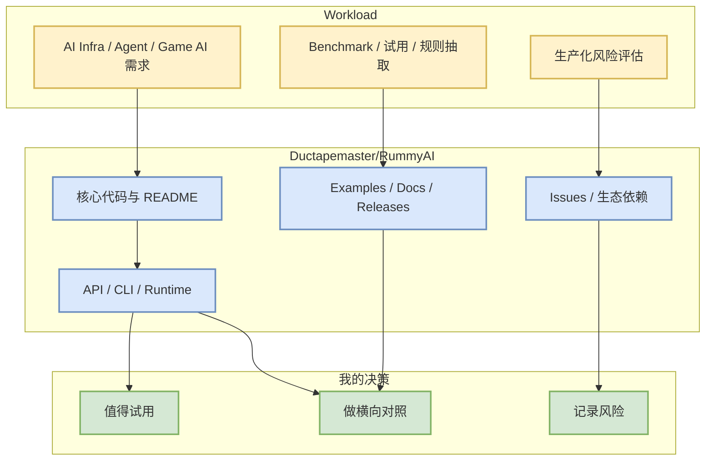

# Ductapemaster/RummyAI

> 日期：2026-09-01  
> 来源类型：GitHub repository / direct watched repo fallback  
> 原文：https://github.com/Ductapemaster/RummyAI

## 一句话结论
Rummy/Game AI 候选，可抽取规则、状态转移、bot baseline 或 evaluator 设计。

## TL;DR
- stars/forks：2 / 0；语言：Python；更新时间：2017-07-11T12:12:49Z。
- 今日增长依据：direct watched repo fallback，非完整全网日增；若为 fallback，则不是完整全网日增。
- 对用户价值：把它放入 AI Infra / coding-agent loop / Rummy 业务的固定观察集合，用于选型、benchmark 或规则抽取。

## 元信息表
| 字段 | 内容 |
|---|---|
| repo | `Ductapemaster/RummyAI` |
| stars | 2 |
| forks | 0 |
| language | Python |
| updated_at | 2017-07-11T12:12:49Z |
| topics | 未标注 |
| 原文 | https://github.com/Ductapemaster/RummyAI |

## 信息压缩图示

## 专业解读
Rummy/Game AI 候选，可抽取规则、状态转移、bot baseline 或 evaluator 设计。 对 AI Infra 工程师的关键不是 star 数本身，而是它是否提供可复现的接口、benchmark、release 节奏和可组合的 runtime/agent loop。今日 GitHub Search 受限，因此该详情页明确以 direct watched repo fallback 为 provenance。

## 通俗解释
可以把它看成今天固定巡检清单里的一个“候选零件”：如果是 serving/训练项目，就看它能不能帮你跑得更快更稳；如果是 coding agent，就看它能不能减少人工循环；如果是 Rummy 项目，就看它能不能抽出规则和 bot baseline。

## 关键机制拆解
| 维度 | 观察点 | 我的判断 |
|---|---|---|
| 可落地性 | docs/examples/release/API | 需要后续拉源码验证 |
| 工程影响 | runtime、scheduler、agent loop、rules engine | 与用户关注主题相关 |
| 风险 | fallback 数据、未完整全网搜索 | 增长榜只作 watchlist |

## 对我的影响
- AI Infra：沉淀 benchmark checklist。
- Coding workflow：对比权限、上下文、MCP、审查日志。
- Point Rummy：复用状态建模、action mask、bot baseline 思路。

## 可信度与局限性
- 元数据来自 GitHub API direct `/repos` 或 snapshot；可信度高于搜索摘要。
- 今日增长不是完整 GitHub 全网增长，不能用于市场排名，只用于固定观察集合。

## 我应该如何跟进
1. 查看 README、examples、release notes。
2. 若为 serving/training 项目，补 benchmark 与部署复杂度。
3. 若为 agent/tool 项目，补权限模式、MCP、日志和远程执行对比。

## 相关链接
- 原文：https://github.com/Ductapemaster/RummyAI
- Daily：[[Daily/2026-09-01]]

#ai-radar #github #watchlist
