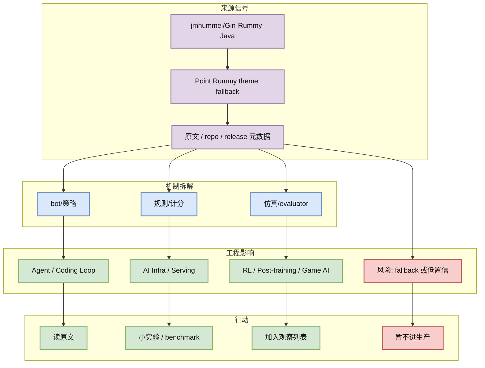
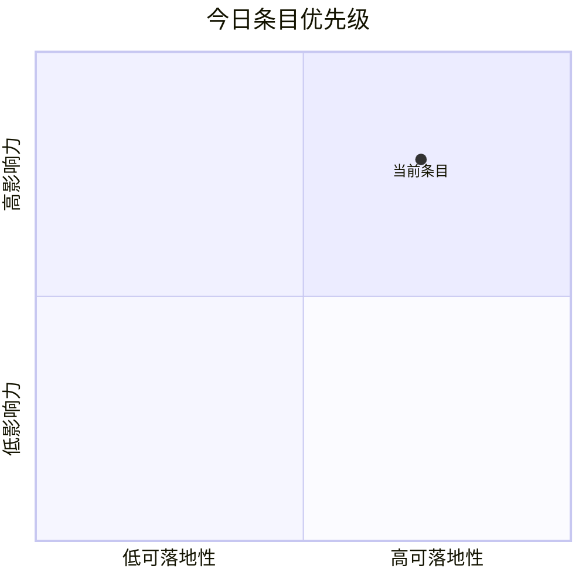

# jmhummel/Gin-Rummy-Java

> 类型：GitHub
> 大类：AI Radar 详情
> 小类：Point Rummy theme fallback
> 推荐等级：可 skim
> 创建日期：2026-09-03
> 原文链接：https://github.com/jmhummel/Gin-Rummy-Java
> 网页详情：https://github.com/dyt27666-oss/AI-news-report-obsidians/blob/main/GitHub/PointRummy/2026-09-03/jmhummel__Gin-Rummy-Java.md
> 返回日报：[[Daily/2026-09-03]]

## 一句话结论

Java-based Gin Rummy console game, with an AI opponent

## TL;DR

- **它是什么**：Point Rummy theme fallback 中与 AI Infra / LLM / RL / Agent / Coding workflow 相关的今日雷达条目。
- **为什么重要**：可用于规则建模、AI opponent、仿真环境或 evaluator 拆解；今日为前日 theme snapshot fallback。
- **和我相关的点**：可映射到 serving、训练数据、post-training、agent loop、tool-use、评测或 Point Rummy 业务建模。
- **建议动作**：先验证原文和 repo/release，再决定试用、复现或只加入 watchlist。

## 元信息

| 字段 | 内容 |
|---|---|
| 发布方/来源 | jmhummel/Gin-Rummy-Java |
| 栏目/来源类型 | Point Rummy theme fallback |
| 作者/机构 | 公开来源 / 项目维护者 |
| 发布时间 | 2026-09-03 自动扫描；原始更新时间见日报表 |
| 原文 | [原文](https://github.com/jmhummel/Gin-Rummy-Java) |
| 代码 | https://github.com/jmhummel/Gin-Rummy-Java |
| PDF | 未发现 |
| 标签 | #ai-radar |

## 信息压缩图示

### 辅助图：影响力 × 可落地性

## 专业解读

Java-based Gin Rummy console game, with an AI opponent 可用于规则建模、AI opponent、仿真环境或 evaluator 拆解；今日为前日 theme snapshot fallback。 对工程侧最重要的不是“热度数字”本身，而是它暴露出的系统抽象：请求如何进入 runtime、状态如何被记录、权限如何被约束、评估如何闭环、以及是否能接入现有 serving / training / coding agent 工具链。

## 通俗解释

可以把它当作今天雷达里的一个高信号路标：如果它是 repo，就先看 README、release、issues 和 examples；如果它是论文/博客，就先看方法图和实验/产品边界。自动化来源受限流影响时，只作为候选，不当作最终事实。

## 关键机制拆解

| 机制 | 解决的问题 | 为什么有效 | 可能的坑 |
|---|---|---|---|
| 规则/计分 | 找到可验证来源 | 保留原文链接和元数据 | GitHub/API 可能限流 |
| bot/策略 | 映射到 AI Infra / Agent / RL | 与用户实际工作栈对齐 | 需要二次阅读确认 |
| 仿真/evaluator | 形成试用或观察动作 | 从“新闻”转成“工程决策” | 不等于生产可用 |

## 对我的影响

| 维度 | 影响 | 建议动作 |
|---|---|---|
| AI Infra | 可能影响 serving、runtime、数据处理或网关选型 | 看 benchmark / docs / release |
| LLM 工程 | 可能影响模型接入、上下文、工具调用或 agent orchestration | 加入 watchlist |
| RL / Game AI | 若含 environment/reward/eval，可复用到训练闭环 | 先抽象接口，不直接照搬 |
| Agent / Eval | 关注权限、记忆、工具、loop、可观测性 | 做最小 demo 或阅读源码 |

## 可信度与局限性

- 证据强度：低；今日 GitHub Search 403，来自 2026-09-02 theme snapshot fallback
- 局限性：今日 GitHub Search 多次 403，部分表格使用 direct watched repo 或前日 theme snapshot fallback。
- 还需要确认：是否存在正式 release note、论文 PDF、benchmark、breaking changes。

## 我应该如何跟进

1. 打开原文，确认是否存在实质功能/论文/benchmark 更新。
2. 对与当前栈直接相关的项目做 30-60 分钟最小试用。
3. 对低置信或 fallback 项只保留观察，不进入生产决策。

## 相关链接

- 原文：https://github.com/jmhummel/Gin-Rummy-Java
- 网页详情：https://github.com/dyt27666-oss/AI-news-report-obsidians/blob/main/GitHub/PointRummy/2026-09-03/jmhummel__Gin-Rummy-Java.md
- 返回日报：[[Daily/2026-09-03]]

## 标签

#ai-radar #GitHub
