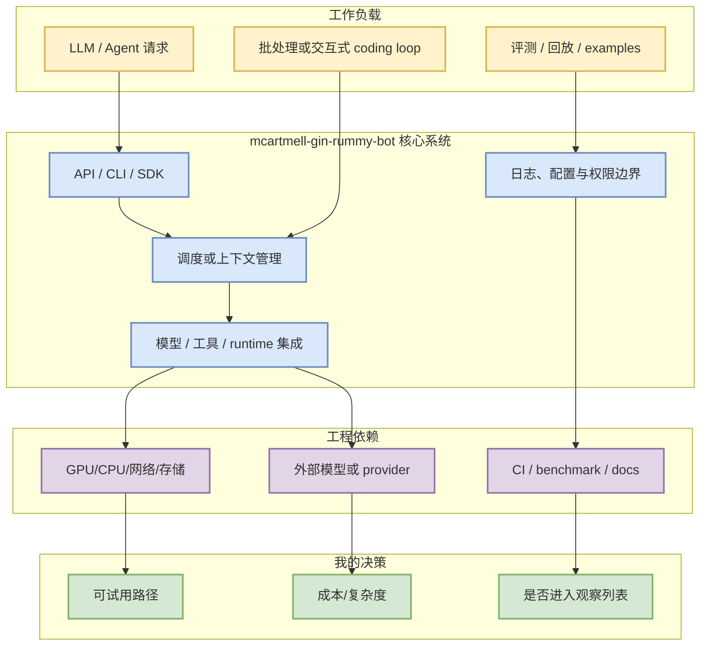
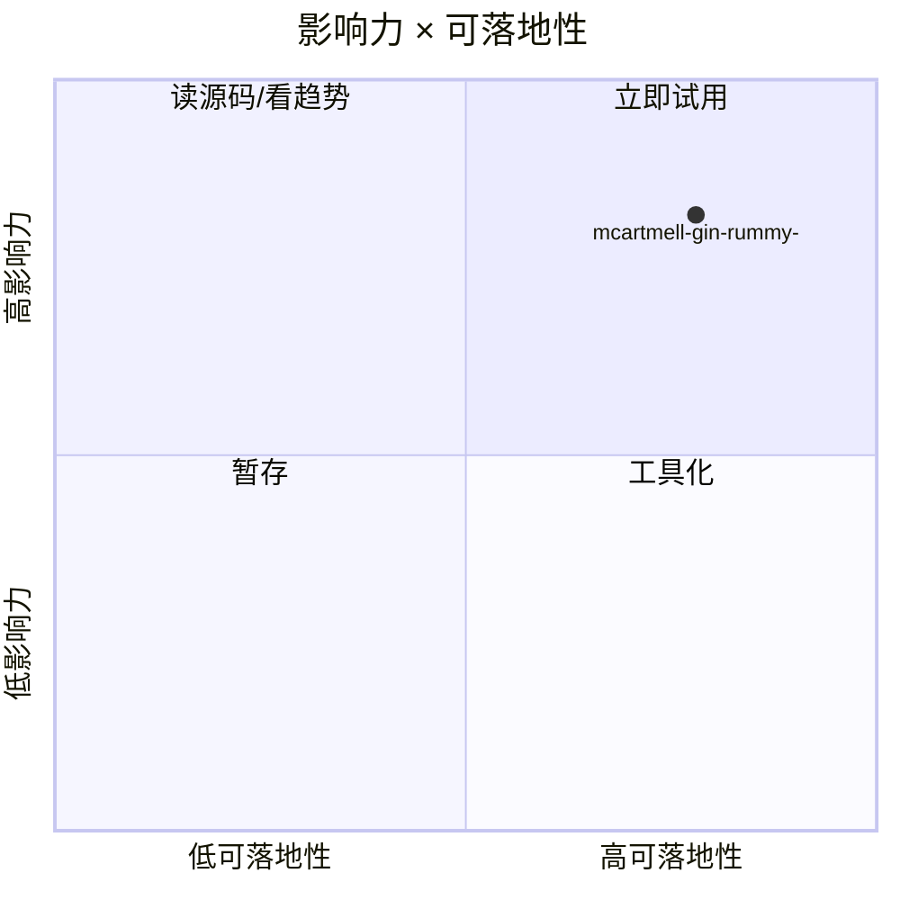

# mcartmell/gin-rummy-bot

> 类型：GitHub 项目详情
> 大类：GitHub
> 小类：PointRummy / AI coding workflow
> 推荐等级：可 skim
> 创建日期：2026-09-09
> 原文链接：https://github.com/mcartmell/gin-rummy-bot
> 网页详情：https://github.com/dyt27666-oss/AI-news-report-obsidians/blob/main/GitHub/PointRummy/2026-09-09/mcartmell-gin-rummy-bot.md
> 返回日报：[[Daily/2026-09-09]]

## 一句话结论
mcartmell/gin-rummy-bot 是今日 AI Radar 的 高 star / growth fallback 项，需把它放在 serving、agent loop、训练或工具链的实际工作流里评估，而不是只看 star。

## TL;DR
- **它是什么**：A web-based Gin Rummy game and AI
- **为什么重要**：stars=4、forks=2，说明它在开发者生态中已有明显采用；今日由于 GitHub Search 403，广义榜单使用最近成功 broad snapshot / watched repo fallback，不能解读为完整全网实时排名。
- **和我相关的点**：关注 LLM serving、post-training、agent loop、上下文工程、工具权限和评测回放时，它可作为架构对照或可试用依赖。
- **建议动作**：先读 README / releases / examples，再用一个最小 agent 或 serving workload 做 smoke test。

## 元信息
| 字段 | 内容 |
|---|---|
| repo | `mcartmell/gin-rummy-bot` |
| stars / forks | 4 / 2 |
| language | Perl |
| updated_at | 2024-10-30 |
| topics | 无 |
| 来源类型 | GitHub Repository / 2026-09-09 current Point Rummy snapshot |
| 原文 | [GitHub](https://github.com/mcartmell/gin-rummy-bot) |

## 信息压缩图示

## 专业解读
mcartmell/gin-rummy-bot 的价值不在于单点功能，而在于它能否进入可重复的工程闭环：输入 workload、调度/上下文层、runtime/provider 集成、观测和评测。对 AI Infra 工程师来说，优先看它的控制面设计、benchmark、部署复杂度和 failure mode；对 coding-agent workflow 来说，优先看权限模型、上下文压缩、工具调用记录和回放能力。

## 通俗解释
可以把它当成一个“生态信号”：star 和更新频率说明很多人在试，但真正要不要用，取决于它是否能被塞进你的训练、推理或 coding-agent 日常流程，并且能稳定复现。

## 关键机制拆解
| 机制 | 解决的问题 | 为什么有效 | 可能的坑 |
|---|---|---|---|
| API/CLI/SDK 接入 | 降低集成成本 | 让模型/工具可被脚本化调用 | API 变化和版本兼容 |
| 上下文/调度层 | 控制复杂 workload | 能把请求、工具、状态串成 loop | 长上下文成本与错误传播 |
| benchmark/examples | 快速判断可用性 | 用最小样例验证实际收益 | 示例可能过于理想化 |

## 对我的影响
| 维度 | 影响 | 建议动作 |
|---|---|---|
| AI Infra | 可作为 serving/training/tooling 架构对照 | 读部署文档和性能章节 |
| LLM 工程 | 观察 provider、上下文和 eval 集成 | 做最小 smoke test |
| RL / Game AI | 可借鉴仿真、评测、批处理或 agent loop | 抽象 state/action/evaluator |
| Agent / Eval | 关注工具权限、日志、回放 | 与 Codex/Claude Code/Cline 对照 |

## 可信度与局限性
- 证据强度：中。GitHub metadata 可验证，但今日 broad Search 403，榜单为 fallback/非完整全网。
- 局限性：未逐项打开 release diff；需后续人工复核版本变化。
- 潜在风险：star 高不等于生产稳定，需看 issue、benchmark 和维护节奏。

## 我应该如何跟进
1. 打开原文和 release notes，确认最近 7 天变化。
2. 用一个最小 workload 验证安装、示例和失败恢复。
3. 若涉及 agent loop，记录上下文、权限、执行日志和评测回放设计。

## 相关链接
- 原文：https://github.com/mcartmell/gin-rummy-bot
- 网页详情：https://github.com/dyt27666-oss/AI-news-report-obsidians/blob/main/GitHub/PointRummy/2026-09-09/mcartmell-gin-rummy-bot.md
- 返回日报：[[Daily/2026-09-09]]

## 标签
#ai-radar #github #pointrummy #loop-engineering
