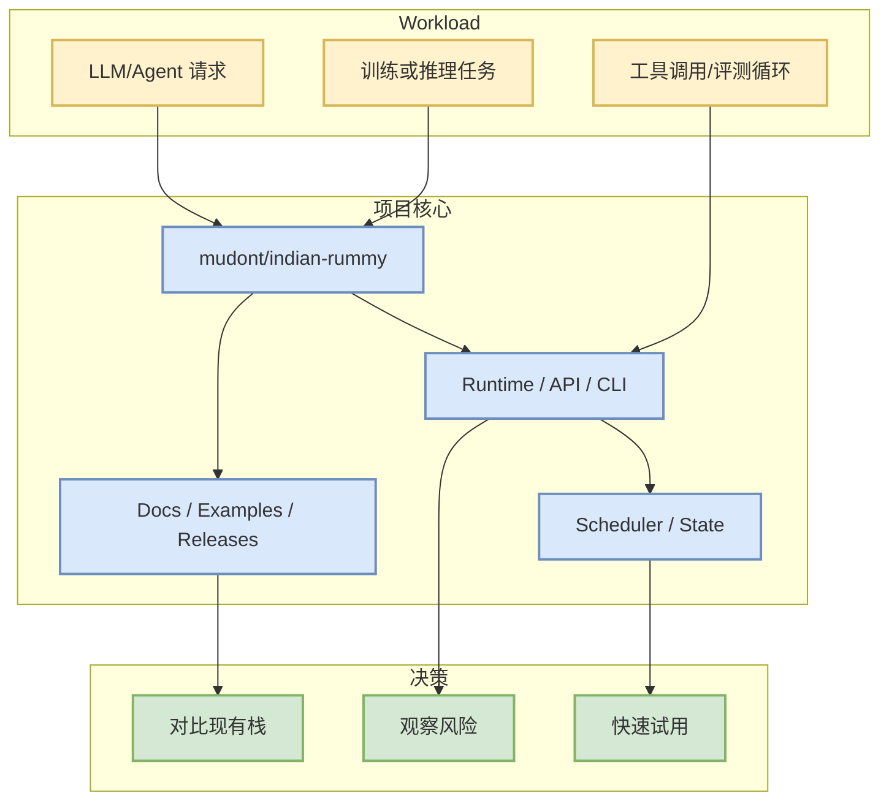

# mudont/indian-rummy

> 一句话结论：Typescript library for Indian Rummy card game

## TL;DR
- 来源：GitHub direct `/repos` fallback / snapshot。
- Stars/Forks：5 / 0；语言：TypeScript。
- 更新时间：2025-08-08T21:05:04Z；原文：https://github.com/mudont/indian-rummy。
- 对 AI Infra/Agent 的意义：用于观察 serving、训练、coding-agent loop 或工具链生态的工程成熟度。

## 元信息表
| 字段 | 值 |
|---|---|
| repo | mudont/indian-rummy |
| stars | 5 |
| forks | 0 |
| language | TypeScript |
| topics | 无 |
| source | snapshot/direct |
| 原文 | https://github.com/mudont/indian-rummy |

## 信息压缩图示

## 机制 / 影响矩阵
| 维度 | 观察点 | 对我的影响 |
|---|---|---|
| 工程成熟度 | star、fork、更新频率、release | 判断是否进入试用队列 |
| Infra 相关性 | serving/training/agent/eval 组件 | 映射到现有 AI Infra 工作流 |
| 风险 | API 变化、维护频率、文档质量 | 试用前需要先跑 examples/benchmark |

## 专业解读
该项目今日作为 AI Radar 的候选进入榜单，主要价值在于为 LLM serving、训练后优化、agent loop 或 coding workflow 提供可观测的工程实现。若它属于基础设施类，应重点看调度、吞吐、延迟、KV/cache、分布式与硬件依赖；若属于 coding-agent 类，应重点看权限模式、上下文管理、工具调用、评测闭环和 IDE/CLI 集成。

## 通俗解释
把它当成一个“是否值得拿来做实验”的候选项目：先看活跃度和文档，再决定是否接入自己的小 benchmark。

## 可信度与局限性
- GitHub Search 今日部分 403，因此该页优先使用 direct `/repos` 或已保存 snapshot。
- 未自动阅读全文 README；结论偏工程雷达，不等于完整评测。

## 我应该如何跟进
1. 打开原 repo 阅读 README/Release。
2. 若与 serving/training/agent loop 强相关，拉取 examples 跑最小 demo。
3. 对比现有栈记录延迟、吞吐、上下文窗口、权限与评测能力。

#ai-radar #github #pointrummy
