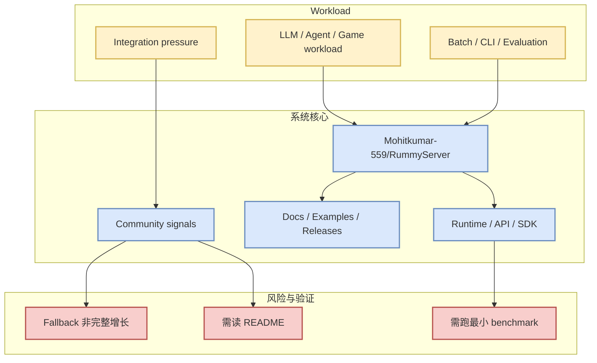

# Mohitkumar-559/RummyServer

> 日期：2026-09-14
> 来源类型：GitHub repository / direct /repos fallback
> 原文：https://github.com/Mohitkumar-559/RummyServer

## 一句话结论
Mohitkumar-559/RummyServer 今日作为 PointRummy watched repo fallback 进入 Radar；增长数据需按“非完整全网日增”理解。

## TL;DR
- Stars：2；Forks：1；Language：JavaScript。
- 最近更新：2024-03-17T03:48:34Z；增长依据：cross-snapshot direct watched repo fallback，非完整全网日增。
- 重点：Rummy game server for game that contain deal rummy and point rummy
- 对我：适合作为 Rummy 规则、计分、bot 或仿真 baseline 参考，但成熟度需人工验证。

## 元信息表
| 字段 | 值 |
|---|---|
| repo | Mohitkumar-559/RummyServer |
| stars / forks | 2 / 1 |
| language | JavaScript |
| topics | 无 |
| updated_at | 2024-03-17T03:48:34Z |
| source | direct /repos fallback |
| 原文 | https://github.com/Mohitkumar-559/RummyServer |

## 信息压缩图示

## 影响矩阵
| 维度 | 判断 | 下一步 |
|---|---|---|
| 工程可落地性 | 中高，取决于 README、examples、release 活跃度 | 拉取最小 demo，记录依赖与启动成本 |
| AI Infra 价值 | serving/training/agent loop 相关 | 放入 watched repo baseline |
| 风险 | 今日 GitHub Search 403，增长不是完整全网排名 | 明日继续以真实 snapshot 校正 |

## 专业解读
Mohitkumar-559/RummyServer 的价值不只是 star 数，而是它代表的生态位置：runtime、agent loop、模型框架或业务 baseline。今天的 direct fallback 能保证固定主题不断档，但不能替代完整 GitHub Search。

## 通俗解释
把它当成“今天仍值得盯的工程样本”：先看是否能跑起来，再看能否复用到推理、训练、agent 编排或 Rummy 业务。

## 可信度与局限性
- 可信度：中。repo 元数据来自 GitHub direct `/repos` 或历史 snapshot fallback。
- 局限：Search 403，不能声称覆盖全网新增。

## 我应该如何跟进
1. 打开 README / release。
2. 跑最小 demo。
3. 记录性能、权限、上下文、依赖和维护风险。

#ai-radar #github #pointrummy
