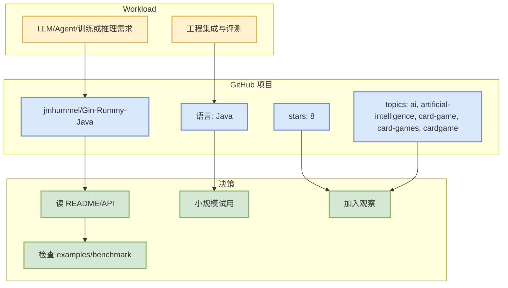

# jmhummel/Gin-Rummy-Java

> 日期：2026-09-22  
> 来源类型：GitHub Repository  
> 原文：https://github.com/jmhummel/Gin-Rummy-Java

## 一句话结论
jmhummel/Gin-Rummy-Java 是今日 AI Radar 关注的项目；本页基于 GitHub 元数据与历史 snapshot，用于判断是否值得试用或跟踪。

## TL;DR
- stars / forks：8 / 0
- language：Java
- updated_at：2023-08-16T16:12:58Z
- topics：ai, artificial-intelligence, card-game, card-games, cardgame, gin, gin-rummy, java, java-8, java8, rummy
- 描述：Java-based Gin Rummy console game, with an AI opponent
- 今日增长依据：previous theme snapshot fallback，非今日实时数据；stars_delta=None

## 信息压缩图示

## 机制 / 影响矩阵
| 维度 | 判断 |
|---|---|
| AI Infra 相关性 | 中：主题相关，需进一步核验代码质量 |
| 生产可用性 | 需要检查 release、benchmark、examples；仅凭 stars 不代表可直接上线。 |
| 对我的影响 | 可作为选型、竞品观察或 workflow 灵感来源。建议抽取规则建模、状态表示、bot 策略或评测思路。 |
| 风险 | 今日 GitHub Search 403，部分增长来自 direct watched repo fallback 或历史快照，不是完整全网日增。 |

## 我应该如何跟进
1. 打开原文检查 README、release、benchmark。
2. 若涉及 serving / coding agent loop，拉本地运行最小 demo。
3. 若涉及 Rummy/Game AI，优先抽取规则引擎、状态表示、rollout/eval 设计。

## 相关链接
- 原文：https://github.com/jmhummel/Gin-Rummy-Java
- GitHub 网页详情：https://github.com/dyt27666-oss/AI-news-report-obsidians/blob/main/GitHub/PointRummy/2026-09-22/jmhummel-gin-rummy-java.md

#ai-radar #github #ai-infra
