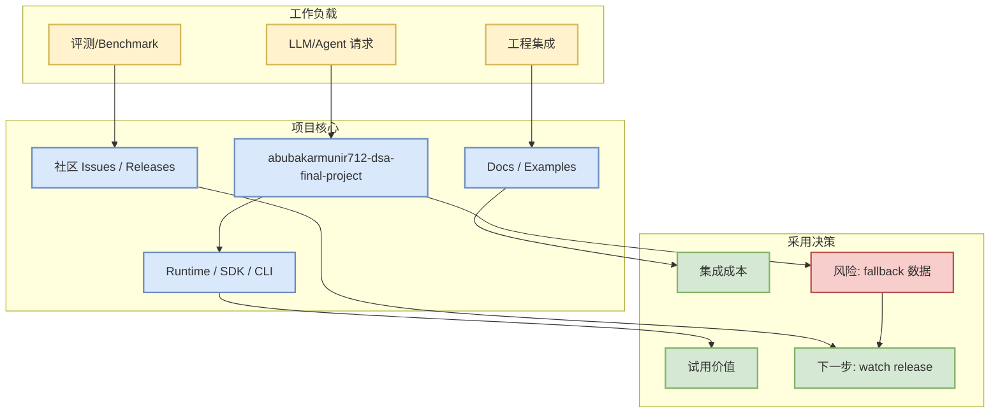

# abubakarmunir712/dsa-final-project

> 日期：2026-09-29  
> 来源类型：GitHub repository / direct watched repo fallback  
> 原文：https://github.com/abubakarmunir712/dsa-final-project

## 一句话结论
abubakarmunir712/dsa-final-project 是今日 PointRummy watched set 中的重要项目；当前数据来自 GitHub direct repo metadata 或历史 snapshot fallback，增长不代表完整全网排名。

## TL;DR
- Stars / forks：2 / 1
- 语言：Python
- 更新时间：2026-06-27T06:34:26Z
- Topics：无
- 摘要：A Python-based multiplayer Indian Rummy game with support for AI opponents and LAN play. Implements data structures like linked lists, stacks, queues, hashmaps, and graphs to ensure efficient gameplay and intelligent AI decisions.

## 元信息表
| 字段 | 值 |
|---|---|
| repo | abubakarmunir712/dsa-final-project |
| source type | GitHub repository |
| stars_delta | 0 |
| growth_basis | direct watched repo fallback，非完整全网日增 |
| 原文 | [GitHub](https://github.com/abubakarmunir712/dsa-final-project) |

## 信息压缩图示

## 专业解读
对 AI Infra / coding loop 的价值在于：它暴露了社区在 serving、agent runtime、上下文工程、评测循环或 post-training 工具链上的关注点。若该项目进入增长榜，应优先检查 release notes、benchmark、examples 和 issue 活跃度，而不是只看 star。

## 通俗解释
把它当作一个“可能影响工程工作流的工具/框架”。今天因为 GitHub Search 403，榜单不是全网实时搜索，而是固定 watched repo 集合的连续性监控。

## 关键机制拆解
| 模块 | 关注点 | 对我的意义 |
|---|---|---|
| API/CLI/SDK | 是否容易接入 | 影响多 agent 编排和自动化 |
| Runtime | 调度、缓存、执行效率 | 影响 serving/training 成本 |
| Docs/Examples | 可复现性 | 决定是否值得今天试用 |
| Release/Issues | 活跃度 | 判断是否进入观察队列 |

## 对我的影响
- AI Infra：关注吞吐、延迟、部署复杂度。
- LLM/Agent：关注工具调用、上下文、评测闭环。
- RL/Game：若可抽象为环境/评测框架，可借鉴到自博弈与仿真。

## 可信度与局限性
GitHub Search 今日 403；metadata 主要来自 direct `/repos` 或历史 snapshot fallback。增长标注为“非完整全网日增”。

## 我应该如何跟进
1. 打开原 repo 检查 release / benchmark。
2. 若与 serving 或 coding loop 直接相关，加入本周试用清单。
3. 对增长异常项，明天用新 snapshot 复核。

## 相关链接
- [原文](https://github.com/abubakarmunir712/dsa-final-project)
- 今日日报：[[Daily/2026-09-29]]

#ai-radar #github #pointrummy
