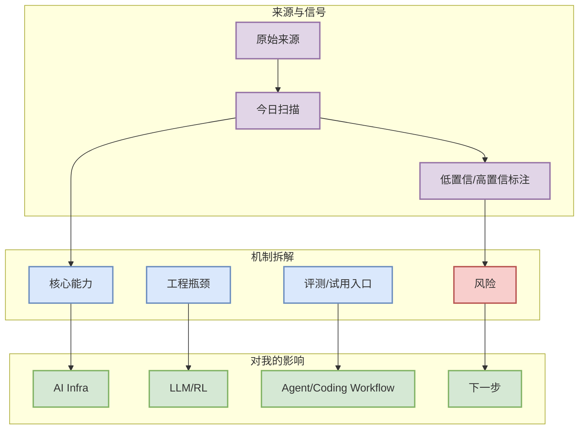

# abkcode/rummy

> 一句话结论：GitHub direct API 失败，保留 watched repo 占位。

## TL;DR
- 类型：GitHub
- 可信度：中等；GitHub Search 今日 403，GitHub 榜单使用 direct watched repo fallback；论文来自 arXiv API。
- 对我的影响：建议作为 watched repo fallback 观察；不要把今日 delta 当完整全网增长。

## 元信息
| 字段 | 内容 |
|---|---|
| 标题 | abkcode/rummy |
| 类型 | GitHub |
| 来源 | https://github.com/abkcode/rummy |
| 生成日期 | 2026-09-30 |
| 元数据 | stars=0, forks=0, language=Unknown, delta=0 |

## 信息压缩图示

## 机制 / 结构化拆解
| 模块 | 观察 | 工程含义 |
|---|---|---|
| 信号 | GitHub direct API 失败，保留 watched repo 占位。 | 决定是否进入试用/阅读队列 |
| Infra | serving、训练、agent runtime 或工具链相关 | 关注吞吐、延迟、调度、上下文、权限 |
| 风险 | 今日部分来源为 fallback / watchlist | 不把 fallback 增长当作真实全网日增 |

## 专业解读
建议作为 watched repo fallback 观察；不要把今日 delta 当完整全网增长。 对 AI Infra / LLM / RL 工程的价值在于它提供了可复用的实现、趋势信号或评测入口。若涉及 serving，应重点看 scheduler、KV cache、batching、硬件依赖；若涉及 coding agent，应重点看 loop、权限、上下文管理和可观测性。

## 通俗解释
可以把它当作今日 AI Radar 的一个路标：先确认它是否与当前工程问题相关，再决定深读、试用或仅观察。

## 我应该如何跟进
1. 打开原文核对最新 release / paper 版本。
2. 若是 GitHub 项目，优先跑 README 中最小 demo。
3. 若是论文，先读方法图和实验设置，判断是否可复现。

## 相关链接
- 原文：https://github.com/abkcode/rummy

#ai-radar #GitHub
