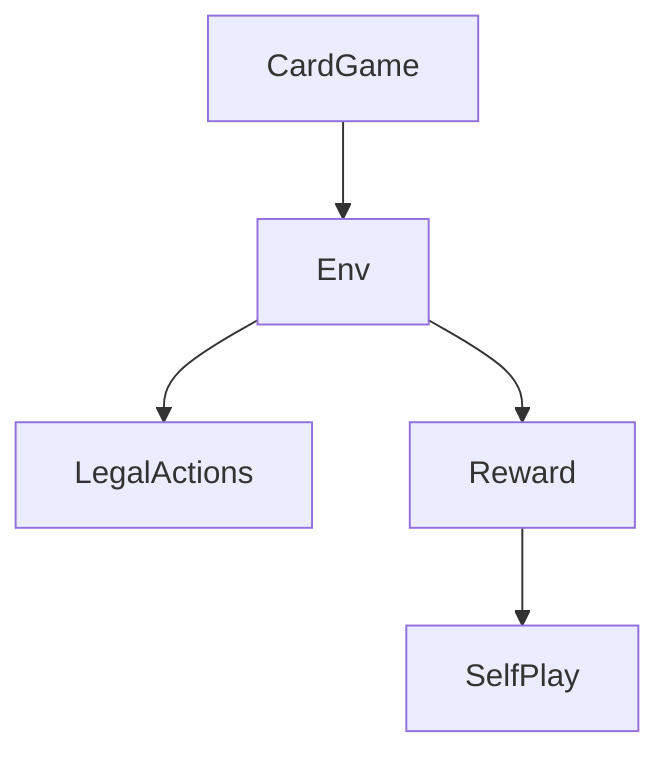

# datamllab/rlcard

> 来源类型：GitHub / Game AI fallback
> 原文：https://github.com/datamllab/rlcard

## 一句话结论
RLCard 是 card-game RL 环境参考，可迁移到 Point Rummy 环境设计。

```mermaid
flowchart TB
  CardGame --> Env
  Env --> LegalActions
  Env --> Reward
  Reward --> SelfPlay
```

#ai-radar #point-rummy #rl
