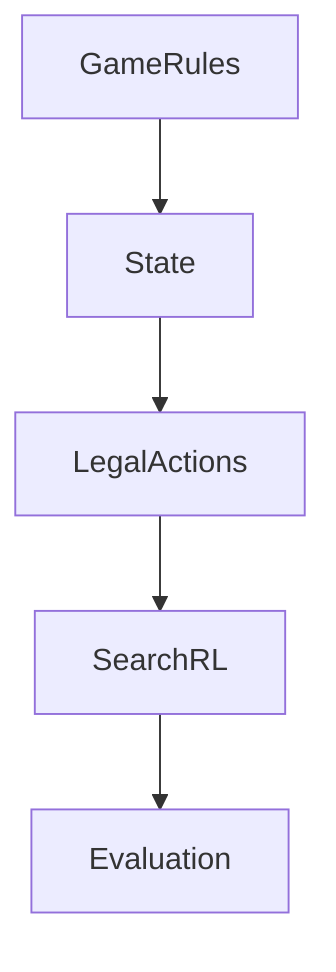

# google-deepmind/open_spiel

> 来源类型：GitHub / Game AI fallback
> 原文：https://github.com/google-deepmind/open_spiel

## 一句话结论
OpenSpiel 是通用博弈 RL/搜索环境库，可为 Rummy imperfect-information 建模提供参考。

#ai-radar #point-rummy #game-ai
