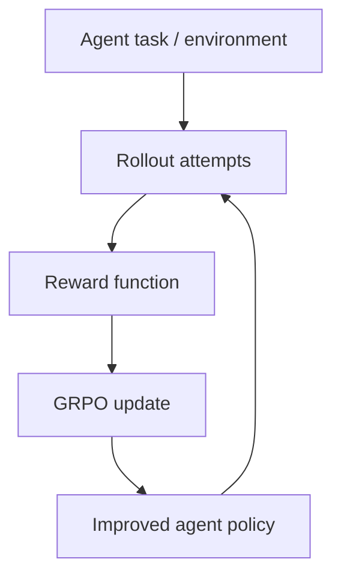

# OpenPipe ART Agent Reinforcement Trainer

> 类型：GitHub 项目
> 分类：Agent RL / GRPO
> 推荐等级：可 skim
> 创建日期：2026-06-08
> 原文链接：https://github.com/OpenPipe/ART

## 一句话结论

ART 把 GRPO 包装成面向多步 Agent 任务的训练框架，9.9k stars，值得作为真实任务 on-the-job RL 方向的轻量试验入口。

## 元信息

- 来源：GitHub
- 作者/机构：OpenPipe
- 发布时间：2025-03-10 创建；2026-06-06 活跃 push
- Stars：9,950；Forks：890；Open issues：126
- 代码链接：https://github.com/OpenPipe/ART
- 文档：https://art.openpipe.ai
- 相关标签：agent, grpo, qwen, reinforcement-learning, lora

## 专业解读

ART 的重点不是通用 RLHF 训练平台，而是把 Agent 环境、reward function、LoRA/模型训练和 rollout 反馈循环降低到开发者可操作的层级。对业务 Agent 来说，这类框架能快速验证是否能通过任务奖励改进行为，但大规模分布式能力、复杂 verifier 和安全评估仍要与 verl/OpenRLHF/promptfoo 等生态组合。

## 通俗解释

如果你有一个 Agent 做多步任务表现不稳定，ART 试图让它像实习生一样在任务中反复练习，用结果好坏来改进。

## 图示

## 核心要点

- 成熟度：stars 接近 10k，issues 相对可控，适合试用。
- 工程价值：降低 Agent RL 试验门槛。
- 集成价值：可与 W&B、业务 sandbox、eval harness 联动。

## 对我的影响

- AI Infra：需要关注训练/推理资源是否自动化、是否支持私有模型和本地 serving。
- LLM 工程：适合快速做 Agent reward shaping PoC。
- RL / Game AI：多步任务环境接口和 GRPO loop 可借鉴到游戏智能体。
- 是否值得试用：可 skim；选一个小型 Agent 任务做 smoke test。

## 局限性 / 风险

- 真实复杂任务的 reward hacking 和 eval contamination 风险仍需额外控制。
- 不一定适合超大规模 RLVR 训练。

## 相关链接

- 原文：https://github.com/OpenPipe/ART
- 文档：https://art.openpipe.ai
- 相关卡片：[[Concepts/RLVR Reward Credit Assignment]]

#ai-radar #github #agent #grpo #rl
