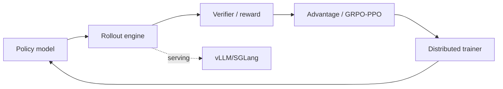

# verl HybridFlow RL Post-Training Framework

> 类型：GitHub 项目
> 分类：Post-training / RLHF
> 推荐等级：必读
> 创建日期：2026-06-08
> 原文链接：https://github.com/verl-project/verl

## 一句话结论

verl 是 ByteDance Seed 发起的高活跃 RL post-training 框架，21k+ stars，适合作为 PPO/GRPO/RLVR、大规模 rollout 与训练资源编排的重点跟踪对象。

## 元信息

- 来源：GitHub
- 作者/机构：ByteDance Seed / verl community
- 发布时间：2024-10-31 创建；2026-06-08 活跃 push
- Stars：21,839；Forks：4,038；Open issues：2,034
- 代码链接：https://github.com/verl-project/verl
- 文档：https://verl.readthedocs.io/en/latest/index.html
- 论文：https://arxiv.org/pdf/2409.19256

## 专业解读

后训练的难点在于 actor、rollout engine、reference model、reward/verifier、critic、数据队列和分布式训练之间的资源耦合。verl/HybridFlow 的意义在于把 RLHF/RLVR 中训练、采样、评估的混合执行流工程化，方便接入 vLLM 等推理引擎并在 Ray/分布式环境里调度。对做 GRPO/RLVR 的团队，框架能力往往决定实验迭代速度和最大 batch/sequence 长度。

## 通俗解释

它是训练会推理、会执行任务的大模型的工具箱，帮你把生成样本、打分、更新模型这些复杂步骤串起来并跑在多机多卡上。

## 图示

## 核心要点

- 成熟度：Apache-2.0，ByteDance Seed 背书，社区增长快。
- 工程价值：把 RL post-training 的异构执行流显式框架化。
- 集成价值：适合评估内部 RLVR pipeline 是否需要自研还是基于 verl 扩展。

## 对我的影响

- AI Infra：关注 rollout/training 资源隔离、checkpoint、失败恢复、吞吐指标。
- LLM 工程：GRPO/RLVR 新论文可优先尝试在 verl 里复现。
- RL / Game AI：可作为语言 Agent 或游戏策略模型的 post-training backbone。
- 是否值得试用：必读；跟踪与 vLLM/SGLang、Ray、Megatron/FSDP 的集成细节。

## 局限性 / 风险

- 快速增长期 issue 较多，API 稳定性和版本兼容要谨慎。
- 算法默认配置未必适合每个 verifier/环境，需要强实验监控。

## 相关链接

- 原文：https://github.com/verl-project/verl
- 文档：https://verl.readthedocs.io/en/latest/index.html
- 相关卡片：[[Concepts/RLVR Reward Credit Assignment]]

#ai-radar #github #rlhf #grpo #verl #post-training
