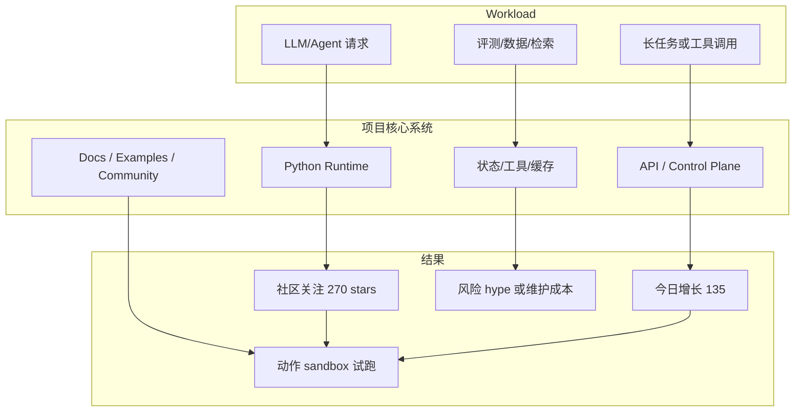

# Tencent-Hunyuan/UniRL

> 类型：GitHub 项目
> 大类：GitHub
> 小类：AI Infra / Agent / LLM
> 推荐等级：必读
> 创建日期：2026-06-10
> 原文链接：https://github.com/Tencent-Hunyuan/UniRL
> 网页详情：https://github.com/dyt27666-oss/AI-news-report-obsidians/blob/main/GitHub/Tencent-Hunyuan__UniRL/2026-06-10-Tencent-Hunyuan-UniRL.md
> 返回日报：[[Daily/2026-06-10]]

## 一句话结论

Tencent-Hunyuan/UniRL 今日值得关注：stars=270，forks=13，stars_delta=135，主题覆盖 reinforcement-learning。

## TL;DR

- **它是什么**：UniRL is a Framework for Unified Multimodal Model Reinforcement Learning
- **为什么重要**：反映开源社区对 agent harness、LLM 工具链或 serving 基础设施的注意力迁移。
- **和我相关的点**：观察 AI Infra / Agent 平台抽象边界、集成方式和社区采纳速度。
- **建议动作**：先看 README、examples、release，再 sandbox 试跑。

## 元信息

| 字段 | 内容 |
|---|---|
| repo | Tencent-Hunyuan/UniRL |
| stars | 270 |
| forks | 13 |
| language | Python |
| updated_at | 2026-06-10T00:08:12Z |
| pushed_at | 2026-06-09T16:18:13Z |
| topics | reinforcement-learning |
| 原文 | [GitHub](https://github.com/Tencent-Hunyuan/UniRL) |
| benchmark/docs/examples/release | 未自动验证，建议人工检查 README / releases / examples |
| 是否值得试用 | 是，优先试用 |

## 信息压缩图示

## 辅助结构：试用决策

| 维度 | 判断 | 动作 |
|---|---|---|
| 相关性 | AI Infra / Agent / LLM 相关 | 保留观察 |
| 社区热度 | stars_delta=135 | 高增长则优先看 issue/release |
| 工程落地 | 未自动运行 | 先读 quickstart，再 sandbox |
| 风险 | 可能存在 hype 或安全问题 | 不直接接生产密钥 |

## 专业解读

该项目的价值主要来自两个维度：覆盖的工作负载是否贴近真实 agent/LLM infra；社区增长是否说明某个抽象正在成为事实标准。当前主题为 reinforcement-learning，需要进一步检查 README、examples、release cadence 和 issue 质量。

## 对我的影响

| 维度 | 影响 | 建议动作 |
|---|---|---|
| AI Infra | 可能提供可复用组件或趋势信号 | 对照内部架构做差距分析 |
| LLM 工程 | 可能影响工具链/模型接入方式 | 看 examples 和 API surface |
| RL / Game AI | 若涉及训练/环境则可借鉴 | 仅相关项目深挖 |
| Agent / Eval | 强相关时可纳入候选栈 | 做小规模 sandbox |

## 相关链接

- GitHub：https://github.com/Tencent-Hunyuan/UniRL
- 网页详情：https://github.com/dyt27666-oss/AI-news-report-obsidians/blob/main/GitHub/Tencent-Hunyuan__UniRL/2026-06-10-Tencent-Hunyuan-UniRL.md
- Snapshot：[[Automation/state/github-stars-2026-06-10.json]]

## 标签

#ai-radar #github #ai-infra #llm #agent
