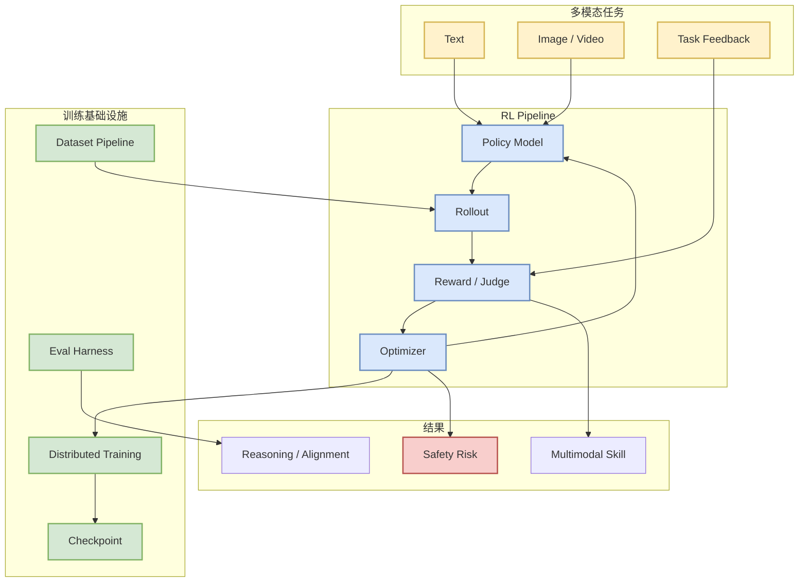

# Tencent-Hunyuan/UniRL

> 类型：GitHub 项目  
> 大类：GitHub  
> 小类：Multimodal RL / Post-training  
> 推荐等级：后续深挖  
> 创建日期：2026-06-11  
> 原文链接：https://github.com/Tencent-Hunyuan/UniRL  
> 返回日报：[[Daily/2026-06-11]]

## 一句话结论

UniRL 是统一多模态模型强化学习框架，对 RLHF、RLAIF、多模态 reward 和 agent post-training 都有观察价值。

## TL;DR

- **它是什么**：Tencent-Hunyuan 开源的 unified multimodal model reinforcement learning framework。
- **为什么重要**：多模态模型后训练需要统一处理文本、视觉、任务反馈和 reward。
- **和我相关的点**：贴合 RL 游戏模型训练算法、post-training 和 agent policy optimization。
- **建议动作**：检查 examples、reward 设计、rollout pipeline 和是否支持 GRPO/PPO。

## 信息压缩图示

## 专业解读

多模态 RL 的难点不是只把 PPO/GRPO 搬到 VLM 上，而是要处理不同模态的 reward 定义、rollout 成本、数据混合、评测和安全边界。UniRL 值得观察的点包括：是否抽象出统一 rollout API、是否支持多 reward、是否有稳定分布式训练 recipe，以及是否能复现公开结果。

## 通俗解释

它像是给多模态模型做强化学习训练的工具箱，让模型可以根据文本、图像、任务反馈继续优化行为。

## 关键机制拆解

| 机制 | 解决的问题 | 为什么有效 | 可能的坑 |
|---|---|---|---|
| Unified RL framework | 多模态训练碎片化 | 统一 pipeline | 抽象可能过重 |
| Reward / Judge | 多模态反馈难定义 | 可统一优化目标 | reward hacking |
| Distributed rollout | 成本高 | 提升训练吞吐 | 系统复杂 |

## 对我的影响

| 维度 | 影响 | 建议动作 |
|---|---|---|
| AI Infra | 需要 rollout + distributed training | 看其并行设计 |
| LLM 工程 | post-training 参考 | 检查支持算法 |
| RL / Game AI | 直接相关 | 深读 examples |
| Agent / Eval | agent policy 优化可借鉴 | 关注 reward/eval |

## 可信度与局限性

- 证据强度：中；来自 GitHub snapshot 和项目描述。
- 局限性：今日未实时刷新，也未跑代码。
- 还需要确认：算法支持、训练脚本、benchmark 和 license。

## 我应该如何跟进

1. 查看 README/examples。
2. 确认支持 PPO、GRPO、DPO 或自定义 reward。
3. 对比 verl、OpenRLHF、AReaL。

## 相关链接

- GitHub：https://github.com/Tencent-Hunyuan/UniRL
- 返回日报：[[Daily/2026-06-11]]

## 标签

#ai-radar #github #rl #post-training #multimodal
