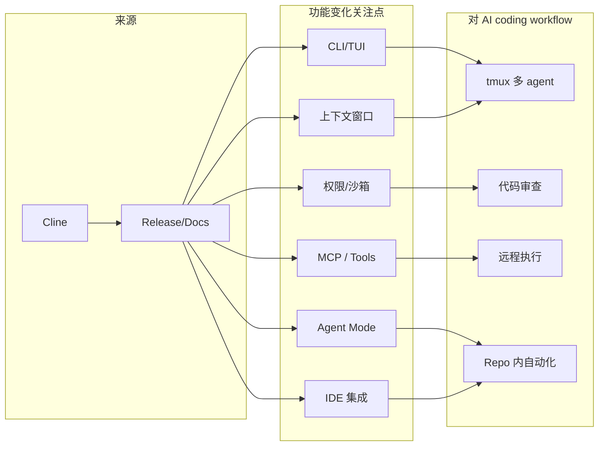

# Cline - Coding 工具更新 (2026-08-10)

## 一句话结论
Cline 今天进入 Coding 工具扫描矩阵；release/tag=desktop-v0.0.11，用于观察 CLI/TUI、agent mode、MCP、权限和 IDE 集成变化。

## 元信息表
| 字段 | 内容 |
|---|---|
| 工具/厂商 | Cline / Cline |
| 来源类型 | GitHub Release / Docs / Changelog |
| 发布时间或 tag | 2026-08-09T04:16:07Z / desktop-v0.0.11 |
| 原文链接 | https://github.com/cline/cline/releases/tag/desktop-v0.0.11 |
| Docs/Changelog | https://github.com/cline/cline/releases |

## 工具链影响图

## 对我的影响
- 若涉及权限/沙箱：影响无人值守 coding agent 的安全边界。
- 若涉及 MCP/tool use：影响工具接入和多 agent 编排。
- 若涉及上下文窗口/IDE：影响大型 repo 任务的可靠性。

## 可信度与局限性
Release 元数据通过 GitHub direct API 或固定 changelog 链接扫描；未确认具体 changelog diff 时标注为观察项。

## 相关链接
- 原文：https://github.com/cline/cline/releases/tag/desktop-v0.0.11
- 文档：https://github.com/cline/cline/releases
- Daily：[[Daily/2026-08-10]]

#ai-radar #coding-tools #agent-workflow
