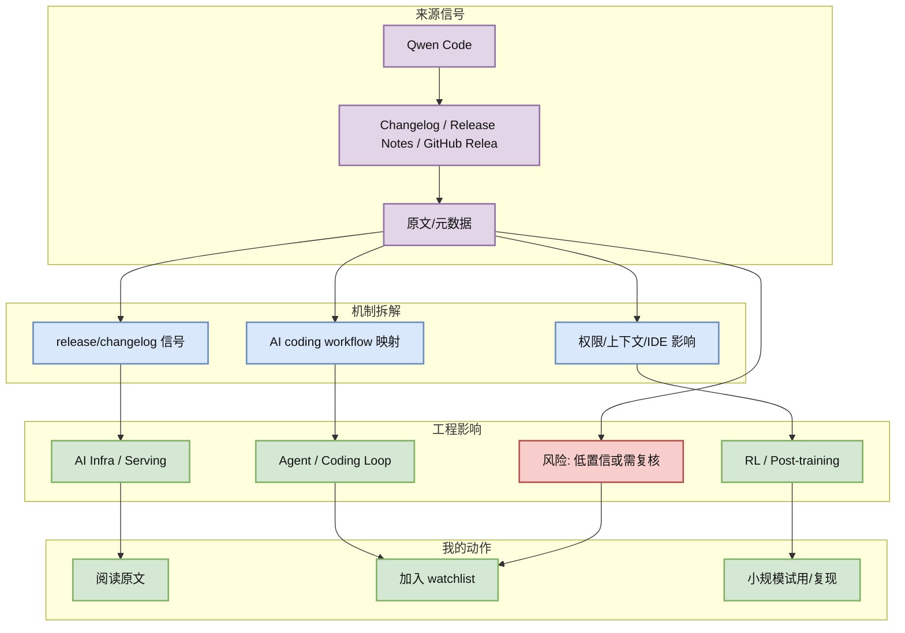

# Qwen Code 工具更新扫描

> 类型：Tool
> 大类：AI Radar 详情
> 小类：Changelog / Release Notes / GitHub Release
> 推荐等级：可 skim
> 创建日期：2026-08-21
> 原文链接：https://github.com/QwenLM/qwen-code/releases/tag/v0.21.15
> 网页详情：https://github.com/dyt27666-oss/AI-news-report-obsidians/blob/main/GitHub/Tools/2026-08-21/qwen-code.md
> 返回日报：[[Daily/2026-08-21]]

## 一句话结论

Qwen Code 今日扫描结果：Release v0.21.15；tag/时间：v0.21.15 / 2026-08-20T17:38:51Z。

## TL;DR

- **它是什么**：Qwen Code 的今日雷达条目，来源类型为 Changelog / Release Notes / GitHub Release。
- **为什么重要**：影响 CLI/TUI、IDE 集成、MCP、权限模式、上下文窗口或 agent loop 工作流。
- **和我相关的点**：用于 AI Infra、LLM serving/training、agent loop、AI coding workflow 或 RL/Game AI 的工程判断。
- **建议动作**：先看原文和元数据；若是 fallback/低置信项，只进入 watchlist，不直接作为生产决策。

## 元信息

| 字段 | 内容 |
|---|---|
| 发布方/来源 | Qwen Code |
| 栏目/来源类型 | Changelog / Release Notes / GitHub Release |
| 作者/机构 | Qwen Code / 公开来源 |
| 发布时间 | 2026-08-21 或源站最新元数据 |
| 原文 | [原文](https://github.com/QwenLM/qwen-code/releases/tag/v0.21.15) |
| 代码 | https://github.com/QwenLM/qwen-code/releases/tag/v0.21.15 |
| PDF | 未发现 |
| 标签 | #ai-radar |

## 信息压缩图示

### 辅助结构：影响矩阵

| 维度 | 影响 | 建议动作 |
|---|---|---|
| AI Infra | 影响 CLI/TUI、IDE 集成、MCP、权限模式、上下文窗口或 agent loop 工作流。 | 看 repo/release/benchmark 是否可运行 |
| LLM 工程 | 关注上下文、推理、模型接入或评测链路 | 加入短期 watchlist |
| RL / Game AI | 若相关，映射到环境、reward、rollout、evaluator | 只保留强相关候选 |
| Agent / Eval | 关注 tool use、MCP、权限、验证 loop | 做最小试用 |

## 专业解读

Qwen Code 今日扫描结果：Release v0.21.15；tag/时间：v0.21.15 / 2026-08-20T17:38:51Z。 这个信号的价值不只在标题或 star 数，而在它和用户关注的系统问题之间的映射：推理吞吐、训练/rollout 成本、agent tool-use 边界、coding-agent 验证闭环，以及 Rummy/Game AI 的规则环境与评测基准。若本页标注 direct fallback 或间接扫描，说明它是固定 watchlist 信号，不是完整全网排名。

## 通俗解释

可以把它看成今天雷达里的一个“工程温度计”：它提示某类技术或工具正在变热，但还需要看原文、release、README 和实际可运行性，才能决定是否投入时间。

## 关键机制拆解

| 机制 | 解决的问题 | 为什么有效 | 可能的坑 |
|---|---|---|---|
| release/changelog 信号 | 找到高信号来源 | 保留 repo/source 元数据和原文 | 可能受 API 限流影响 |
| AI coding workflow 映射 | 映射到工程问题 | 对齐 serving/agent/RL 关注点 | 需要二次验证 |
| 权限/上下文/IDE 影响 | 形成行动建议 | 进入试用/复现/watchlist | 不等于生产就绪 |

## 对我的影响

| 方向 | 影响 | 下一步 |
|---|---|---|
| AI Infra | 可能影响 runtime、scheduler、cache、分布式或平台治理判断 | 看 benchmark/docs/release |
| LLM 工程 | 可能影响模型接入、上下文管理、推理和 eval workflow | 记录试用成本 |
| RL / Game AI | 若涉及 Rummy/RL，可拆成 env/action/reward/evaluator | 做最小环境接口 |
| Agent / Eval | 可能影响 coding agent loop、权限和工具调用验证 | 加入 loop-engineering 观察 |

## 可信度与局限性

- 证据强度：中；来自公开 API、GitHub direct fallback 或源站入口。
- 局限性：GitHub Search 今日 403 限流，广义榜单不是完整全网排名。
- 还需要确认：具体 release note、benchmark、代码质量和维护活跃度。

## 我应该如何跟进

1. 打开原文确认 README / release / paper 是否有实质更新。
2. 若和当前工作栈相关，记录 30 分钟内能否跑通的最小实验。
3. 对低置信项只加入观察，不进入生产决策。

## 相关链接

- 原文：https://github.com/QwenLM/qwen-code/releases/tag/v0.21.15
- 网页详情：https://github.com/dyt27666-oss/AI-news-report-obsidians/blob/main/GitHub/Tools/2026-08-21/qwen-code.md
- 返回日报：[[Daily/2026-08-21]]

## 标签

#ai-radar #tool
