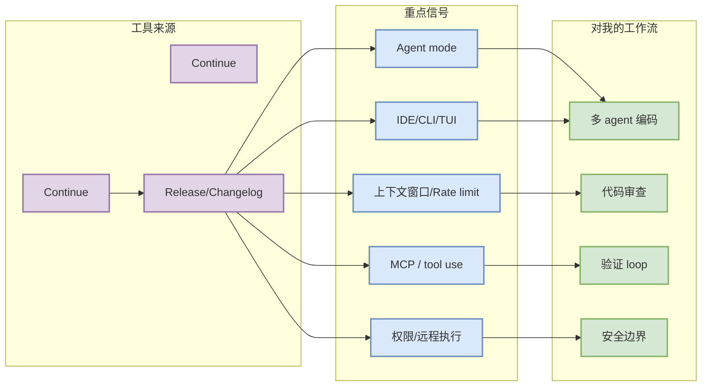

# Continue 工具更新观察

> 日期：2026-08-22  
> 工具/厂商：Continue / Continue  
> 来源类型：Changelog / Release Notes / GitHub Release / Docs  
> 原文：[https://github.com/continuedev/continue/releases](https://github.com/continuedev/continue/releases)

## 一句话结论
Continue 今日保留在 Coding 工具扫描矩阵中；可验证的代表更新为 `Release API 失败` / `需页面核验` / `需页面核验`，重点观察 agent mode、MCP、IDE/CLI、权限模式、上下文窗口、远程执行与 pricing/rate limit。

## TL;DR
- 来源类型：Release Notes / Changelog / Docs。
- 功能变化：本轮未自动深读完整 changelog；以 release tag 和官方入口作为可追溯信号。
- 对 AI coding 工作流：影响多 agent 编码、tmux 监控、代码审查、权限边界、MCP 工具接入和上下文工程。

## 信息压缩图示

## 影响矩阵
| 变化维度 | 需要关注的点 | 行动 |
|---|---|---|
| Agent 能力 | 是否新增 autonomous loop、plan/act、background task | 等官方说明确认后试用 |
| MCP / Tool use | 是否改变工具协议、权限或审计 | 影响 Hermes / coding agent harness |
| IDE/CLI/TUI | 是否改变终端、多窗口、远程执行体验 | 影响 tmux 多 agent 工作流 |
| Pricing / Rate limit | 是否改变使用成本和上下文窗口 | 影响日常工程效率 |

## 可信度与局限性
- 可信度：中；release tag/入口可验证，但未逐条抽取完整 changelog。
- 局限：Cursor/Windsurf/Copilot 等页面可能需要浏览器/JS 深扫；今日保留矩阵状态，不夸大为重大更新。

## 相关链接
- 原文：https://github.com/continuedev/continue/releases
- 官方入口：https://github.com/continuedev/continue/releases
- 今日日报：[[Daily/2026-08-22]]

#ai-radar #coding-tools #ai-agent
