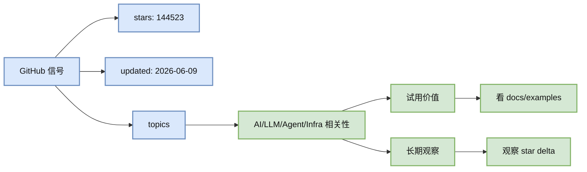

# langgenius/dify

> 类型：GitHub 项目
> 大类：GitHub
> 创建日期：2026-06-09
> 原文链接：https://github.com/langgenius/dify
> 网页详情：https://github.com/dyt27666-oss/AI-news-report-obsidians/blob/main/GitHub/Watchlist/langgenius%20dify.md
> 返回日报：[[Daily/2026-06-09]]

## 一句话结论

langgenius/dify 是本次补扫纳入的 GitHub 观察项目；它的 star/更新信号说明需要在 AI Infra、LLM 应用、Agent 或 ML 工程生态中判断其真实价值。

## TL;DR

- repo：langgenius/dify
- stars / forks：144523 / 22744
- language：TypeScript
- updated_at：2026-06-09T09:34:21Z
- topics：agent, agentic-ai, agentic-framework, agentic-workflow, ai, automation, gemini, genai, gpt, gpt-4, llm, low-code, mcp, nextjs, no-code, openai, orchestration, python, rag, workflow
- 简介：Production-ready platform for agentic workflow development.
- 建议：值得试用/纳入观察，和 AI Infra、Agent 或 LLM 应用工程相关。

## 元信息

| 字段 | 内容 |
|---|---|
| repo | langgenius/dify |
| stars | 144523 |
| forks | 22744 |
| language | TypeScript |
| updated_at | 2026-06-09T09:34:21Z |
| pushed_at | 2026-06-09T09:30:39Z |
| topics | agent, agentic-ai, agentic-framework, agentic-workflow, ai, automation, gemini, genai, gpt, gpt-4, llm, low-code, mcp, nextjs, no-code, openai, orchestration, python, rag, workflow |
| 原文 | [GitHub](https://github.com/langgenius/dify) |

## 信息压缩图示

### 辅助矩阵

| 维度 | 观察点 | 初步判断 |
|---|---|---|
| 生态热度 | stars/forks | 144523 / 22744 |
| 活跃度 | updated_at/pushed_at | 2026-06-09T09:34:21Z / 2026-06-09T09:30:39Z |
| 贴合度 | topics/description | 需要结合内部 AI Infra/Agent/RL 需求复核 |
| 风险 | star 不等于生产可用 | 需要看 release、issue、benchmark、license |

## 专业解读

这个项目进入补扫列表的原因是 GitHub 搜索或更新信号足够强。对 AI Infra 工程来说，不能只看 stars，而要判断它是否能进入平台链路：serving、gateway、agent workflow、eval、observability、数据抓取或训练工具链。如果只是泛 AI 应用层，则适合作为生态趋势观察，不应直接当成生产依赖。

## 通俗解释

它像是一个 GitHub 上热度较高或最近很活跃的 AI 相关项目。现在先把它放进雷达，后续用真实 star 增长、文档质量和是否能跑起来判断是否值得深入。

## 我应该如何跟进

1. 看 README、examples、release 和 license。
2. 如果和 serving/agent/eval/RL 相关，做最小 demo。
3. 明天开始用 snapshot 计算真实 star 增长，而不是冷启动代理。

## 相关链接

- 原文：https://github.com/langgenius/dify
- 网页详情：https://github.com/dyt27666-oss/AI-news-report-obsidians/blob/main/GitHub/Watchlist/langgenius%20dify.md

#ai-radar #github #watchlist
