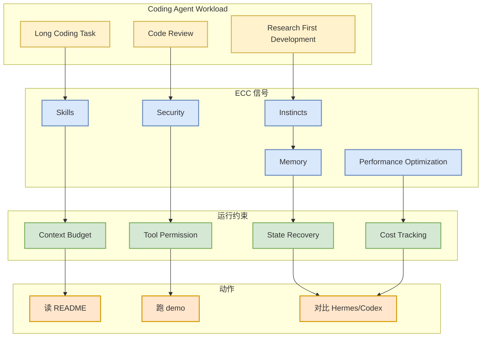
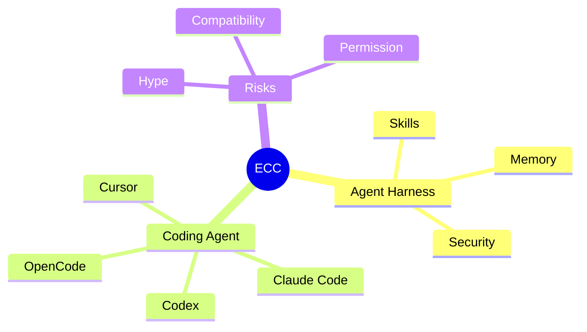

# affaan-m/ECC

> 类型：GitHub 项目  
> 大类：GitHub  
> 小类：Agent Harness / Performance  
> 推荐等级：后续深挖  
> 创建日期：2026-06-11  
> 原文链接：https://github.com/affaan-m/ECC  
> 返回日报：[[Daily/2026-06-11]]

## 一句话结论

ECC 的高 star 和高增长信号说明 agent harness performance optimization、skills、memory、security 和 research-first workflow 正成为 coding agent 生态热点。

## TL;DR

- **它是什么**：GitHub 项目，描述为面向 Claude Code、Codex、OpenCode、Cursor 等的 agent harness performance optimization system。
- **为什么重要**：coding agent 的瓶颈正在转向上下文管理、技能复用、成本、安全和长任务可靠性。
- **和我相关的点**：适合观察 agent harness 如何把 skills / instincts / memory / security 组织为工程栈。
- **建议动作**：先读 README 和 examples，确认是否真实可用以及与现有工具链是否重叠。

## 元信息

| 字段 | 内容 |
|---|---|
| repo | affaan-m/ECC |
| 来源类型 | GitHub Repository |
| stars | 211898（来自 fallback snapshot） |
| forks | 32526 |
| language | JavaScript |
| 原文 | [GitHub](https://github.com/affaan-m/ECC) |

## 信息压缩图示

## 专业解读

ECC 的元数据和描述高度贴合 agent harness 的当前热点：多工具、多模型、多 IDE/CLI 集成。真正要判断价值，需要看它是否有清晰架构、可运行 examples、权限边界和 benchmark，而不是只看 star。

## 通俗解释

它像是给 coding agent 加一层“工作习惯和记忆系统”，让 agent 不只是会写代码，还能按流程、按安全规则、按上下文预算工作。

## 关键机制拆解

| 机制 | 解决的问题 | 为什么有效 | 可能的坑 |
|---|---|---|---|
| Skills | 流程复用 | 降低重复提示 | 技能质量参差 |
| Memory | 长任务连续性 | 保留项目上下文 | 错误记忆污染 |
| Security | 工具调用安全 | 降低破坏性操作风险 | 权限配置复杂 |

## 对我的影响

| 维度 | 影响 | 建议动作 |
|---|---|---|
| AI Infra | agent runtime 的控制面更重要 | 看其状态和权限模型 |
| LLM 工程 | skills 可提升 coding agent 稳定性 | 对比 Codex/Hermes workflow |
| RL / Game AI | 可借鉴长任务反馈循环 | 关注 trajectory 记录 |
| Agent / Eval | 直接相关 | 加入 harness 对比清单 |

## 可信度与局限性

- 证据强度：中低；今日仅基于 GitHub snapshot 和描述，未完整审计代码。
- 局限性：高 star 可能受 hype 影响。
- 还需要确认：license、release、真实用户和 CI 状态。

## 我应该如何跟进

1. 阅读 README 和 install guide。
2. 检查是否有 benchmark / examples / tests。
3. 与 Hermes Agent、Claude Code skills 做架构对照。

## 相关链接

- GitHub：https://github.com/affaan-m/ECC
- 返回日报：[[Daily/2026-06-11]]

## 标签

#ai-radar #github #agent #coding-agent
