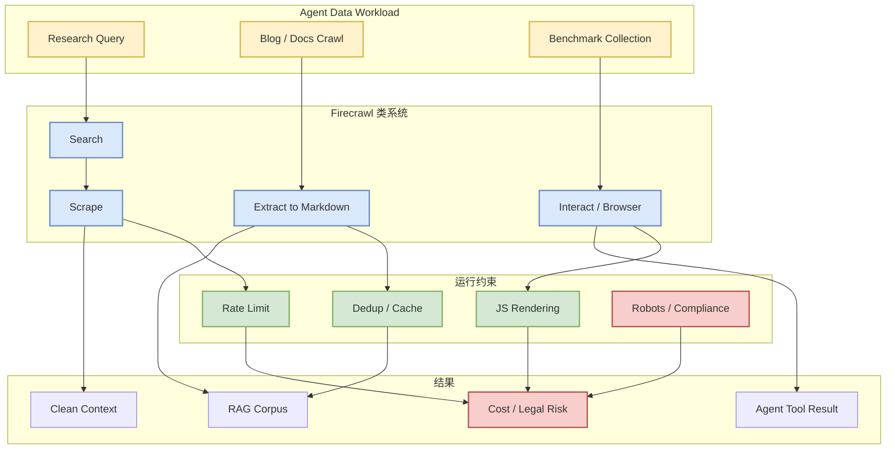
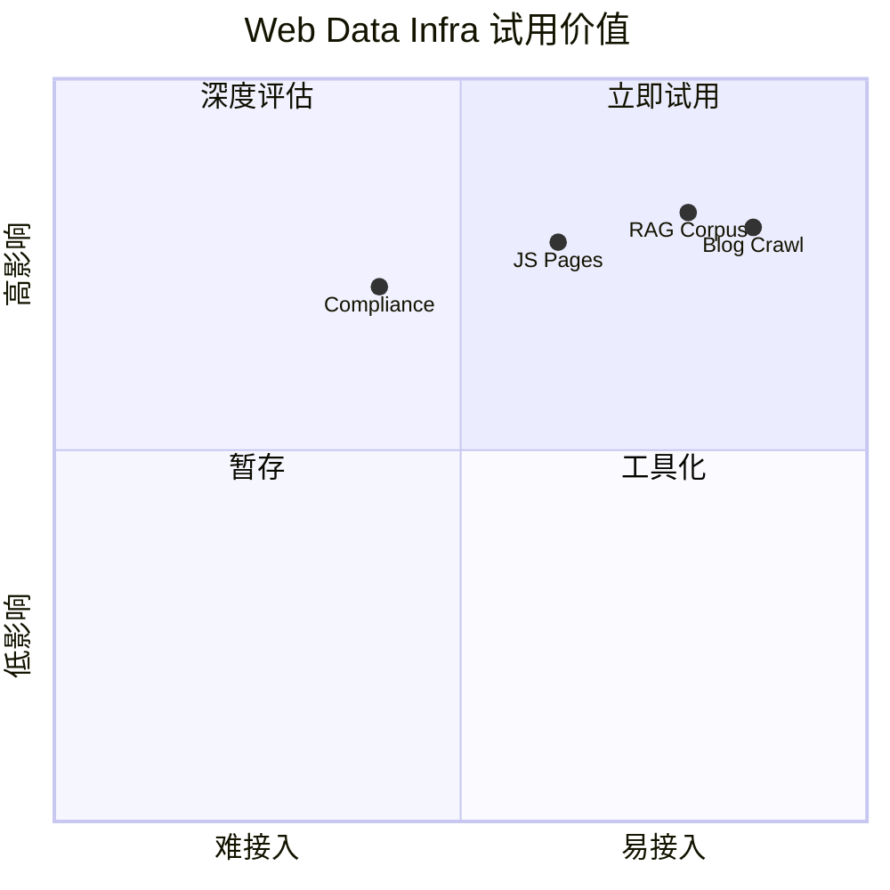

# firecrawl/firecrawl

> 类型：GitHub 项目  
> 大类：GitHub  
> 小类：Web Data Infra / Agent Tools  
> 推荐等级：后续深挖  
> 创建日期：2026-06-11  
> 原文链接：https://github.com/firecrawl/firecrawl  
> 返回日报：[[Daily/2026-06-11]]

## 一句话结论

Firecrawl 的持续高增长说明 web search、scrape、extract 和 agent interaction at scale 仍是 agent 平台最关键的数据入口之一。

## TL;DR

- **它是什么**：面向 web search / scrape / interact 的 API 和开源项目。
- **为什么重要**：Agent 需要可靠的外部信息获取，网页抓取质量直接影响 research agent、RAG 和工具调用结果。
- **和我相关的点**：可作为 agent 数据入口、benchmark 数据采集和网页转 markdown 的基础设施参考。
- **建议动作**：测试其 JS-heavy 页面、rate limit、结构化抽取和成本模型。

## 元信息

| 字段 | 内容 |
|---|---|
| repo | firecrawl/firecrawl |
| 来源类型 | GitHub Repository |
| stars | 130750（来自 fallback snapshot） |
| forks | 7735 |
| language | TypeScript |
| 原文 | [GitHub](https://github.com/firecrawl/firecrawl) |

## 信息压缩图示

## 专业解读

对 agent 平台来说，网页不是普通数据源。它包含动态渲染、反爬、重复内容、结构混乱、过期信息和版权/合规约束。Firecrawl 这类项目的价值在于把 search、crawl、extract、markdown conversion 和 API 化能力封装起来，降低 research agent 和 RAG pipeline 的工程摩擦。

## 通俗解释

它像是 agent 的“网页阅读器”和“清洗器”：帮 agent 把网页变成更干净、更适合模型处理的文本。

## 关键机制拆解

| 机制 | 解决的问题 | 为什么有效 | 可能的坑 |
|---|---|---|---|
| Search + scrape | 找到并抓取网页 | 降低数据入口复杂度 | rate limit 和反爬 |
| Markdown extraction | 清洗网页结构 | 更适合 LLM context | 可能丢表格/图 |
| Browser interaction | 处理动态页面 | 覆盖 JS-heavy 来源 | 成本和稳定性高 |

## 对我的影响

| 维度 | 影响 | 建议动作 |
|---|---|---|
| AI Infra | 外部数据入口需要缓存和限流 | 测试成本与吞吐 |
| LLM 工程 | RAG/agent context 质量提升 | 做网页抽取 benchmark |
| RL / Game AI | 可采集网页任务环境 | 低优先观察 |
| Agent / Eval | research agent 强相关 | 集成到 eval 数据采集 |

## 可信度与局限性

- 证据强度：中；GitHub 热度高，但需实测。
- 局限性：不同网站效果差异大。
- 还需要确认：部署方式、API 成本、反爬策略、合规边界。

## 我应该如何跟进

1. 用 10 个常见技术博客页面做抽取质量测试。
2. 比较 Firecrawl、browser-use、Playwright 自建方案。
3. 记录 markdown 完整度、延迟、失败率和成本。

## 相关链接

- GitHub：https://github.com/firecrawl/firecrawl
- 返回日报：[[Daily/2026-06-11]]

## 标签

#ai-radar #github #web-data #agent-tools #rag
