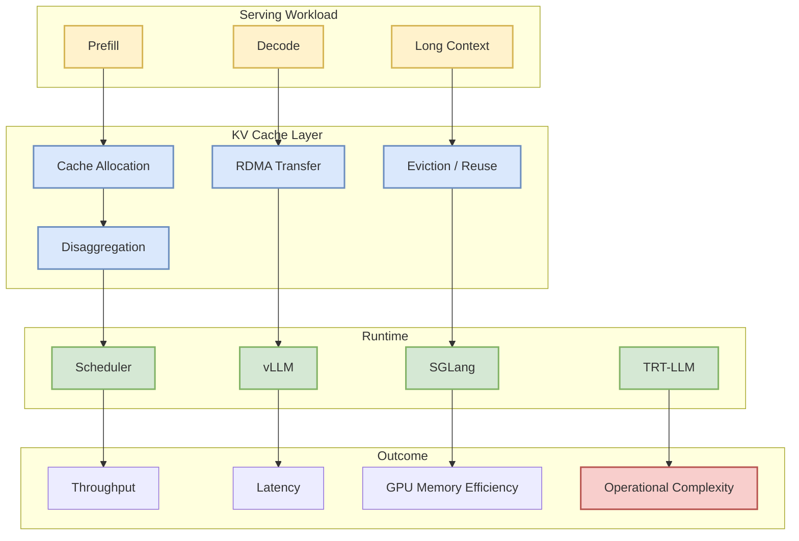

# kvcache-ai/Mooncake

> 类型：GitHub 项目  
> 大类：GitHub  
> 小类：LLM Serving / KV Cache  
> 推荐等级：后续深挖  
> 创建日期：2026-06-11  
> 原文链接：https://github.com/kvcache-ai/Mooncake  
> 返回日报：[[Daily/2026-06-11]]

## 一句话结论

Mooncake 是 Kimi serving 平台相关的高价值观察项，主题覆盖 KV cache、disaggregation、RDMA、vLLM/SGLang/TRT-LLM。

## TL;DR

- **它是什么**：LLM serving 平台项目，强调 KV cache 和 disaggregated serving。
- **为什么重要**：长上下文和高并发服务下，KV cache 管理往往决定吞吐、延迟和成本。
- **和我相关的点**：直接贴合 LLM serving / inference / cache / scheduler。
- **建议动作**：读 README、架构图、benchmark，确认是否可借鉴到内部 serving。

## 信息压缩图示

## 专业解读

KV cache 已经成为 LLM serving 的核心状态。Mooncake 如果确实提供 production-grade disaggregated cache，那么它的价值在于把 prefill/decode、GPU memory、网络传输和调度器绑定成统一系统问题。要重点确认 benchmark 是否覆盖真实长上下文、并发、cache miss、RDMA 和故障恢复。

## 通俗解释

KV cache 像模型推理时的“工作记忆”。Mooncake 关注的是如何把这块记忆在多机器、多 GPU 间更高效地保存和搬运。

## 关键机制拆解

| 机制 | 解决的问题 | 为什么有效 | 可能的坑 |
|---|---|---|---|
| KV cache 分离 | GPU 显存紧张 | 提升复用和容量 | 网络延迟/复杂度 |
| RDMA | 跨机传输开销 | 降低 cache 访问延迟 | 部署门槛高 |
| Scheduler | 匹配 prefill/decode | 提升吞吐 | 策略复杂 |

## 对我的影响

| 维度 | 影响 | 建议动作 |
|---|---|---|
| AI Infra | 直接相关 | 深读架构与 benchmark |
| LLM 工程 | 长上下文服务成本相关 | 对比 vLLM/SGLang |
| RL / Game AI | 若有长 rollout 推理可借鉴 | 低优先观察 |
| Agent / Eval | 长任务 agent 上下文成本相关 | 关注 cache 复用 |

## 可信度与局限性

- 证据强度：中；来自 GitHub fallback snapshot 和项目描述。
- 局限性：今日未实时刷新，也未完整审计 benchmark。
- 还需要确认：部署复杂度、硬件依赖和真实生产案例。

## 我应该如何跟进

1. 阅读 README 和架构文档。
2. 查 benchmark 是否覆盖长上下文和高并发。
3. 与 vLLM prefix cache / SGLang RadixAttention 做对比。

## 相关链接

- GitHub：https://github.com/kvcache-ai/Mooncake
- 返回日报：[[Daily/2026-06-11]]

## 标签

#ai-radar #github #llm-serving #kv-cache #ai-infra
