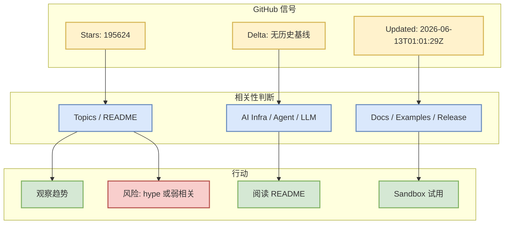

# tensorflow/tensorflow

> 类型：GitHub 项目
> 大类：GitHub
> 小类：AI Infra / Agent / LLM Ecosystem
> 推荐等级：可 skim
> 创建日期：2026-06-13
> 原文链接：https://github.com/tensorflow/tensorflow
> 网页详情：https://github.com/dyt27666-oss/AI-news-report-obsidians/blob/main/GitHub/tensorflow__tensorflow_2026_06_13.md
> 返回日报：[[Daily/2026-06-13]]

## 一句话结论

tensorflow/tensorflow 今日出现在 AI Radar GitHub Top 10 或增长榜：An Open Source Machine Learning Framework for Everyone

## TL;DR

- **它是什么**：GitHub 项目，语言 C++，stars 195624，forks 75175。
- **为什么重要**：进入 Top 10 或增长榜说明社区关注度高；需要结合 topics 与 README 判断是否真适合 AI Infra/LLM/Agent 工作流。
- **和我相关的点**：可作为 agent runtime、模型工具链、开发工作流、数据处理或生态趋势的观察样本。
- **建议动作**：观察/skim；先读 README、examples、release 和 issue 活跃度，不要只按 star 决策。

## 元信息

| 字段 | 内容 |
|---|---|
| repo | tensorflow/tensorflow |
| stars / forks | 195624 / 75175 |
| language | C++ |
| updated_at | 2026-06-13T01:01:29Z |
| pushed_at | 2026-06-13T01:01:18Z |
| topics | deep-learning, deep-neural-networks, distributed, machine-learning, ml, neural-network, python, tensorflow |
| stars_delta | 无历史基线 |
| 增长依据 | cold_start_proxy_updated_or_stars |
| 原文 | [GitHub](https://github.com/tensorflow/tensorflow) |
| 是否值得试用 | 观察/skim |

## 信息压缩图示

### 辅助结构：试用判断矩阵

| 检查项 | 当前判断 | 为什么 |
|---|---|---|
| 社区热度 | 高 | 进入 Top 10 或增长榜 |
| 工程相关性 | 中 | 需结合 README 与 topics 精筛 |
| 可落地性 | 待确认 | metadata 不能替代试用 |
| 风险 | 中 | 高 star 项目可能是教程、列表或泛 AI 应用 |

## 专业解读

GitHub 榜单的价值是发现社区注意力迁移，但它不是技术质量证明。对用户的 AI Infra/LLM/RL 背景，应该把项目拆成三层看：第一，是否提供可复用系统组件，例如 gateway、runtime、scheduler、memory、eval；第二，是否有可运行 examples、benchmark 或 release；第三，是否能安全接入真实代码、数据和凭证。若只满足 star 热度而缺乏工程结构，就只作为趋势样本。

## 通俗解释

它今天很热，但“热”不等于“马上能用”。最好的用法是先把它放进观察池，再用 README、示例和小规模 sandbox 试用来验证。

## 关键机制拆解

| 机制 | 解决的问题 | 为什么有效 | 可能的坑 |
|---|---|---|---|
| GitHub 热度 | 快速发现社区关注 | star/delta 反映传播速度 | 容易被 hype 干扰 |
| Topics/描述过滤 | 判断是否和 AI Infra 强相关 | 比单纯 stars 更可靠 | topic 可能不准确 |
| Sandbox 试用 | 验证能否落地 | 避免接入真实敏感环境 | 需要额外时间 |

## 对我的影响

| 维度 | 影响 | 建议动作 |
|---|---|---|
| AI Infra | 可能提供架构参考 | 查部署和运行方式 |
| LLM 工程 | 可能影响工具链/生态 | 查 examples 和模型支持 |
| RL / Game AI | 多数项目相关性间接 | 只保留可迁移机制 |
| Agent / Eval | 若涉及 agent/harness/eval，可重点看 | 加入对比表 |

## 可信度与局限性

- 证据强度：GitHub API metadata，适合判断热度。
- 局限性：未完成代码审计与 benchmark 复现。
- 还需要确认：license、CI、release、docs、examples、安全边界。

## 我应该如何跟进

1. 阅读 README 与最新 release。
2. 检查是否有 benchmark/docs/examples。
3. 必要时在无敏感凭证的 sandbox 中试用。

## 相关链接

- 原文：https://github.com/tensorflow/tensorflow
- 网页详情：https://github.com/dyt27666-oss/AI-news-report-obsidians/blob/main/GitHub/tensorflow__tensorflow_2026_06_13.md
- 相关卡片：[[Daily/2026-06-13]]

## 标签

#ai-radar #github #ai-infra #agent #llm
