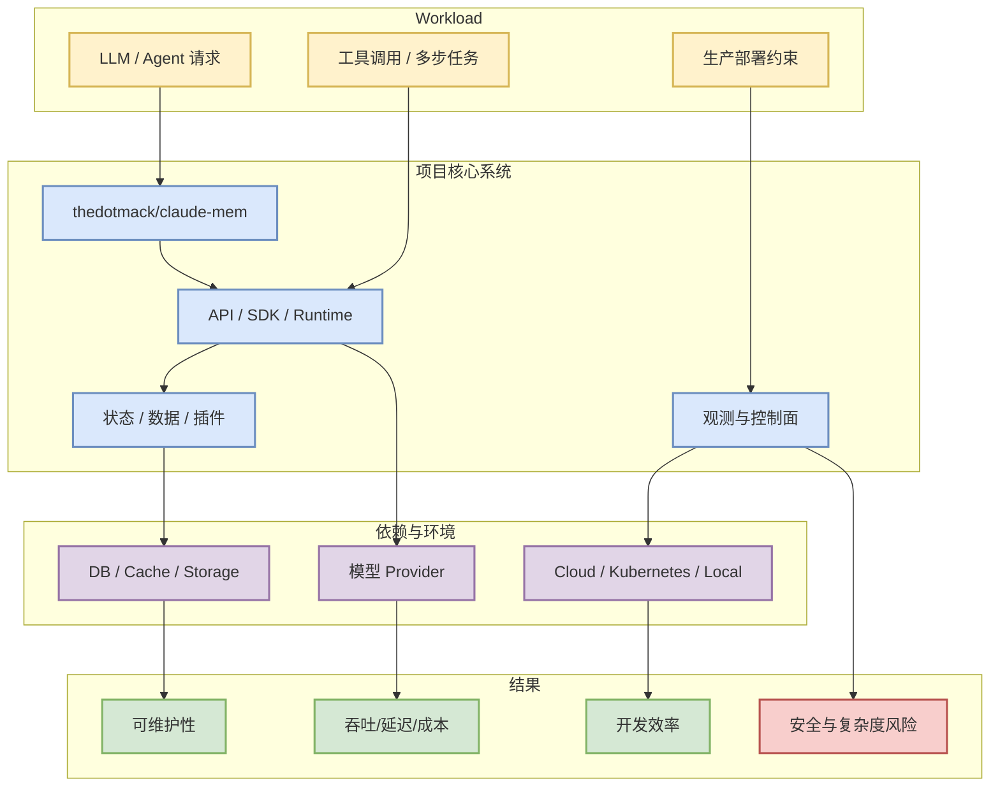
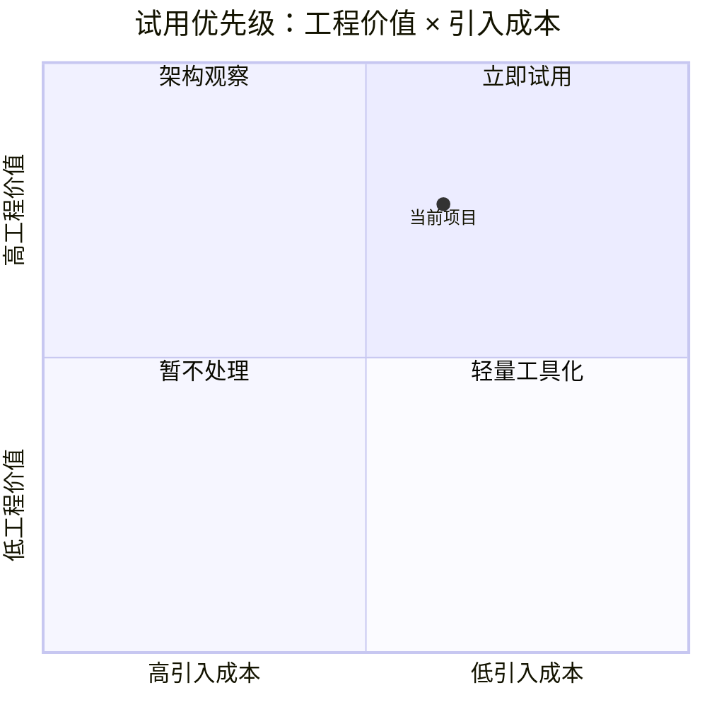

# thedotmack/claude-mem

> 类型：GitHub 项目
> 大类：GitHub
> 小类：AI Infra / Agent / LLM Tooling
> 推荐等级：可 skim
> 创建日期：2026-06-12
> 原文链接：https://github.com/thedotmack/claude-mem
> 网页详情：https://github.com/dyt27666-oss/AI-news-report-obsidians/blob/main/GitHub/thedotmack__claude_mem_2026_06_12.md
> 返回日报：[[Daily/2026-06-12]]

## 一句话结论

Persistent Context Across Sessions for Every Agent –  Captures everything your agent does during sessions, compresses it with AI, and injects relevant context back into future sessions. Works with Claude Code, OpenClaw, Codex, Gemini, Hermes, Copilot, OpenCode + More

## TL;DR

- **它是什么**：GitHub 项目 `thedotmack/claude-mem`，语言 JavaScript，stars 81839，forks 7058。
- **为什么重要**：在今日 GitHub 榜单中信号较强，主题覆盖 ai, ai-agents, ai-memory, anthropic, artificial-intelligence, chromadb, claude, claude-agent-sdk, claude-agents, claude-code, claude-code-plugin, claude-skills, embeddings, long-te。
- **和我相关的点**：可作为 agent、LLM 应用、AI gateway、serving 或数据/环境基础设施的观察样本。
- **建议动作**：先看 README、examples、release 和 benchmark；不要直接引入生产。

## 元信息

| 字段 | 内容 |
|---|---|
| repo | thedotmack/claude-mem |
| stars / forks | 81839 / 7058 |
| language | JavaScript |
| updated_at | 2026-06-12T00:56:45Z |
| pushed_at | 2026-06-11T21:29:02Z |
| stars_delta | 354 |
| topics | ai, ai-agents, ai-memory, anthropic, artificial-intelligence, chromadb, claude, claude-agent-sdk, claude-agents, claude-code, claude-code-plugin, claude-skills, embeddings, long-term-memory, mem0, memory-engine, openmemory, rag, sqlite, supermemory |
| 原文 | [GitHub](https://github.com/thedotmack/claude-mem) |
| benchmark / docs / examples / release | 需进入仓库确认；本日报仅基于 GitHub 元数据初筛 |
| 是否值得试用 | 值得观察/skim |

## 信息压缩图示

## 专业解读

这个项目的价值要从 workload 匹配度看，而不是只看 star。若它解决的是 agent memory、AI gateway、模型服务或开发工具链问题，需要重点验证：API 是否稳定、状态模型是否清晰、是否支持可观测性、是否有安全边界，以及能否和现有 Kubernetes/serving/eval pipeline 对接。

## 通俗解释

先把它当成一个可能有用的工具箱，而不是直接上生产的基础设施。

## 关键机制拆解

| 机制 | 解决的问题 | 为什么有效 | 可能的坑 |
|---|---|---|---|
| 项目核心 API | 降低接入成本 | 把常见 LLM/agent 模式封装 | 抽象泄漏 |
| 状态/插件/工具链 | 支持复杂任务 | 复用社区生态 | 权限和稳定性风险 |
| 文档与示例 | 加快试用 | 降低验证成本 | demo 与生产差距大 |

## 对我的影响

| 维度 | 影响 | 建议动作 |
|---|---|---|
| AI Infra | 观察其 runtime/control plane 设计 | 读架构和部署文档 |
| LLM 工程 | 可能影响应用层 serving 和工具调用 | 做最小 demo |
| RL / Game AI | 若支持环境/agent orchestration 可借鉴 | 暂时观察 |
| Agent / Eval | 可进入 agent 工具候选池 | 补 benchmark 检查 |

## 可信度与局限性

- 证据强度：GitHub 元数据 + star 增长，尚未源码审计。
- 局限性：未自动验证 docs/examples/release 完整性。
- 潜在风险：star 可能受传播影响，不等于生产成熟。

## 我应该如何跟进

1. 检查 README、examples、release note。
2. 判断是否有 benchmark 或真实部署案例。
3. 若与当前 infra 匹配，安排 30 分钟最小试用。

## 相关链接

- 原文：https://github.com/thedotmack/claude-mem
- 网页详情：https://github.com/dyt27666-oss/AI-news-report-obsidians/blob/main/GitHub/thedotmack__claude_mem_2026_06_12.md
- Snapshot：[[Automation/state/github-stars-2026-06-12.json]]

## 标签

#ai-radar #github #ai-infra
