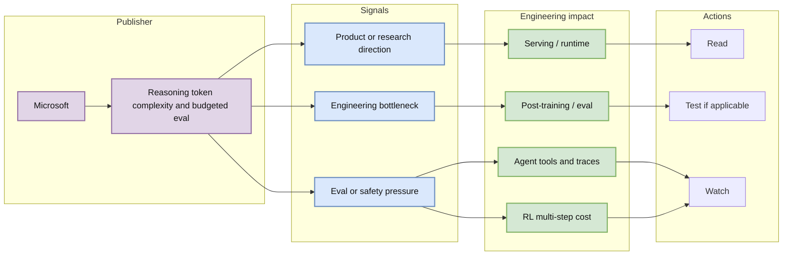
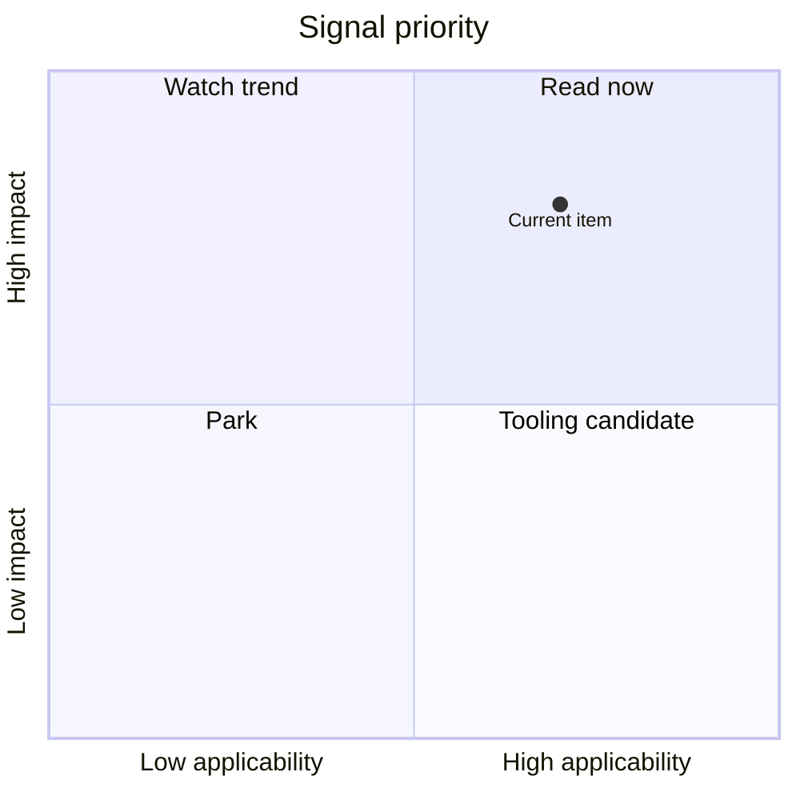

# Microsoft Reasoning about Reasoning BAPO

> Type: Industry / Research
> Company: Microsoft
> Source type: Research Publication
> Date: 2026-06-15
> Source: https://www.microsoft.com/en-us/research/publication/reasoning-about-reasoning-bapo-bounds-on-chain-of-thought-token-complexity-in-llms/
> Web: https://github.com/dyt27666-oss/AI-news-report-obsidians/blob/main/Industry/2026-06-15/Microsoft-Reasoning-about-Reasoning-BAPO.md
> Daily: [[Daily/2026-06-15]]

## One-line takeaway

Reasoning token complexity and budgeted eval; interpret it as a signal for AI infra, LLM engineering, agent eval, or serving cost control.

## TL;DR

- What it is: a company source item from Microsoft.
- Why important: it maps external signals to engineering requirements: runtime, evaluation, cost, safety, and tooling.
- Relevance: useful for AI Infra / LLM / Agent / Eval prioritization.
- Action: read source, extract measurable metrics, and add to watch list.

## Metadata

| Field | Value |
|---|---|
| Publisher | Microsoft |
| Source type | Research Publication |
| Authors/org | Microsoft |
| Published | Low-confidence unless explicitly visible in the source scan |
| Source | [original](https://www.microsoft.com/en-us/research/publication/reasoning-about-reasoning-bapo-bounds-on-chain-of-thought-token-complexity-in-llms/) |
| Code | Not found |
| PDF | Not found |

## Signal diagram

## Professional interpretation

The value is in translating the announcement into measurable engineering work. For serving, track latency, provider routing, cost, and fallback. For agents, track task success rate, trace quality, tool permission, and recovery. For post-training and RL, track whether signals can become reward, eval, or environment constraints.

## Plain explanation

This item is a directional signal. Do not copy it blindly; turn it into metrics and a small experiment.

## Mechanisms

| Mechanism | Problem | Value | Risk |
|---|---|---|---|
| Company signal | Trend ambiguity | Shows where labs invest | Marketing bias |
| Eval framing | Hard to compare systems | Creates measurable metrics | May miss hidden data |
| Infra mapping | Hard to operationalize | Converts news into tasks | Needs local validation |

## Impact on me

| Dimension | Impact | Action |
|---|---|---|
| AI Infra | Control-plane/runtime ideas | Extract measurable requirements |
| LLM Engineering | Model/eval implications | Add a small benchmark |
| RL/Game AI | Multi-step task analogy | Watch for environment signals |
| Agent/Eval | Trace and success metrics | Add to eval backlog |

## Limits

- Some sources were page scans, not full paper reads.
- Publication date may be low-confidence if not exposed in HTML.
- Requires follow-up reading.

## Links

- Source: https://www.microsoft.com/en-us/research/publication/reasoning-about-reasoning-bapo-bounds-on-chain-of-thought-token-complexity-in-llms/
- Web: https://github.com/dyt27666-oss/AI-news-report-obsidians/blob/main/Industry/2026-06-15/Microsoft-Reasoning-about-Reasoning-BAPO.md
- Daily: [[Daily/2026-06-15]]

#ai-radar #industry #ai-infra #llm #agent
