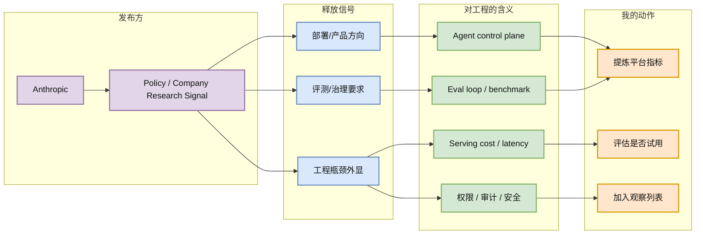
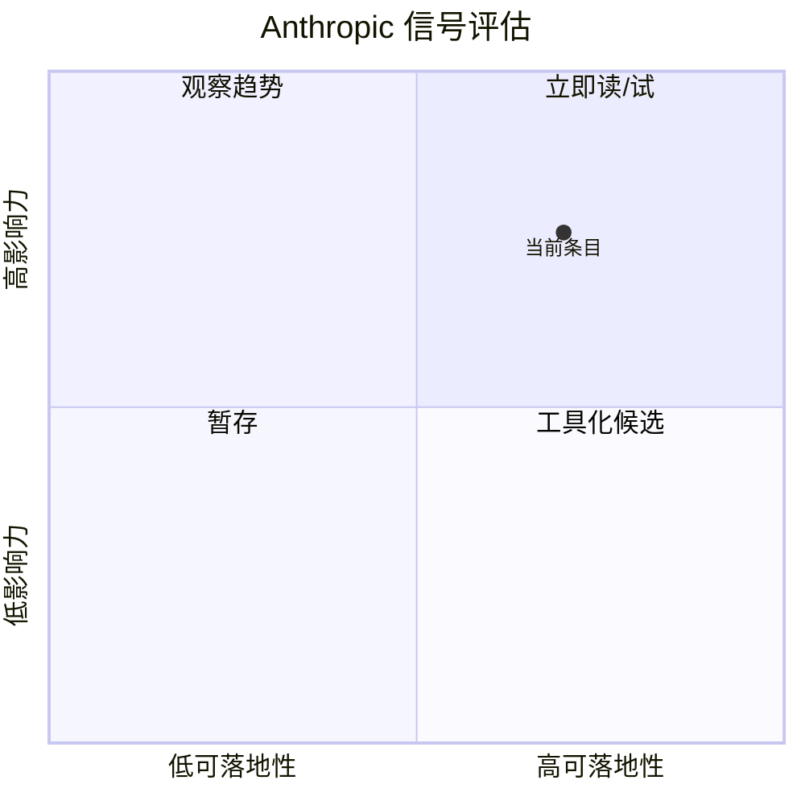

# Policy on the AI Exponential

> 类型：大厂资讯 / 工程博客
> 大类：博客
> 小类：Anthropic / Policy / Company Research Signal
> 推荐等级：可 skim
> 创建日期：2026-06-16
> 原文链接：https://www.anthropic.com/policy-on-the-ai-exponential
> 网页详情：https://github.com/dyt27666-oss/AI-news-report-obsidians/blob/main/Industry/2026-06-16/Anthropic-AI-Exponential-Policy.md
> 返回日报：[[Daily/2026-06-16]]

## 一句话结论

Policy on the AI Exponential 的核心信号是：Anthropic 继续强调 AI 能力指数级增长与治理滞后之间的张力，释放出安全评估、能力监控和政策接口的重要性。

## TL;DR

- **它是什么**：Anthropic 发布的 Policy / Company Research Signal。
- **为什么重要**：对 Agent/Eval 工程有直接信号：高能力模型上线前后的 capability eval、cyber eval、监控和可追溯性会变成平台能力。
- **和我相关的点**：它把模型能力映射到部署、评测、agent 运行时或环境标准化等工程问题。
- **建议动作**：保留原文，抽取其中可落地到 eval、serving、agent control plane 的指标。

## 元信息

| 字段 | 内容 |
|---|---|
| 发布方/来源 | Anthropic |
| 大厂/实验室 | Anthropic |
| 栏目/来源类型 | Policy / Company Research Signal |
| 作者/机构 | Anthropic |
| 发布时间 | 2026-06-10 |
| 原文 | [原文](https://www.anthropic.com/policy-on-the-ai-exponential) |
| 代码 | 未发现 |
| PDF | 未发现 |
| 标签 | #ai-radar #industry #agent #eval #ai-infra |

## 信息压缩图示

### 辅助图：影响力 × 可落地性

## 专业解读

对 Agent/Eval 工程有直接信号：高能力模型上线前后的 capability eval、cyber eval、监控和可追溯性会变成平台能力。 对 AI Infra 工程而言，这类大厂信号通常比单个 demo 更重要：它说明生产系统要补齐哪些非模型能力，例如身份与权限、数据连接器、评测回归、审计日志、成本配额和人机协作流程。若把它放到 LLM/Agent 平台架构里，关键不是“能不能调用模型”，而是能否把模型调用变成可测、可控、可回滚的服务。

## 通俗解释

可以把它理解成：大厂在告诉市场，AI 不再只是聊天窗口，而是要进入真实业务流程。进入真实流程后，最难的事情不是写 prompt，而是让系统稳定、可监管、可评估、出了错能追责。

## 关键机制拆解

| 机制 | 解决的问题 | 为什么有效 | 可能的坑 |
|---|---|---|---|
| 来源信号跟踪 | 避免只追热点项目 | 大厂发布能反映真实部署方向 | 公告可能偏 PR，细节不足 |
| Eval/治理映射 | 把博客转成工程指标 | 可沉淀到平台 checklist | 需要结合实际业务验证 |
| Agent 控制面 | 管理工具、权限和状态 | 多步任务需要可观测运行时 | 过度平台化会增加复杂度 |

## 对我的影响

| 维度 | 影响 | 建议动作 |
|---|---|---|
| AI Infra | 需要补齐部署、治理和观测能力 | 把相关指标加入平台设计文档 |
| LLM 工程 | 评测不应只看准确率，还要看稳定性和成本 | 增加 success-per-token / latency-per-success |
| RL / Game AI | 如果涉及交互环境，可借鉴环境标准化和回归测试 | 关注任务接口、奖励和可复现性 |
| Agent / Eval | 强相关：多步 agent 必须可追踪、可复现 | 建立 agent trace schema |

## 可信度与局限性

- 证据强度：中等，来自官方原文，但细节需二次验证。
- 局限性：没有完整 benchmark 或代码时，不能直接推断实际性能。
- 潜在风险：公告语言可能高估成熟度。
- 还需要确认：是否有公开技术文档、API、评测或案例。

## 我应该如何跟进

1. 阅读原文并抽取可落地指标。
2. 对照现有 agent/serving 平台检查缺口。
3. 如果涉及工具或框架，安排最小可行试用。

## 相关链接

- 原文：https://www.anthropic.com/policy-on-the-ai-exponential
- 网页详情：https://github.com/dyt27666-oss/AI-news-report-obsidians/blob/main/Industry/2026-06-16/Anthropic-AI-Exponential-Policy.md
- 相关卡片：[[Daily/2026-06-16]]

## 标签

#ai-radar #industry #ai-infra #agent #eval
