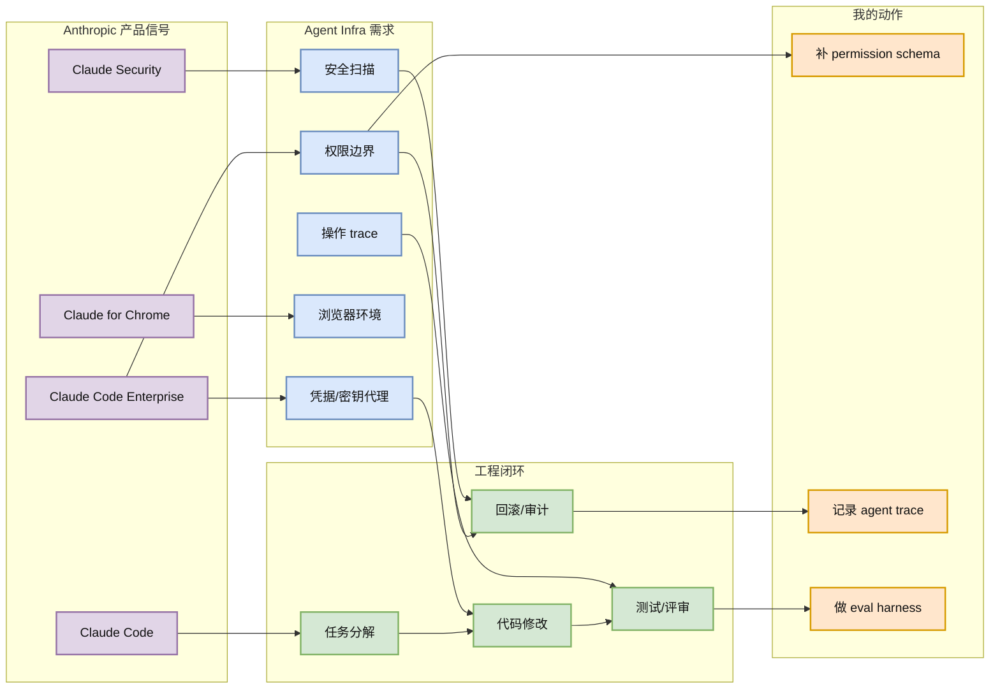
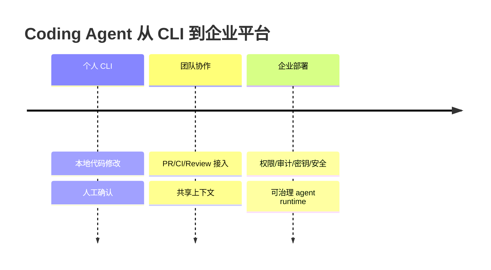

# Claude Code / Enterprise Agent 工程信号

> 类型：大厂产品/工程信号
> 大类：博客 / 资讯
> 小类：Anthropic / Coding Agent / Enterprise Agent
> 推荐等级：必读
> 创建日期：2026-06-17
> 原文链接：https://claude.com/product/claude-code
> 网页详情：https://github.com/dyt27666-oss/AI-news-report-obsidians/blob/main/Industry/2026-06-17/Anthropic-Claude-Code-Enterprise-Signal.md
> 返回日报：[[Daily/2026-06-17]]

## 一句话结论

Anthropic 页面导航中持续突出 Claude Code、Claude Code Enterprise、Claude Security 和 Claude for Chrome，说明 coding agent 正在从个人 CLI 转向企业级权限、审计、浏览器和安全工作流。

## TL;DR

- **它是什么**：本次扫描 Anthropic News 页面时，产品导航持续露出 Claude Code、Enterprise、Security、Chrome 等 agent 产品线。
- **为什么重要**：这不是单篇技术论文，但它是强产品信号：agent runtime 需要企业权限、凭据、审计、浏览器动作和安全边界。
- **和我相关的点**：用户当前的自动化/Obsidian/工具调用系统和企业 coding agent 的基础设施问题高度重合。
- **建议动作**：必读产品方向；对照自己的 agent 平台补齐 permission、credential proxy、trace、eval 和 rollback。

## 元信息

| 字段 | 内容 |
|---|---|
| 发布方/来源 | Anthropic |
| 大厂/实验室 | Anthropic |
| 栏目/来源类型 | Product / Enterprise Agent Signal |
| 作者/机构 | Anthropic |
| 发布时间 | 2026-06-17 扫描到 |
| 原文 | [Claude Code](https://claude.com/product/claude-code) |
| 代码 | 不适用 |
| PDF | 不适用 |
| 标签 | #anthropic #claude-code #agent #enterprise #ai-infra |

## 信息压缩图示

## 专业解读

Claude Code 的核心信号是 coding agent 正在产品化为企业基础设施。企业版意味着问题不再是“模型能不能写代码”，而是能不能安全地读写 repo、调用工具、使用密钥、解释行为、通过 CI、回滚错误并被审计。

这与 GitHub 增长榜上的 Hermes Agent、ECC、caveman、claude-mem、agent-vault 等项目形成同一条线：agent runtime 的下一阶段竞争点是 harness、memory、credential、trace 和 eval，而不是单个 prompt。

## 通俗解释

Coding agent 正在从“一个会写代码的聊天窗口”变成“能进入公司工程系统的自动员工”。自动员工需要门禁、工牌、工作记录和安全检查。

## 关键机制拆解

| 机制 | 解决的问题 | 为什么有效 | 可能的坑 |
|---|---|---|---|
| Enterprise 权限 | agent 不能无限制访问资源 | 最小权限和审批可控 | 配置复杂 |
| 操作 trace | 难以解释 agent 做了什么 | 方便复盘、审计、训练 eval | trace 数据可能泄密 |
| 安全产品线 | 代码/依赖/凭据风险 | 把安全嵌入开发循环 | 容易误报/阻塞 |

## 对我的影响

| 维度 | 影响 | 建议动作 |
|---|---|---|
| AI Infra | agent runtime 要有权限、密钥和审计 | 设计统一 control plane |
| LLM 工程 | coding agent eval 要接 CI 和 repo trace | 建 eval harness |
| RL / Game AI | long-horizon agent 训练也需要 trace/reward | 记录过程级状态 |
| Agent / Eval | 最直接相关 | 深读产品形态 |

## 可信度与局限性

- 证据强度：中等；来自官方产品入口和页面信号，不是技术白皮书。
- 局限性：没有公开全部企业实现细节。
- 潜在风险：产品叙事可能领先于真实能力。
- 还需要确认：权限模型、审计导出、CI/IDE/浏览器集成边界。

## 我应该如何跟进

1. 对照 Hermes/自有工作流列出 permission、credential、trace、eval 缺口。
2. 关注 agent-vault、Hermes Agent、OpenHands 的企业化能力。
3. 把 coding agent 的成功指标从“完成任务”扩展为“可审计、可回滚、低风险完成任务”。

## 相关链接

- 原文：https://claude.com/product/claude-code
- Anthropic News：https://www.anthropic.com/news
- 网页详情：https://github.com/dyt27666-oss/AI-news-report-obsidians/blob/main/Industry/2026-06-17/Anthropic-Claude-Code-Enterprise-Signal.md

## 标签

#ai-radar #anthropic #claude-code #agent #eval #ai-infra
