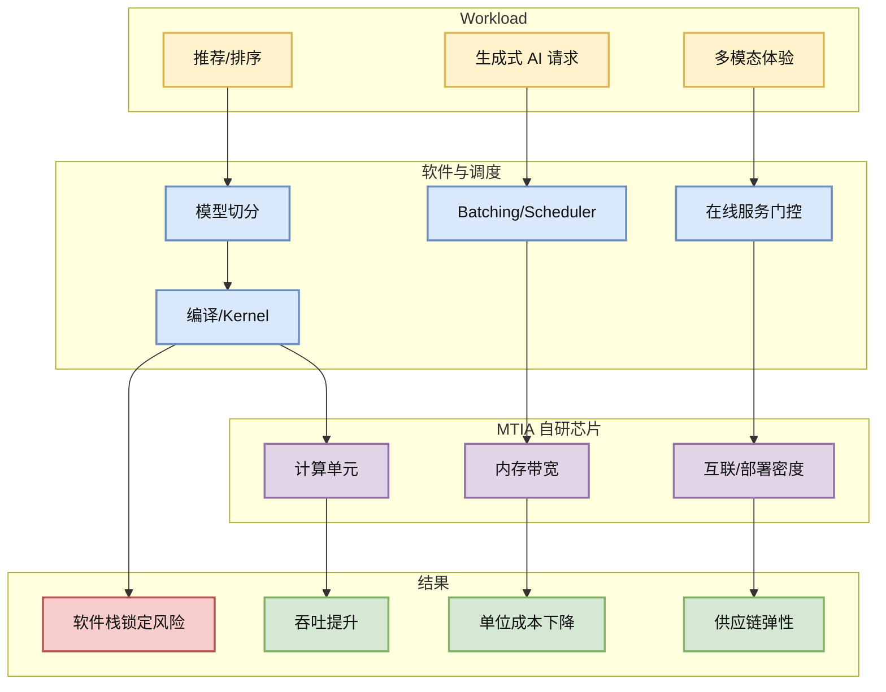

# Four MTIA Chips in Two Years: Scaling AI Experiences for Billions

> 类型：大厂博客
> 大类：博客
> 小类：Meta AI / AI Hardware Infra
> 推荐等级：可 skim
> 创建日期：2026-06-17
> 原文链接：https://ai.meta.com/blog/meta-mtia-scale-ai-chips-for-billions/
> 网页详情：https://github.com/dyt27666-oss/AI-news-report-obsidians/blob/main/Industry/2026-06-17/Meta-MTIA-Scaling-AI-Chips.md
> 返回日报：[[Daily/2026-06-17]]

## 一句话结论

Meta 的 MTIA 芯片节奏说明大厂正在把模型体验、推荐/生成式 AI workload 和自研加速器共同优化，而不是只依赖通用 GPU 扩容。

## TL;DR

- **它是什么**：Meta AI 关于 MTIA 芯片快速迭代和面向十亿级 AI 体验扩展的工程博客。
- **为什么重要**：Serving 成本、batching、模型结构和硬件能力会越来越强耦合；大厂自研硬件会改变推理优化的约束条件。
- **和我相关的点**：LLM serving 工程不能只看模型和框架，还要关注 workload partition、memory bandwidth、compiler/runtime 与在线系统配合。
- **建议动作**：可 skim；重点关注 Meta 如何描述 workload、芯片迭代速度、软件栈和在线部署边界。

## 元信息

| 字段 | 内容 |
|---|---|
| 发布方/来源 | Meta AI Blog |
| 大厂/实验室 | Meta AI |
| 栏目/来源类型 | Engineering Blog / AI Hardware |
| 作者/机构 | Meta AI |
| 发布时间 | 2026-06 扫描到 |
| 原文 | [原文](https://ai.meta.com/blog/meta-mtia-scale-ai-chips-for-billions/) |
| 代码 | 不适用 |
| PDF | 不适用 |
| 标签 | #meta-ai #mtia #ai-infra #serving #hardware |

## 信息压缩图示

| 观察点 | 对 serving 的含义 | 跟进方式 |
|---|---|---|
| 芯片快速迭代 | workload 已稳定到值得硬件化 | 关注哪些模型/算子被优化 |
| 自研软件栈 | runtime/compiler 是护城河 | 关注是否开放工具链 |
| 十亿级体验 | 成本比峰值性能更关键 | 对比 GPU 推理成本模型 |

## 专业解读

AI Infra 的未来会更像系统协同优化：模型结构、compiler、kernel、scheduler、硬件内存层次和在线产品需求共同决定性价比。MTIA 这类信号说明 Meta 不只在训练大模型，也在推理和推荐/生成式 workload 上持续做垂直整合。

对用户而言，这类博客的直接价值是提醒 serving 优化不能只停留在 vLLM/SGLang 层面；当模型进入海量在线场景，硬件特性、算子形态、批处理和流量治理会变成同一套优化问题。

## 通俗解释

Meta 在说：我们不只是买更多 GPU，而是在给自己的 AI 产品定制发动机，并且快速换代。

## 关键机制拆解

| 机制 | 解决的问题 | 为什么有效 | 可能的坑 |
|---|---|---|---|
| 自研芯片 | 通用 GPU 成本/供应受限 | 按内部 workload 优化 | 生态封闭、迁移成本高 |
| 软件栈协同 | 硬件能力难直接释放 | compiler/runtime 贴近模型 | 工程复杂度大 |
| 在线部署闭环 | 实验性能不等于产品性能 | 以真实流量优化成本 | 细节通常不公开 |

## 对我的影响

| 维度 | 影响 | 建议动作 |
|---|---|---|
| AI Infra | 强化硬件感知 serving 的重要性 | 记录硬件/运行时趋势 |
| LLM 工程 | 模型部署会受硬件约束影响 | 关注算子和内存模式 |
| RL / Game AI | 大规模仿真也可能受专用硬件影响 | 暂时观察 |
| Agent / Eval | 成本下降会放大 agent 调用量 | 估算 long-horizon agent 成本 |

## 可信度与局限性

- 证据强度：中等；官方博客可信，但性能细节可能选择性披露。
- 局限性：缺少公开 benchmark 和可复现配置。
- 潜在风险：与开源工程可直接复用的距离较远。
- 还需要确认：MTIA 对 LLM 推理、推荐模型、多模态模型分别覆盖到什么程度。

## 我应该如何跟进

1. 把 MTIA 作为大厂硬件趋势观察项。
2. 对比 NVIDIA/Google TPU/AWS Trainium 的 serving 叙事。
3. 在自有 serving 设计中保留硬件抽象层，不把调度写死到单一后端。

## 相关链接

- 原文：https://ai.meta.com/blog/meta-mtia-scale-ai-chips-for-billions/
- 网页详情：https://github.com/dyt27666-oss/AI-news-report-obsidians/blob/main/Industry/2026-06-17/Meta-MTIA-Scaling-AI-Chips.md
- 相关卡片：[[Daily/2026-06-17]]

## 标签

#ai-radar #meta-ai #ai-infra #serving #hardware
