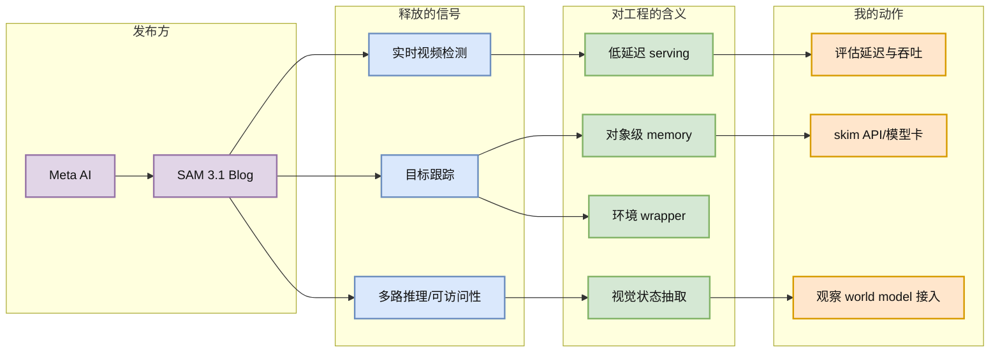
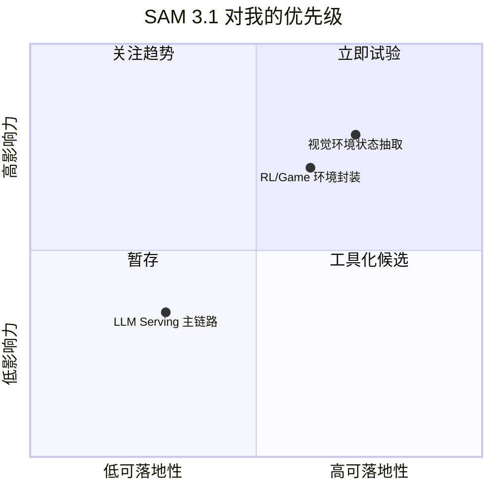

# SAM 3.1: Faster and More Accessible Real-Time Video Detection and Tracking

> 类型：大厂博客
> 大类：博客
> 小类：Meta AI / Computer Vision Infra
> 推荐等级：可 skim
> 创建日期：2026-06-17
> 原文链接：https://ai.meta.com/blog/segment-anything-model-3/
> 网页详情：https://github.com/dyt27666-oss/AI-news-report-obsidians/blob/main/Industry/2026-06-17/Meta-SAM-31-Video-Detection.md
> 返回日报：[[Daily/2026-06-17]]

## 一句话结论

SAM 3.1 的信号不是“又一个分割模型”，而是 Meta 继续把视觉感知能力做成可部署、可交互、可实时化的基础模型组件。

## TL;DR

- **它是什么**：Meta AI 关于 SAM 3.1 的产品/研究博客，强调实时视频检测、跟踪、多路推理和更易访问的部署形态。
- **为什么重要**：多模态 agent、机器人、游戏世界模型都需要稳定的视觉状态抽取层；实时分割/跟踪会影响下游环境建模和动作决策。
- **和我相关的点**：如果做 RL 游戏模型或 agent 环境，视觉状态压缩、对象持久 ID、低延迟推理都会成为环境 wrapper 的核心能力。
- **建议动作**：可 skim；重点看模型延迟、视频 tracking API、许可证、能否接入现有数据管线。

## 元信息

| 字段 | 内容 |
|---|---|
| 发布方/来源 | Meta AI Blog |
| 大厂/实验室 | Meta AI |
| 栏目/来源类型 | AI Research / Product Blog |
| 作者/机构 | Meta AI |
| 发布时间 | 2026-06 扫描到 |
| 原文 | [原文](https://ai.meta.com/blog/segment-anything-model-3/) |
| 代码 | 未在本次扫描中确认 |
| PDF | 不适用 |
| 标签 | #meta-ai #sam #vision #world-model #ai-infra |

## 信息压缩图示

## 专业解读

SAM 系列的价值在于把视觉分割从离线标注能力转成可复用的感知 primitive。SAM 3.1 如果强化实时视频检测和跟踪，就意味着下游系统可以用对象级状态替代高维像素帧：对象、mask、轨迹、置信度和时间连续性可以进入 agent memory 或 RL environment state。

对 AI Infra 来说，关键不是单次精度，而是吞吐、尾延迟、批处理策略、视频流状态缓存和跨帧一致性。对 RL/Game AI 来说，它可作为 environment wrapper 的视觉层，把复杂场景变成对象图或事件流。

## 通俗解释

可以把它理解成“给视频装一个稳定的物体雷达”：不只是看见画面里有什么，还要持续知道同一个东西在后续帧里去了哪里。

## 关键机制拆解

| 机制 | 解决的问题 | 为什么有效 | 可能的坑 |
|---|---|---|---|
| 实时分割 | 像素级状态太重 | 压缩成对象/mask | GPU 成本和尾延迟不明 |
| 视频跟踪 | 单帧结果无法形成状态 | 跨帧 ID 让 agent 可记忆 | 遮挡、快速运动会漂移 |
| 可部署接口 | 研究模型难接工程链路 | 方便接入标注、检索、环境 | 许可证/模型大小需要确认 |

## 对我的影响

| 维度 | 影响 | 建议动作 |
|---|---|---|
| AI Infra | 可能需要视频推理队列和状态缓存 | 观察 API 与模型尺寸 |
| LLM 工程 | 多模态 agent 可用它形成视觉上下文 | 暂不主线投入 |
| RL / Game AI | 可用于对象级环境状态抽取 | 做小样例评估 |
| Agent / Eval | 视觉任务评测可加入跟踪一致性 | 关注 benchmark |

## 可信度与局限性

- 证据强度：中等；来自 Meta 官方博客，但本次未深读技术报告。
- 局限性：缺少本地 benchmark、延迟和成本数据。
- 潜在风险：视觉模型热度高但与 LLM serving 主线距离较远。
- 还需要确认：代码、模型权重、许可证、视频场景 benchmark。

## 我应该如何跟进

1. 查看是否有可下载权重和 demo。
2. 对一段游戏/机器人视频做对象轨迹抽取试验。
3. 评估是否能输出给 graph memory 或 world model pipeline。

## 相关链接

- 原文：https://ai.meta.com/blog/segment-anything-model-3/
- 网页详情：https://github.com/dyt27666-oss/AI-news-report-obsidians/blob/main/Industry/2026-06-17/Meta-SAM-31-Video-Detection.md
- 相关卡片：[[Daily/2026-06-17]]

## 标签

#ai-radar #meta-ai #vision #world-model #rl
