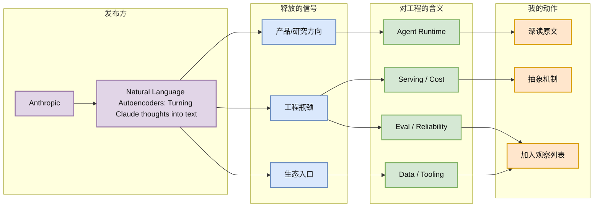
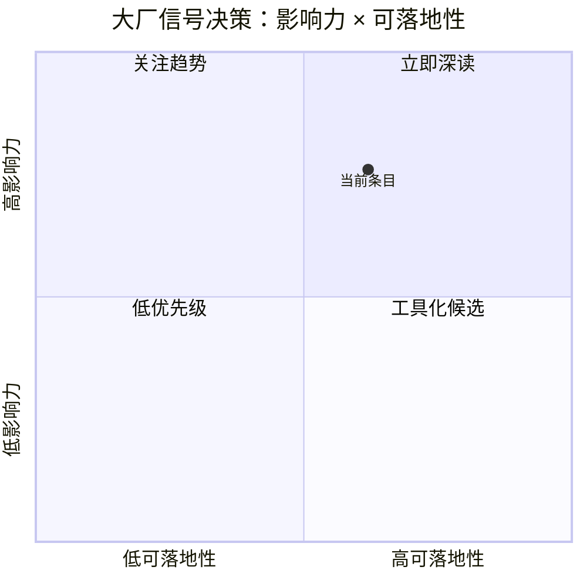

# Natural Language Autoencoders: Turning Claude thoughts into text

> 类型：大厂博客 / Research
> 大类：博客
> 小类：Anthropic / AI Infra
> 推荐等级：可 skim
> 创建日期：2026-06-18
> 原文链接：https://www.anthropic.com/research
> 网页详情：https://github.com/dyt27666-oss/AI-news-report-obsidians/blob/main/Industry/2026-06-18/Anthropic-Natural-Language-Autoencoders.md
> 返回日报：[[Daily/2026-06-18]]

## 一句话结论

Anthropic Research 首页显示把 Claude 的 thought 表征转成自然语言的可解释性信号。

## TL;DR

- **它是什么**：Anthropic 的 Research 信号。
- **为什么重要**：这对 agent/eval 很重要：如果模型内部状态可以被压缩成可读文本，未来调试、奖励建模、policy audit 和失败归因会更接近工程可操作对象。
- **和我相关的点**：判断它对 agent runtime、LLM serving、training/post-training 或 eval pipeline 的工程启发。
- **建议动作**：补读原文，重点看方法是否能用于 rollout trace 解释与 reward hacking 诊断。

## 元信息

| 字段 | 内容 |
|---|---|
| 发布方/来源 | Anthropic |
| 大厂/实验室 | Anthropic |
| 栏目/来源类型 | Research |
| 作者/机构 | Anthropic |
| 发布时间 | 2026-06-18 抓取到的首页/栏目最新信号，具体发布日期需原文确认 |
| 原文 | [原文](https://www.anthropic.com/research) |
| 代码 | 未发现 |
| PDF | 未发现 |
| 标签 | #ai-radar #industry #agent #ai-infra |

## 信息压缩图示

## 专业解读

这对 agent/eval 很重要：如果模型内部状态可以被压缩成可读文本，未来调试、奖励建模、policy audit 和失败归因会更接近工程可操作对象。 对 AI Infra 工程师来说，关键不是新闻本身，而是它暴露的系统抽象：数据如何进入、任务如何被拆分、运行状态如何被评估、成本和延迟如何被约束、失败如何恢复。

## 通俗解释

这类大厂信号相当于风向标：它不一定马上提供可用代码，但会告诉我们平台团队正在把工程资源投向哪里。

## 关键机制拆解

| 机制 | 解决的问题 | 为什么有效 | 可能的坑 |
|---|---|---|---|
| 研究/产品信号 | 判断资源投入方向 | 大厂发布通常对应内部路线 | 首页抓取可能遗漏细节 |
| 工程瓶颈映射 | 把新闻转成可行动问题 | 能指导 infra/eval/backlog | 需要原文和实验验证 |
| 跟进路径 | 形成 watchlist | 避免被一次性新闻淹没 | 需要定期复扫 |

## 对我的影响

| 维度 | 影响 | 建议动作 |
|---|---|---|
| AI Infra | 提供平台抽象和可靠性信号 | 补读原文，重点看方法是否能用于 rollout trace 解释与 reward hacking 诊断。 |
| LLM 工程 | 观察模型能力如何产品化 | 补读原文 |
| RL / Game AI | 间接相关，关注评估/环境/工具链 | 暂存 |
| Agent / Eval | 关注工具、记忆、评估和权限边界 | 加入观察 |

## 可信度与局限性

- 证据强度：来自官方栏目抓取；部分页面未获取完整正文。
- 局限性：发布日期和细节需打开原文确认。
- 潜在风险：官方发布偏战略叙事，工程细节可能不足。

## 我应该如何跟进

1. 打开原文确认日期、作者、正文和相关链接。
2. 搜索是否有对应论文、代码、release 或 benchmark。
3. 若与当前工作流相关，整理成 Concepts 卡片或实验任务。

## 相关链接

- 原文：https://www.anthropic.com/research
- 网页详情：https://github.com/dyt27666-oss/AI-news-report-obsidians/blob/main/Industry/2026-06-18/Anthropic-Natural-Language-Autoencoders.md
- 相关卡片：[[Daily/2026-06-18]]

## 标签

#ai-radar #industry #ai-infra #agent
