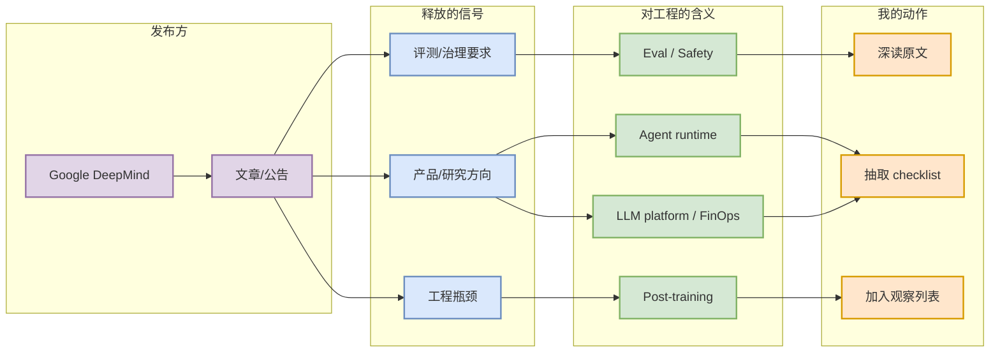

# Securing the future of AI agents

## 一句话结论
DeepMind 将 AI agent 安全显式落到 control roadmap、实时监控和内部系统防护，适合作为 agent runtime 安全架构参考。

## TL;DR
- 发布方/大厂：Google DeepMind
- 栏目/来源类型：Blog / Agent Safety
- 原文：https://deepmind.google/blog/securing-the-future-of-ai-agents/
- 对用户画像的价值：把公司信号映射到 AI Infra、LLM 工程、Agent Eval 或 Post-training 的实际动作。

## 元信息
| 字段 | 值 |
|---|---|
| 发布方/大厂 | Google DeepMind |
| 栏目/来源类型 | Blog / Agent Safety |
| 发布时间 | 2026-06-18/近期 RSS |
| 原文链接 | [原文](https://deepmind.google/blog/securing-the-future-of-ai-agents/) |
| 返回日报 | [[Daily/2026-06-19]] |

## 信息压缩图示

## 专业解读
DeepMind 将 AI agent 安全显式落到 control roadmap、实时监控和内部系统防护，适合作为 agent runtime 安全架构参考。 对 AI Infra 工程师的重点不在新闻本身，而在它暴露出的平台能力边界：成本治理、agent 安全、评测可迁移性、小模型 agent 体验或微调方法迭代，都会影响后续系统设计。

## 通俗解释
这条信息说明大厂正在把“能 demo 的 AI”推进到“能被企业、研究团队或工程团队稳定使用和评估的 AI”。

## 关键机制拆解
| 层级 | 关注点 | 可转化动作 |
|---|---|---|
| 产品/研究信号 | 发布方强调的能力 | 判断方向是否进入主流路线 |
| 工程约束 | 成本、安全、评测、延迟 | 转化为内部 checklist |
| 生态影响 | 是否改变工具链 | 决定是否试用/跟踪 |

## 对我的影响
如果后续要做 agent workflow、research automation、LLM 平台治理或 post-training 实验，应把这条作为需求输入，而不是只作为资讯阅读。

## 可信度与局限性
来自官方/公司渠道，可信度较高但有产品叙事偏差；本次 cron 主要基于 RSS/公开页面元数据，未完整抓取全文。

## 我应该如何跟进
1. 深读原文并抽取可执行 checklist。
2. 对照现有 AI Radar / Hermes / serving / post-training 工作流寻找可落地点。
3. 若涉及 benchmark 或开源工具，后续补一次源码/实验复现。

## 相关链接
- 原文：[Securing the future of AI agents](https://deepmind.google/blog/securing-the-future-of-ai-agents/)
- 返回日报：[[Daily/2026-06-19]]

#ai-radar #industry #ai-infra #llm #agent
