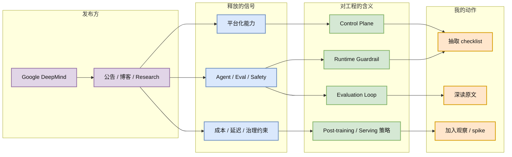

# DiffusionGemma: 4x faster text generation

## 一句话结论
Diffusion-based text generation 主打更快生成，提示非自回归/扩散语言模型路线在 serving 延迟上仍值得观察。

## TL;DR
- 发布方/大厂：Google DeepMind
- 栏目/来源类型：Blog / Research / Model Architecture
- 推荐等级：可 skim
- 对我相关：短期未必替代主流 LLM serving，但对 batch scheduling、latency/cost tradeoff 和 speculative-like 解码路线有参考价值。

## 元信息
| 字段 | 值 |
|---|---|
| 发布方/大厂 | Google DeepMind |
| 栏目/来源类型 | Blog / Research / Model Architecture |
| 作者/机构 | Google DeepMind |
| 发布时间 | 近期 RSS |
| 原文链接 | [原文](https://deepmind.google/blog/) |
| 网页详情 | [GitHub](https://github.com/dyt27666-oss/AI-news-report-obsidians/blob/main/Industry/2026-06-20/DeepMind-DiffusionGemma.md) |
| 返回日报 | [[Daily/2026-06-20]] |

## 信息压缩图示

### 辅助结构：影响矩阵
| 维度 | 信号 | 对我的动作 |
|---|---|---|
| AI Infra | Diffusion-based text generation 主打更快生成，提示非自回归/扩散语言模型路线在 serving 延迟上仍值得观察。 | 抽取平台需求和监控指标 |
| LLM 工程 | 短期未必替代主流 LLM serving，但对 batch scheduling、latency/cost tradeoff 和 speculative-like 解码路线有参考价值。 | 检查是否影响 serving / eval / post-training 流程 |
| Agent / Eval | 关注工具调用、失败恢复、安全边界 | 加入 agent runtime checklist |
| RL / Game AI | 若涉及推理预算或评测，可迁移到 rollout/eval | 暂存为方法参考 |

## 专业解读
Diffusion-based text generation 主打更快生成，提示非自回归/扩散语言模型路线在 serving 延迟上仍值得观察。 它的价值不在新闻标题本身，而在公司把哪些能力当作“生产级 AI”的必要部件：成本治理、agent safety、自有工具链评测、低成本模型体验或 PEFT 效率，都会影响后续 AI Infra 的控制面和数据面设计。

## 通俗解释
这条信息说明大厂正在把“能 demo 的模型”推进到“能被企业、工程团队和自动化 agent 稳定使用、度量和治理的系统”。

## 关键机制拆解
| 机制 | 解决的问题 | 为什么有效 | 可能的坑 |
|---|---|---|---|
| 来源信号归因 | 判断是不是强相关新项 | 大厂公开博客反映资源投入方向 | 可能有产品叙事偏差 |
| 工程约束抽取 | 把新闻转成需求 | 成本、安全、评测、延迟都能落到系统设计 | 需要原文细读和二次验证 |
| 行动映射 | 避免只收藏不行动 | 转成 checklist / spike / watchlist | 当天抓取可能缺全文细节 |

## 对我的影响
| 维度 | 影响 | 建议动作 |
|---|---|---|
| AI Infra | 短期未必替代主流 LLM serving，但对 batch scheduling、latency/cost tradeoff 和 speculative-like 解码路线有参考价值。 | 把相关指标加入平台设计检查表 |
| LLM 工程 | 可用于 eval/serving/post-training 的需求输入 | 深读后抽取可执行项 |
| RL / Game AI | 可迁移其中的评测和治理思路 | 仅保留强相关部分 |
| Agent / Eval | 直接影响 tool use、runtime、monitoring | 优先纳入 agent harness 设计 |

## 可信度与局限性
- 证据强度：公司官方来源，方向可信，但包含产品/公关叙事。
- 局限性：本次 cron 主要基于 RSS/公开元数据，未做源码或完整实验复现。
- 还需要确认：是否有论文、代码、benchmark 或更详细的 technical appendix。

## 我应该如何跟进
1. 深读原文，提炼 3-5 条可执行 checklist。
2. 对照当前 AI Radar / Hermes / serving / post-training 工作流找落地点。
3. 若有开源工具或 benchmark，安排一次短 spike。

## 相关链接
- 原文：[DiffusionGemma: 4x faster text generation](https://deepmind.google/blog/)
- 网页详情：https://github.com/dyt27666-oss/AI-news-report-obsidians/blob/main/Industry/2026-06-20/DeepMind-DiffusionGemma.md
- 返回日报：[[Daily/2026-06-20]]

#ai-radar #industry #ai-infra #llm #agent
