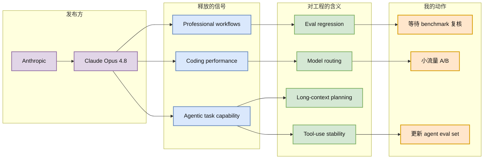

# Anthropic：Claude Opus 4.8 与 agentic tasks 信号

> 类型：大厂/产品公告  
> 大类：博客  
> 小类：Agentic Coding / Model Release / Alignment  
> 推荐等级：后续  
> 创建日期：2026-06-22  
> 原文链接：https://www.anthropic.com/news/claude-opus-4-8  
> 网页详情：https://github.com/dyt27666-oss/AI-news-report-obsidians/blob/main/Industry/2026-06-22/anthropic-claude-opus-4-8.md  
> 返回日报：[[Daily/2026-06-22]]

## 一句话结论

Anthropic 的 Claude Opus 4.8 候选公告继续强化“coding + agentic tasks”是前沿闭源模型竞争的核心战场。

## TL;DR

- **它是什么**：Anthropic News 页面候选条目，标题显示 Opus class 模型升级，强调 coding、agentic tasks、professional work。
- **为什么重要**：coding agent 能力是模型真实工具使用、长上下文规划和错误恢复能力的综合测试。
- **和我相关的点**：如果你维护 agent/coding workflow，需要跟踪模型路由、成本、工具调用稳定性和 benchmark 漂移。
- **建议动作**：低置信保存；等待完整正文和 benchmark 后再决定是否更新默认 coding agent 模型。

## 元信息

| 字段 | 内容 |
|---|---|
| 发布方/来源 | Anthropic |
| 大厂/实验室 | Anthropic |
| 栏目/来源类型 | News / Product Announcement |
| 作者/机构 | Anthropic |
| 发布时间 | 2026-05-28（页面候选文本） |
| 原文 | [原文](https://www.anthropic.com/news/claude-opus-4-8) |
| 代码 | 不适用 |
| PDF | 不适用 |
| 标签 | Claude, coding agent, agentic tasks |

## 信息压缩图示

### 辅助结构：coding agent 评估项

| 维度 | 看什么 | 为什么 |
|---|---|---|
| Patch correctness | 生成补丁能否通过测试 | coding agent 最基本指标 |
| Tool-call stability | 是否正确读文件、跑测试、处理错误 | 反映 agentic task 能力 |
| Long-horizon planning | 多文件、多步骤任务是否保持目标 | 影响真实工程任务完成率 |
| Cost/latency | 单任务 token 和耗时 | 决定是否可日常使用 |

## 专业解读

Anthropic 将 Opus class 模型的升级描述为 coding 和 agentic tasks 增强，说明闭源模型在工程任务上的差异化仍然明显。Coding agent 是一个综合 benchmark：模型要理解代码、规划修改、调用工具、处理测试失败、遵守约束，并在多轮对话中保持一致性。对平台方来说，这会影响模型路由、fallback、上下文缓存和成本控制。

但这条目前属于低置信候选：本轮只从新闻列表抓到摘要级文本，没有完整 benchmark。应该将其纳入观察，而不是立即切换生产模型。

## 通俗解释

这条消息可以理解为 Anthropic 又升级了最强模型，��说它更会写代码、更会做需要多步行动的任务。真正要看的是：它在你的任务里是不是更稳定、更便宜、更少犯工具调用错误。

## 关键机制拆解

| 机制 | 解决的问题 | 为什么有效 | 可能的坑 |
|---|---|---|---|
| Coding benchmark | 衡量工程任务能力 | 比纯问答更贴近工作流 | benchmark 可能和真实任务不一致 |
| Agentic task eval | 测工具调用和多步规划 | 覆盖真实 agent 行为 | 难以复现和归因 |
| Model routing | 不同任务用不同模型 | 控制成本与质量 | 路由策略需要持续更新 |

## 对我的影响

| 维度 | 影响 | 建议动作 |
|---|---|---|
| AI Infra | 需要支持多模型路由和 A/B | 记录任务级质量/成本 |
| LLM 工程 | coding 能力升级可能改变默认模型 | 用本地 eval set 复测 |
| RL / Game AI | agentic benchmark 可借鉴到游戏 agent | 关注长链路任务评估 |
| Agent / Eval | 需要更新 coding agent eval | 加入工具调用失败恢复用例 |

## 可信度与局限性

- 证据强度：页面候选文本可信，但未完整抓正文。
- 局限性：缺少 benchmark、价格、上下文长度、API 限制信息。
- 潜在风险：模型发布宣传可能高估真实工程收益。
- 还需要确认：具体 eval、API 可用性和成本。

## 我应该如何跟进

1. 打开原文和 release notes，记录 benchmark 与价格。
2. 用固定 coding agent eval set 对比当前默认模型。
3. 如果收益明显，再小流量切换模型路由。

## 相关链接

- 原文：https://www.anthropic.com/news/claude-opus-4-8
- Anthropic Research 相关：https://www.anthropic.com/research/teaching-claude-why
- 网页详情：https://github.com/dyt27666-oss/AI-news-report-obsidians/blob/main/Industry/2026-06-22/anthropic-claude-opus-4-8.md
- 相关卡片：[[Daily/2026-06-22]]

## 标签

#ai-radar #anthropic #claude #agent #coding
