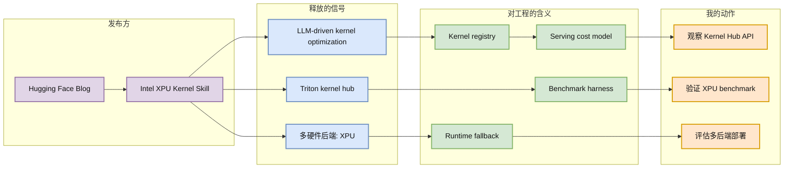

# Hugging Face：Intel XPU Kernel Skill

> 类型：大厂/工程博客  
> 大类：博客  
> 小类：Kernel / Triton / Inference Infra  
> 推荐等级：可 skim  
> 创建日期：2026-06-22  
> 原文链接：https://huggingface.co/blog/danf/intel-xpu-kernels-skill  
> 网页详情：https://github.com/dyt27666-oss/AI-news-report-obsidians/blob/main/Industry/2026-06-22/huggingface-intel-xpu-kernel-skill.md  
> 返回日报：[[Daily/2026-06-22]]

## 一句话结论

Hugging Face blog 的 Intel XPU Kernel Skill 信号表明，LLM-driven Triton kernel optimization 正从 CUDA 单一中心走向多硬件后端。

## TL;DR

- **它是什么**：Hugging Face Blog 候选条目，主题是 Intel XPU Kernel Skill 与 Hugging Face Kernel Hub 的 Triton kernel 优化。
- **为什么重要**：推理服务成本越来越依赖 kernel 级优化，多后端硬件会要求统一 benchmark、选择和 fallback。
- **和我相关的点**：Serving 系统未来不能只抽象模型和 runtime，还要抽象 kernel registry、硬件能力、性能画像。
- **建议动作**：关注 Kernel Hub 的接口、benchmark 格式和是否能接入自己的 serving 编排。

## 元信息

| 字段 | 内容 |
|---|---|
| 发布方/来源 | Hugging Face |
| 大厂/实验室 | Hugging Face / Intel 生态 |
| 栏目/来源类型 | Blog / Technical Blog |
| 作者/机构 | danf / Hugging Face blog 页面候选 |
| 发布时间 | 页面显示约 5 days ago，本轮未解析精确日期 |
| 原文 | [原文](https://huggingface.co/blog/danf/intel-xpu-kernels-skill) |
| 代码 | 未确认 |
| PDF | 不适用 |
| 标签 | kernel, Triton, XPU, inference |

## 信息压缩图示

### 辅助结构：Serving 落地影响矩阵

| 层级 | 变化 | 风险 | 应对 |
|---|---|---|---|
| Kernel | 自动生成/调优成为常态 | benchmark 不可比 | 固定输入分布和硬件环境 |
| Runtime | CUDA 之外的 XPU 后端进入视野 | fallback 行为复杂 | runtime capability registry |
| Scheduler | 不同 kernel 性能差异影响 batch 决策 | 调度策略失真 | 将 kernel profile 输入 scheduler |
| 成本 | 多硬件可降低供应锁定 | 维护成本上升 | 做端到端成本模型 |

## 专业解读

Kernel 优化正在从专家手写 CUDA/Triton 逐步转向自动化生成、搜索和验证。对于 LLM serving，attention、GEMM、sampling、quantization kernel 的选择直接影响吞吐、延迟和成本。如果 Hugging Face Kernel Hub 能形成统一的 kernel artifact + benchmark metadata，那么 serving 平台可以像选择模型一样选择 kernel。

Intel XPU 的信号尤其重要：多硬件后端意味着 infra 层不能默认 CUDA 是唯一目标。调度器、监控、benchmark、回滚策略都要理解硬件能力差异。这里最值得关注的不是单个 kernel 的速度，而是 ecosystem 是否提供可重复、可比较、可回滚的优化闭环。

## 通俗解释

模型推理像开车，kernel 是发动机里的关键零件。以前很多零件只为 NVIDIA/CUDA 打磨；现在 Hugging Face 和 Intel 的方向是在更多硬件上自动打磨这些零件，让同一个模型有机会在不同芯片上跑得更快更便宜。

## 关键机制拆解

| 机制 | 解决的问题 | 为什么有效 | 可能的坑 |
|---|---|---|---|
| LLM-driven kernel optimization | 手写 kernel 成本高 | 自动生成和迭代候选实现 | 生成结果可能只适配窄输入 |
| Kernel Hub | 优化成果难复用 | 统一发布和发现 kernel | 元数据不全会导致误用 |
| XPU support | CUDA 依赖过强 | 扩大硬件选择 | 编译链和 runtime 差异复杂 |

## 对我的影响

| 维度 | 影响 | 建议动作 |
|---|---|---|
| AI Infra | kernel registry 可能成为 serving control plane 的组成部分 | 跟踪 Kernel Hub schema |
| LLM 工程 | benchmark 要下沉到 kernel/input shape 层 | 建立 representative workload |
| RL / Game AI | 大量 rollout 推理成本受 kernel 性能影响 | 评估非 CUDA 加速选项 |
| Agent / Eval | agent workload shape 更碎片化 | 分开测长上下文、短请求和工具调用场景 |

## 可信度与局限性

- 证据强度：来自 Hugging Face blog 页面候选，原文链接有效但本轮未完整抓取正文。
- 局限性：没有完整 benchmark 数字。
- 潜在风险：XPU 生态成熟度、kernel correctness、跨版本兼容性。
- 还需要确认：Kernel Hub 是否提供标准 benchmark、CI、回滚和安全校验。

## 我应该如何跟进

1. 打开原文复核 benchmark 与安装方式。
2. 找到 Kernel Hub 的 artifact 格式和 API。
3. 用一个固定 attention/GEMM shape 对比 CUDA、XPU、CPU fallback。

## 相关链接

- 原文：https://huggingface.co/blog/danf/intel-xpu-kernels-skill
- 网页详情：https://github.com/dyt27666-oss/AI-news-report-obsidians/blob/main/Industry/2026-06-22/huggingface-intel-xpu-kernel-skill.md
- 相关卡片：[[Daily/2026-06-22]]

## 标签

#ai-radar #huggingface #kernel #triton #inference #ai-infra
