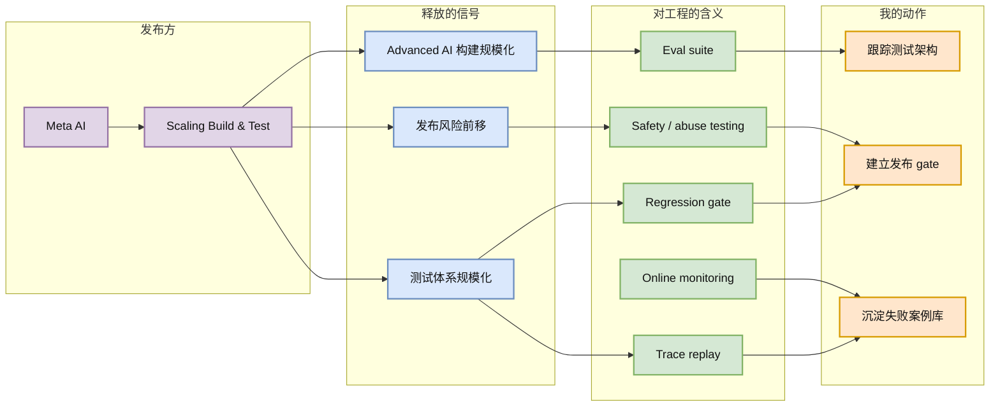

# Meta AI：Scaling How We Build and Test Our Most Advanced AI

> 类型：大厂/工程博客  
> 大类：博客  
> 小类：大厂工程化 / Evaluation / Model Shipping  
> 推荐等级：可 skim  
> 创建日期：2026-06-22  
> 原文链接：https://ai.meta.com/blog/scaling-how-we-build-test-advanced-ai/  
> 网页详情：https://github.com/dyt27666-oss/AI-news-report-obsidians/blob/main/Industry/2026-06-22/meta-scaling-advanced-ai-testing.md  
> 返回日报：[[Daily/2026-06-22]]

## 一句话结论

Meta 的 advanced AI build/test 信号说明大厂竞争不只在模型参数和训练算力，也在大规模测试、发布 gate 和回归防线。

## TL;DR

- **它是什么**：Meta AI Blog 候选文章，主题是如何规模化构建和测试先进 AI。
- **为什么重要**：模型越强，发布前 eval、safety、regression 和产品场景测试越像基础设施，而不是 QA 附属流程。
- **和我相关的点**：AI Infra 工程师需要把 eval pipeline、offline/online gate、trace replay 和红队结果纳入模型发布系统。
- **建议动作**：把它作为大厂 eval infra 方向观察项，等待完整正文复核后补充具体机制。

## 元信息

| 字段 | 内容 |
|---|---|
| 发布方/来源 | Meta AI |
| 大厂/实验室 | Meta AI |
| 栏目/来源类型 | Blog / Engineering Research |
| 作者/机构 | Meta AI |
| 发布时间 | 本轮未解析精确日期 |
| 原文 | [原文](https://ai.meta.com/blog/scaling-how-we-build-test-advanced-ai/) |
| 代码 | 不适用 |
| PDF | 不适用 |
| 标签 | eval, testing, model shipping, ai infra |

## 信息压缩图示

### 辅助结构：发布 gate 分层

| 层级 | 目标 | 典型指标 | Infra 要求 |
|---|---|---|---|
| Offline eval | 训练后筛选 checkpoint | benchmark、domain eval、safety eval | 可复现数据集与版本化结果 |
| Trace replay | 防止线上回归 | 历史请求成功率、延迟、成本 | 真实流量采样和脱敏 |
| Red-team | 找滥用/越狱风险 | jailbreak rate、policy violation | 攻击样本库和人工审查 |
| Online gate | 小流量灰度 | 用户指标、错误率、成本 | 路由、回滚、监控 |

## 专业解读

当模型能力进入 advanced AI 阶段，测试规模化本身就是训练/推理平台的一部分。大厂需要持续比较多个 checkpoint、多个模型版本、多个产品场景和大量 safety policy。这个过程依赖统一的 eval data registry、自动化 runner、trace replay、评分器、报表和发布 gate。

对 AI Infra 来说，关键不是“跑 benchmark”，而是把 benchmark 变成能阻止坏模型上线的控制面。模型发布系统应该能回答：这个版本在哪���任务退步了、哪些安全策略更差了、哪些用户场景成本上升了、是否可以灰度、出了问题如何回滚。

## 通俗解释

训练出强模型只是第一步。Meta 这类公司真正难的是：每天很多模型版本都在变，怎么保证新模型不会在重要场景变差、不会更危险、不会成本暴涨。这需要像软件 CI 一样的模型测试流水线。

## 关键机制拆解

| 机制 | 解决的问题 | 为什么有效 | 可能的坑 |
|---|---|---|---|
| Eval suite | 单点 benchmark 不够 | 多维度覆盖能力和安全 | eval 可能被污染或过拟合 |
| Regression gate | 新版本可能局部退步 | 自动阻止坏版本上线 | 阈值过严影响迭代速度 |
| Trace replay | 离线数据不贴近真实流量 | 用历史请求复现真实场景 | 隐私和脱敏复杂 |

## 对我的影响

| 维度 | 影响 | 建议动作 |
|---|---|---|
| AI Infra | eval runner 和 release gate 是平台必需品 | 设计模型发布 checklist |
| LLM 工程 | checkpoint 选择要结合能力、安全、成本 | 固化多指标评分表 |
| RL / Game AI | RL 训练容易 benchmark overfit | 加入 held-out environment 和 replay |
| Agent / Eval | agent 行为测试需要轨迹级指标 | 记录 tool-call trajectory |

## 可信度与局限性

- 证据强度：来自 Meta AI blog 页面候选标题，原文链接有效但未完整抓取正文。
- 局限性：缺少具体架构与指标细节。
- 潜在风险：大厂流程不一定直接适合小团队。
- 还需要确认：Meta 是否披露具体 eval stack、工具和组织流程。

## 我应该如何跟进

1. 原文可访问后复核具体机制。
2. 对自己的模型/agent 发布流程画出 gate 图。
3. 把历史失败 case 做成 replay set。

## 相关链接

- 原文：https://ai.meta.com/blog/scaling-how-we-build-test-advanced-ai/
- 网页详情：https://github.com/dyt27666-oss/AI-news-report-obsidians/blob/main/Industry/2026-06-22/meta-scaling-advanced-ai-testing.md
- 相关卡片：[[Daily/2026-06-22]]

## 标签

#ai-radar #meta-ai #eval #testing #ai-infra
