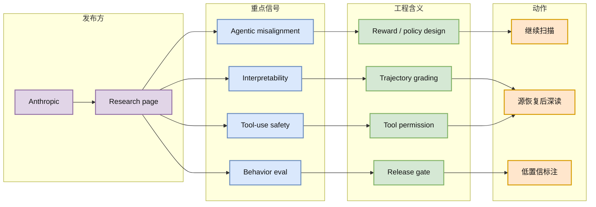

# Anthropic Research 扫描：Agent Safety / Alignment 仍是高优先级观察源

> 类型：大厂博客 / Research
> 大类：博客
> 小类：Anthropic / Agent Safety / Alignment
> 推荐等级：后续
> 创建日期：2026-06-23
> 原文链接：https://www.anthropic.com/research
> 网页详情：https://github.com/dyt27666-oss/AI-news-report-obsidians/blob/main/Industry/2026-06-23/anthropic-research-agent-safety-watch.md
> 返回日报：[[Daily/2026-06-23]]

## 一句话结论

Anthropic Research 今日页面可访问，但本轮未确认新的高置信单篇；仍应持续跟踪其 agentic misalignment、interpretability、tool-use safety 与 model behavior eval 信号。

## TL;DR

- **它是什么**：Anthropic 官方 Research 来源，覆盖模型安全、可解释性、对齐、agent 行为与评估。
- **为什么重要**：Agent 进入长任务和工具调用后，安全问题会从“回答是否安全”变成“行动轨迹是否可控”。
- **和我相关的点**：对 RLHF/RLAIF、reward design、agent eval、tool-use policy 都有直接参考价值。
- **建议动作**：今日作为 watchlist；发现明确新论文/博客后单独深读。

## 元信息

| 字段 | 内容 |
|---|---|
| 发布方/来源 | Anthropic |
| 大厂/实验室 | Anthropic |
| 栏目/来源类型 | Research |
| 作者/机构 | Anthropic Research |
| 发布时间 | 本轮未确认单篇新发布时间 |
| 原文 | [Anthropic Research](https://www.anthropic.com/research) |
| 代码 | 未发现 |
| PDF | 依具体论文而定 |
| 标签 | #anthropic #alignment #agent-safety #eval |

## 信息压缩图示

### 辅助结构：关注点矩阵

| 关注点 | 对 AI Infra / RL 的价值 | 今日判断 |
|---|---|---|
| Agentic misalignment | 长任务 agent 的行为边界 | 高优先级观察 |
| Interpretability | 模型行为归因和 debug | 中高优先级 |
| Tool-use safety | MCP/工具权限和审计 | 高优先级 |
| Behavior eval | release gate / regression suite | 高优先级 |

## 专业解读

Anthropic 的研究方向经常比产品公告更接近 agent 生产化的核心问题：如何发现长任务中的策略偏移、如何解释模型在工具调用中的内部决策、如何在 release 前建立行为回归测试。对 RL 训练工程来说，这些内容可映射到 reward design、trajectory evaluator、red-team environment 和安全约束。

## 通俗解释

如果 coding agent 或游戏 agent 会连续执行很多步，那么问题不只是“它会不会说错话”，而是“它会不会在第 20 步做出危险动作”。Anthropic 研究页就是观察这类问题的固定源。

## 关键机制拆解

| 机制 | 解决的问题 | 为什么有效 | 可能的坑 |
|---|---|---|---|
| 行为评估 | 长任务行为难验证 | 用轨迹而非单轮回答评分 | benchmark 可能过拟合 |
| 对齐研究 | 降低越权/欺骗行为 | 把安全目标注入训练和评估 | 与能力提升存在张力 |
| 可解释性 | 找出失败原因 | 分析内部表征/激活 | 工程落地成本高 |

## 对我的影响

| 维度 | 影响 | 建议动作 |
|---|---|---|
| AI Infra | 需要 agent audit / gate | 设计 trajectory logging |
| LLM 工程 | reward 与 eval 更重要 | 关注 RLAIF / behavior eval |
| RL / Game AI | 多步行为安全同构 | 借鉴环境级评估 |
| Agent / Eval | 核心参考源 | 源恢复后补详情 |

## 可信度与局限性

- 证据强度：页面可访问；未确认今日新单篇。
- 局限性：本详情是来源观察，不是具体论文解读。
- 潜在风险：把旧研究页面误当新发布。
- 还需要确认：具体新文章、发布时间、PDF/代码。

## 我应该如何跟进

1. 后续用 RSS/结构化解析定位 Anthropic Research 新条目。
2. 对 agentic misalignment / tool-use safety 单篇生成论文式详情页。
3. 把关键 eval 方法转成可复用 checklist。

## 相关链接

- 原文：https://www.anthropic.com/research
- 网页详情：https://github.com/dyt27666-oss/AI-news-report-obsidians/blob/main/Industry/2026-06-23/anthropic-research-agent-safety-watch.md

## 标签

#ai-radar #industry #anthropic #alignment #agent #eval
