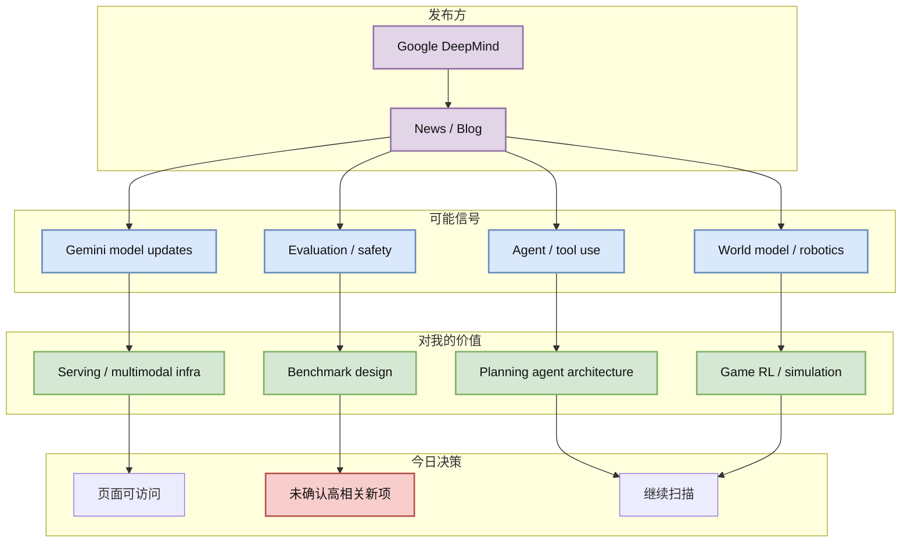

# Google DeepMind 扫描：Gemini / Agent / World Model 信号观察

> 类型：大厂博客 / Research
> 大类：博客
> 小类：Google DeepMind / Gemini / Agent / World Model
> 推荐等级：后续
> 创建日期：2026-06-23
> 原文链接：https://deepmind.google/discover/blog/
> 网页详情：https://github.com/dyt27666-oss/AI-news-report-obsidians/blob/main/Industry/2026-06-23/google-deepmind-agent-models-watch.md
> 返回日报：[[Daily/2026-06-23]]

## 一句话结论

Google DeepMind 今日页面可访问，但抓到的主要是 Gemini、agent、模型导航级信号，未确认新的高置信单篇；仍需作为 world model、agent、多模态模型的固定观察源。

## TL;DR

- **它是什么**：Google DeepMind 官方 News/Blog 来源，覆盖 Gemini、模型研究、agent、机器人与科学 AI。
- **为什么重要**：DeepMind 在 world model、RL、agent、多模态和系统级模型上具有强研究信号。
- **和我相关的点**：对 RL 游戏模型、world model、agent planning、模型评估有长期参考价值。
- **建议动作**：今日不做具体单篇结论；保留来源状态和后续补抓动作。

## 元信息

| 字段 | 内容 |
|---|---|
| 发布方/来源 | Google DeepMind |
| 大厂/实验室 | Google DeepMind |
| 栏目/来源类型 | Blog / Research / Product Announcement |
| 作者/机构 | Google DeepMind |
| 发布时间 | 本轮未确认单篇新发布时间 |
| 原文 | [Google DeepMind Blog](https://deepmind.google/discover/blog/) |
| 代码 | 依具体文章而定 |
| PDF | 依具体论文而定 |
| 标签 | #deepmind #gemini #agent #world-model #rl |

## 信息压缩图示

### 辅助结构：DeepMind 主题 radar

| 主题 | 观察原因 | 今日状态 |
|---|---|---|
| Gemini / 多模态 | 模型能力会带动 serving 和产品架构 | 导航级信号，低置信 |
| Agent / planning | 对长任务 agent 系统有参考 | 继续观察 |
| World model / RL | 与游戏模型训练强相关 | 继续观察 |
| Evaluation / safety | 大厂 release gate 参考 | 继续观察 |

## 专业解读

DeepMind 的价值在于长期研究路线，而不是每日新闻密度。对于用户关注的 RL 游戏模型训练，DeepMind 的 world model、planning、simulation、agent evaluation 方向尤其值得持续跟踪。今日抓取只确认页面可访问与导航级信号，不足以生成具体文章结论。

## 通俗解释

DeepMind 是“长期趋势源”：不一定每天有新文章，但一旦出现 world model 或 agent planning 相关内容，就可能影响后续训练/评估范式。

## 关键机制拆解

| 机制 | 解决的问题 | 为什么有效 | 可能的坑 |
|---|---|---|---|
| 固定来源扫描 | 防止漏掉大厂研究 | 来源可信且方向相关 | 页面动态内容难解析 |
| 主题 watchlist | 聚焦用户兴趣 | RL/Agent/World Model 高相关 | 可能暂时无新项 |
| 低置信处理 | 避免误读导航项 | 保持知识库可信 | 今日信息量较少 |

## 对我的影响

| 维度 | 影响 | 建议动作 |
|---|---|---|
| AI Infra | 多模态模型会改变 serving | 关注 Gemini serving 细节 |
| LLM 工程 | agent/tool-use 设计参考 | 等具体文章深读 |
| RL / Game AI | world model 是核心方向 | 保留高优先级 watch |
| Agent / Eval | planning/eval 值得借鉴 | 关注 benchmark 发布 |

## 可信度与局限性

- 证据强度：页面可访问；未确认新单篇。
- 局限性：本轮只做来源观察，不做技术断言。
- 潜在风险：动态页面导航项混入候选。
- 还需要确认：RSS、具体文章链接、发布时间。

## 我应该如何跟进

1. 后续补充 DeepMind RSS 或结构化解析。
2. 发现 world model / agent planning 单篇时生成深度详情。
3. 将 DeepMind 论文与 arXiv/OpenReview 条目交叉验证。

## 相关链接

- 原文：https://deepmind.google/discover/blog/
- 网页详情：https://github.com/dyt27666-oss/AI-news-report-obsidians/blob/main/Industry/2026-06-23/google-deepmind-agent-models-watch.md

## 标签

#ai-radar #industry #google-deepmind #world-model #agent #rl
