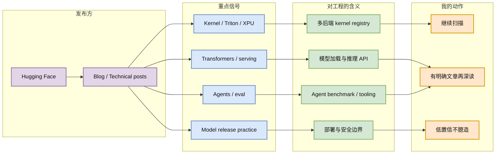

# Hugging Face Blog 扫描：Kernel / Agent / LLM 工程候选继续作为观察源

> 类型：大厂博客 / 工程博客
> 大类：博客
> 小类：Hugging Face / Kernel / Agent / LLM Infra
> 推荐等级：可 skim
> 创建日期：2026-06-23
> 原文链接：https://huggingface.co/blog
> 网页详情：https://github.com/dyt27666-oss/AI-news-report-obsidians/blob/main/Industry/2026-06-23/huggingface-blog-watch-kernel-agent.md
> 返回日报：[[Daily/2026-06-23]]

## 一句话结论

Hugging Face Blog 今日可访问，但本轮未确认新的高置信单篇发布；仍建议把它作为 kernel、多后端推理、agent/eval 工程文章的固定高优先级扫描源。

## TL;DR

- **它是什么**：Hugging Face 官方 Blog，覆盖模型、datasets、Transformers、推理、kernel、agents、社区项目。
- **为什么重要**：HF 往往把研究模型、工程工具和硬件后端连接起来，是 LLM 工程趋势的早期信号源。
- **和我相关的点**：重点关注 Triton/kernel hub、Transformers serving、agents、eval、模型 release 的工程细节。
- **建议动作**：今日无新高置信单篇深读；保留为观察项，等待 RSS/页面抓取更稳定后补具体文章。

## 元信息

| 字段 | 内容 |
|---|---|
| 发布方/来源 | Hugging Face |
| 大厂/实验室 | Hugging Face |
| 栏目/来源类型 | Blog / Technical Blog / Product & Community Blog |
| 作者/机构 | Hugging Face / community authors |
| 发布时间 | 本轮未确认单篇新发布时间 |
| 原文 | [Hugging Face Blog](https://huggingface.co/blog) |
| 代码 | 依具体文章而定 |
| PDF | 不适用 |
| 标签 | #huggingface #llm-infra #kernel #agent |

## 信息压缩图示

### 辅助图：HF Blog 主题观察矩阵

| 主题 | 为什么看 | 今日状态 |
|---|---|---|
| Kernel / Triton | 直接影响 serving 性能和多硬件部署 | 页面可访问，未确认新高置信单篇 |
| Transformers / 推理 | 模型加载、量化、推理接口标准 | 继续观察 |
| Agent / Eval | HF 经常发布工具链和 benchmark 实践 | 继续观察 |
| Model release | 看到模型生态和部署习惯变化 | 继续观察 |

## 专业解读

HF Blog 对 AI Infra 的价值不在“新闻速度”，而在工程细节密度：它常把模型 release、Transformers 支持、kernel 优化、数据集/eval 工具串起来。昨日的 Intel XPU Kernel Skill 已经显示多后端 kernel 优化是一个强信号；今天没有足够高置信的新单篇，不应强行编造。

## 通俗解释

HF Blog 像 LLM 工程生态的公告栏：不是每天都有必读，但一旦出现 kernel、serving、agent eval 文章，通常值得放进深读队列。

## 关键机制拆解

| 机制 | 解决的问题 | 为什么有效 | 可能的坑 |
|---|---|---|---|
| 官方 blog 扫描 | 捕获工具链更新 | 来源可信、工程细节多 | 页面动态内容可能难抓 |
| 主题过滤 | 防止模型发布噪音过多 | 聚焦 infra/agent/eval | 可能漏掉隐含技术点 |
| 低置信标注 | 避免把导航当新闻 | 提升日报可靠性 | 需要后续补抓 |

## 对我的影响

| 维度 | 影响 | 建议动作 |
|---|---|---|
| AI Infra | 关注 kernel 和推理工具链 | 保留高优先级扫描 |
| LLM 工程 | 关注 Transformers 与 deployment practice | 有新文章再做详情页 |
| RL / Game AI | 直接相关较少 | 只关注 eval/agent 工具 |
| Agent / Eval | 可能出现工具/benchmark | 继续观察 |

## 可信度与局限性

- 证据强度：本轮页面可访问，但未确认具体新文章。
- 局限性：没有 RSS/结构化抓取时，容易混入旧文或导航内容。
- 潜在风险：把社区模型发布误判为工程趋势。
- 还需要确认：下一轮使用更稳定的 feed 或页面解析。

## 我应该如何跟进

1. 为 Hugging Face Blog 增加 RSS/结构化解析，避免只依赖 HTML。
2. 发现 kernel/serving/agent/eval 单篇后单独生成详情页。
3. 将 HF 文章和对应 GitHub repo / model card 交叉链接。

## 相关链接

- 原文：https://huggingface.co/blog
- 网页详情：https://github.com/dyt27666-oss/AI-news-report-obsidians/blob/main/Industry/2026-06-23/huggingface-blog-watch-kernel-agent.md
- 相关卡片：[[GitHub/2026-06-23/Kong-AI-Gateway]]

## 标签

#ai-radar #industry #huggingface #llm-infra #kernel #agent
