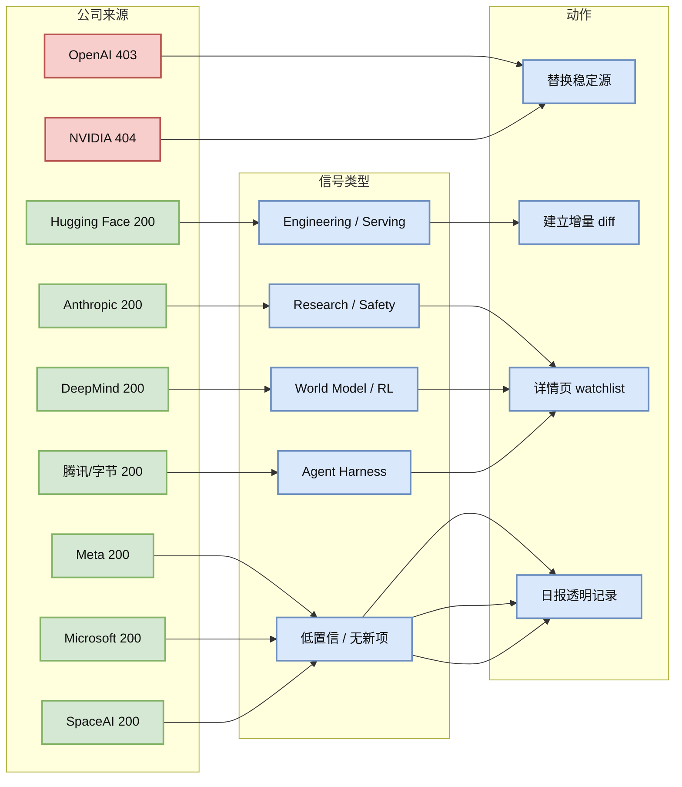

# 2026-06-24 公司来源扫描矩阵

> 类型：大厂资讯 / Research / Engineering Blog
> 大类：Industry
> 小类：Source Watch / Provenance
> 推荐等级：后续
> 创建日期：2026-06-24
> 原文链接：见各来源 URL
> 网页详情：https://github.com/dyt27666-oss/AI-news-report-obsidians/blob/main/Industry/2026-06-24/company-source-scan-matrix.md
> 返回日报：[[Daily/2026-06-24]]

## 一句话结论

今日大厂来源扫描以“透明状态”为主：Anthropic、DeepMind、Meta、Hugging Face、Microsoft、腾讯、字节、SpaceAI 页面可访问；OpenAI 403，NVIDIA 配置 URL 404；未确认足够高置信新单篇，因此大厂区以 watchlist 和 provenance 为主。

## TL;DR

- **它是什么**：固定公司来源扫描记录，覆盖 OpenAI、Anthropic、Google DeepMind、Meta AI、NVIDIA、Microsoft、Hugging Face、腾讯、字节、SpaceAI。
- **为什么重要**：日报必须区分“没有新项”和“没有扫描到”，避免把来源失败误读成行业无变化。
- **和我相关的点**：大厂博客是 LLM/Agent/RL 基础设施趋势的强信号源，但网页动态化和反爬会影响自动化。
- **建议动作**：为 OpenAI/NVIDIA 替换更稳定 RSS/API；对可访问来源建立增量 diff。

## 元信息

| 公司/实验室 | 来源/栏目 | 今日状态 | 高相关条数 | 代表条目 | 备注 |
|---|---|---|---:|---|---|
| OpenAI | News / Research | 访问失败 | 0 | 无 | `https://openai.com/news/` 与 research 返回 403。 |
| Anthropic | News / Research | 有来源观察 | 1 | Research / safety watch | 页面 200；未确认新单篇。 |
| Google DeepMind | Blog / Research | 有来源观察 | 1 | Agent / world model watch | 页面 200；需增量 diff。 |
| Meta AI | Blog / Research | 低置信 | 0 | 无 | 页面 200；本轮未确认强相关新项。 |
| NVIDIA | Technical Blog / AI | 访问失败 | 0 | 无 | 配置 URL 返回 404。 |
| Microsoft | Research AI | 低置信 | 0 | 无 | 页面 200；偏导航页。 |
| Hugging Face | Blog / Papers / Releases | 有来源观察 | 1 | Transformers / serving watch | 页面 200；结合 GitHub transformers 活跃。 |
| 腾讯 | AI Lab / 技术博客 | 无高相关新项 | 0 | 无 | 页面 200；未抓到强相关新项。 |
| 字节 | Seed / 技术博客 | 有 GitHub 信号 | 1 | DeerFlow | 官方 Seed 页面 200；GitHub bytedance/deer-flow 高增长。 |
| SpaceAI | Blog / News | 低置信 | 0 | 无 | 页面 200；主题与 AI Infra/LLM/RL 弱相关。 |

## 信息压缩图示



```mermaid
timeline
  title 2026-06-24 来源可用性
  09:00 : OpenAI 403 / NVIDIA 404
  09:01 : Anthropic / DeepMind / Meta / HF 可访问
  09:02 : GitHub snapshot 保存 130 repos
  09:03 : arXiv 429 / timeout，论文降级 watchlist
```

## 专业解读

公司来源扫���的价值在于 provenance。大厂博客经常是训练/推理基础设施、safety eval、agent 产品化和硬件生态的早期信号，但网页结构高度动态，且常出现 403/404/反爬。自动研究系统必须把访问失败写清楚，而不是让日报“看起来完整”。

今日最有工程价值的大厂相关信号反而来自 GitHub：`bytedance/deer-flow` 的长程 agent harness 高增长、`microsoft/agent-lightning` 进入候选池、Hugging Face Transformers 继续高活跃。这说明 source matrix 不应只看博客，还要交叉 GitHub repo 信号。

## 通俗解释

这页像“今天我到底看了哪些官网”的考勤表。没有新内容不等于没看；访问失败也要写出来，避免误判。

## 关键机制拆解

| 机制 | 解决的问题 | 为什么有效 | 可能的坑 |
|---|---|---|---|
| 固定公司矩阵 | 来源覆盖不稳定 | 每家公司每天都有状态 | 低置信项不能过度解读 |
| URL 可用性记录 | 403/404 被误认为无更新 | 透明说明失败原因 | 仍需替换稳定 RSS |
| GitHub 交叉验证 | 博客无新项但代码有信号 | 捕捉工程落地趋势 | repo 热度可能被 hype 放大 |

## 对我的影响

| 维度 | 影响 | 建议动作 |
|---|---|---|
| AI Infra | 大厂 source watch 需要可观测性 | 为每个来源加 last_success 和 diff |
| LLM 工程 | HF/Microsoft/OpenAI 等源影响模型栈 | 使用 RSS/API 优先 |
| RL / Game AI | DeepMind/Meta 是长期关键源 | 建 world model / game RL watchlist |
| Agent / Eval | Anthropic/字节/HF 信号强 | 关注 safety、harness、eval |

## 我应该如何跟进

1. 替换 NVIDIA AI blog URL 为可访问栏目或 RSS。
2. 为 OpenAI 增加备用来源：RSS、GitHub、OpenAI status/news mirrors。
3. 对可访问来源保存摘要 hash，次日做增量 diff。

## 标签

#ai-radar #industry #source-watch #company-matrix #provenance
