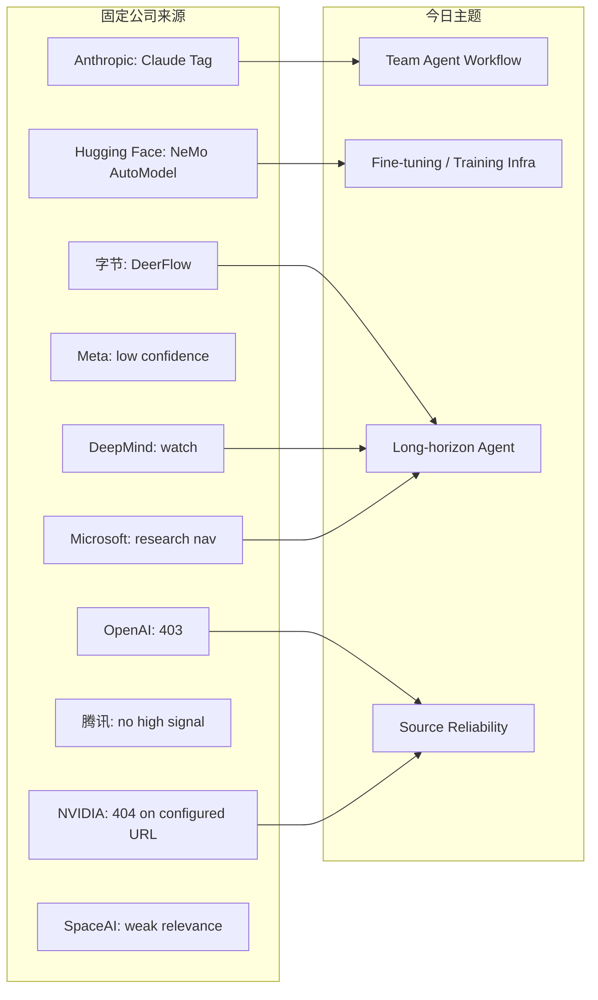
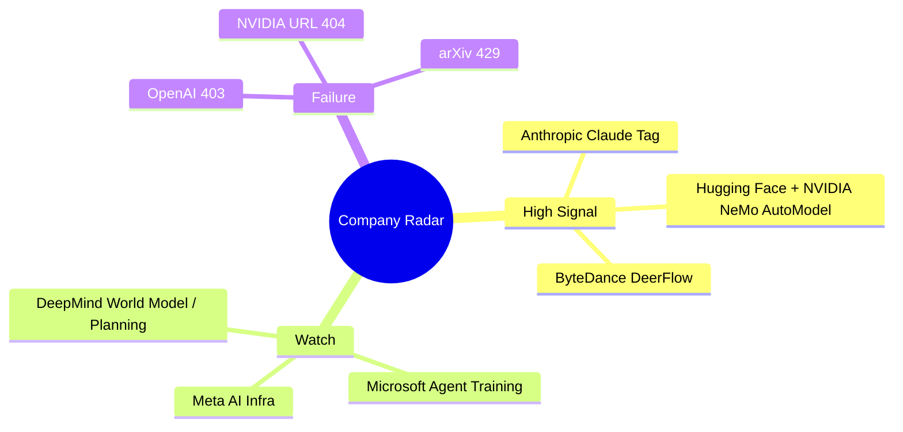

# 公司来源扫描矩阵 - 2026-06-25

> 类型：大厂来源扫描  
> 大类：Industry  
> 小类：Company Source Watch  
> 推荐等级：后续  
> 创建日期：2026-06-25  
> 原文链接：https://huggingface.co/blog  
> 网页详情：https://github.com/dyt27666-oss/AI-news-report-obsidians/blob/main/Industry/2026-06-25/company-source-scan-matrix.md  
> 返回日报：[[Daily/2026-06-25]]

## 一句话结论
今日大厂来源的高置信新项集中在 Anthropic Claude Tag、Hugging Face/NVIDIA fine-tuning、ByteDance DeerFlow；OpenAI 仍 403，NVIDIA 配置 URL 404，论文源限流。

## TL;DR
- **它是什么**：固定公司来源的可访问性和高相关内容扫描记录。
- **为什么重要**：日报不能把“没抓到”误写成“没有变化”；矩阵保留 provenance 和失败原因。
- **建议动作**：为 OpenAI/NVIDIA 增加 RSS、GitHub、官方 X/新闻镜像等 fallback。

## 公司信号图

## 扫描矩阵
| 公司/实验室 | 来源/栏目 | 今日状态 | 高相关条数 | 代表条目 | 备注 |
|---|---|---|---:|---|---|
| OpenAI | News / Research | 访问失败 | 0 | 无 | `https://openai.com/news/` 与 research 返回 403；未臆造新项。 |
| Anthropic | News / Research / Engineering | 有高相关新项 | 1 | Introducing Claude Tag | Product，Jun 23 2026；团队协作与 Claude 工作流相关。 |
| Google DeepMind | Blog / Research | 有来源观察 | 0 | 无高相关新单篇 | 页面 200；继续关注 world model、planning、game RL。 |
| Meta AI | Blog / Research | 低置信 | 0 | 无 | 页面 200，但动态内容噪音较高，本轮未确认强相关新项。 |
| NVIDIA | Technical Blog / AI | 访问失败 | 0 | 无 | 配置 URL 返回 404；但 Hugging Face 新文涉及 NVIDIA NeMo AutoModel。 |
| Microsoft | Research AI | 低置信 | 0 | 无 | 页面 200，偏研究导航；另关注 `microsoft/agent-lightning`。 |
| Hugging Face | Blog / Papers / Releases | 有高相关新项 | 2 | NeMo AutoModel fine-tuning；CUGA agent apps | Blog 页面 200，有训练 infra 和 agent harness 条目。 |
| 腾讯 | AI Lab / 技术博客 | 无高相关新项 | 0 | 无 | 页面 200，本轮未抓到强相关新项。 |
| 字节 | Seed / GitHub | 有 GitHub 信号 | 1 | DeerFlow | `bytedance/deer-flow` 今日 +527 stars。 |
| SpaceAI | Blog / News | 低置信 | 0 | 无 | 页面 200，和本 radar 主题弱相关。 |

## 专业解读
固定矩阵的价值是把源可靠性纳入日报本身。今天有明确高相关内容，但不是所有来自公司官网：ByteDance 的高信号来自 GitHub，NVIDIA 的训练信号来自 Hugging Face 联合生态。这说明源扫描应按“公司官网 + GitHub + release notes + 生态博客”组合，而不是单 URL。

## 关键机制拆解
| 机制 | 解决的问题 | 为什么有效 | 可能的坑 |
|---|---|---|---|
| 固定矩阵 | 防止漏扫 | 每家公司都有状态 | 需要维护 URL |
| 失败显式记录 | 403/404 不等于无新项 | provenance 透明 | 可能低估动态页面 |
| 生态交叉验证 | 公司信号不只在官网 | 发现 HF/NVIDIA、GitHub/字节 | 来源更多更难验收 |

## 对我的影响
| 维度 | 影响 | 建议动作 |
|---|---|---|
| AI Infra | 训练/serving/agent 信号跨平台出现 | 增加 fallback 来源 |
| LLM 工程 | 产品与工程博客都要扫 | 固化 HF blog 解析 |
| RL / Game AI | DeepMind/Meta 仍需更细来源 | 加 RSS/sitemap |
| Agent / Eval | Claude Tag、DeerFlow 高相关 | 建 team agent watchlist |

## 跟进
1. 为 OpenAI 与 NVIDIA 增加可用 fallback 源。
2. 将 Hugging Face blog 的 JSON 片段解析固化为采集脚本。
3. DeepMind/Meta/Microsoft 需要更细 RSS 或 sitemap，降低动态页面噪音。

## 标签
#ai-radar #industry #source-watch #company-matrix
