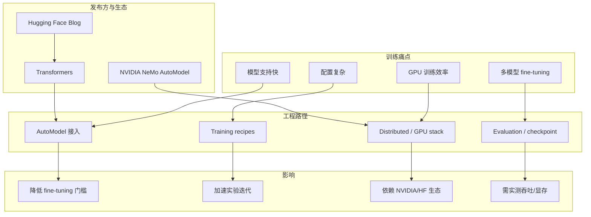
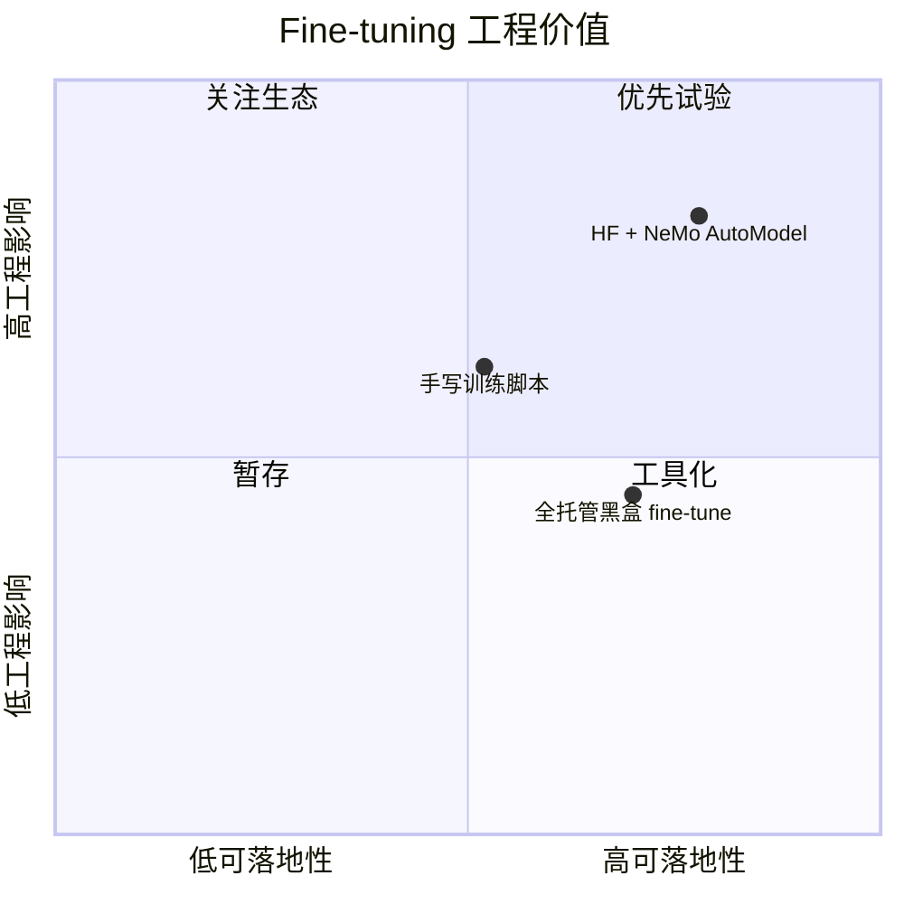

# Hugging Face：Accelerating Transformers Fine-Tuning with NVIDIA NeMo AutoModel

> 类型：大厂 / 工程博客  
> 大类：Industry  
> 小类：Fine-tuning / Training Infra  
> 推荐等级：必读  
> 创建日期：2026-06-25  
> 原文链接：https://huggingface.co/blog/accelerating-fine-tuning-nvidia-nemo-automodel  
> 网页详情：https://github.com/dyt27666-oss/AI-news-report-obsidians/blob/main/Industry/2026-06-25/huggingface-nemo-automodel-finetuning.md  
> 返回日报：[[Daily/2026-06-25]]

## 一句话结论
Hugging Face 2026-06-24 发布的 NeMo AutoModel fine-tuning 文章，是 Transformers 生态与 NVIDIA 训练栈继续靠拢的工程信号。

## TL;DR
- **发布方/大厂**：Hugging Face，关联 NVIDIA NeMo AutoModel。
- **栏目/来源类型**：Engineering Blog / Training Infra。
- **发布时间**：2026-06-24。
- **为什么重要**：fine-tuning 工程正在围绕模型定义生态、GPU stack、自动化训练 API 收敛。

## 信息压缩图示

## 专业解读
这类文章的价值在于训练生态的接口收敛。Transformers 是模型定义与加载的事实标准，NVIDIA NeMo 则代表 GPU 训练优化和企业级训练栈。二者结合能减少从模型选择到 fine-tuning recipe 的胶水代码，但真实收益必须用吞吐、显存、稳定性和可恢复训练来验证。

## 通俗解释
它像把常用模型库和 GPU 训练工具链接得更紧：少写一些接线代码，更快开始 fine-tuning，但是否真的省钱省显存还要实测。

## 关键机制拆解
| 机制 | 解决的问题 | 为什么有效 | 可能的坑 |
|---|---|---|---|
| Transformers 接入 | 模型生态变化快 | 复用 HF 模型定义 | 新模型兼容性需测 |
| NeMo AutoModel | 训练配置复杂 | 提供更自动化 recipe | 生态绑定更强 |
| GPU stack | fine-tuning 成本高 | 利用 NVIDIA 优化 | 非 NVIDIA 环境收益有限 |

## 对我的影响
| 维度 | 影响 | 建议动作 |
|---|---|---|
| AI Infra | 训练栈整合信号 | 比较 NeMo/DeepSpeed/FSDP recipes |
| LLM 工程 | fine-tuning 实验成本可能下降 | 选一个小模型复现实测吞吐 |
| RL / Game AI | 可用于 policy/reward model fine-tuning | 关注分布式与 checkpoint |
| Agent / Eval | 弱相关 | 仅作为模型训练支撑 |

## 可信度与局限性
- 证据强度：Hugging Face blog 页面可访问并显示 2026-06-24 ��布条目。
- 局限性：未完整抽取正文 benchmark；需要后续读取原文细节与代码示例。
- 潜在风险：宣传性工程博客可能强调易用性，真实吞吐和显存收益需复现。

## 我应该如何跟进
1. 阅读原文的训练配置、硬件和 benchmark。
2. 选一个 reward/policy 模型做小规模 fine-tuning smoke test。
3. 对比 NeMo AutoModel、Accelerate、DeepSpeed、FSDP 的配置复杂度。

## 标签
#ai-radar #huggingface #nvidia #finetuning #training-infra
