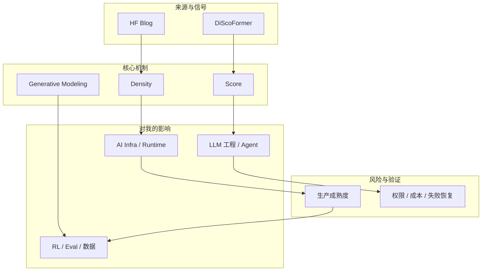
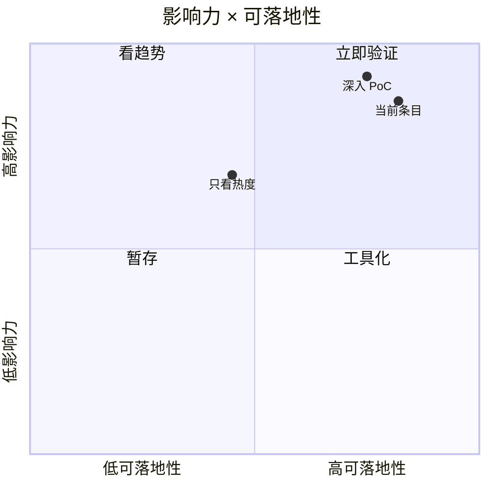

# Hugging Face DiScoFormer：density 与 score 的统一 Transformer

> 类型：大厂 / 社区博客  
> 大类：Industry  
> 小类：Generative Modeling / Score Modeling  
> 推荐等级：可 skim  
> 创建日期：2026-06-30  
> 原文链接：https://huggingface.co/blog/discoformer  
> 网页详情：https://github.com/dyt27666-oss/AI-news-report-obsidians/blob/main/Industry/2026-06-30/huggingface-discoformer-density-score.md  
> 返回日报：[[Daily/2026-06-30]]

## 一句话结论
DiScoFormer 是 Hugging Face Jun 29 新文，主题偏统一 density/score modeling，对生成建模研究有观察价值，但和今日 AI Infra 主线弱一些。

## TL;DR
- **它是什么**：一个跨 distributions 的 density 和 score 统一建模方向。
- **为什么重要**：score/density 表示影响扩散、生成建模和概率建模基础。
- **和我相关的点**：短期不直接影响 serving/RL 工程，适合作为模型方法观察。
- **建议动作**：低优先级 skim，除非后续出现代码或强实验结果。

## 元信息
| 字段 | 内容 |
|---|---|
| type | 大厂 / 社区博客 |
| major | Industry |
| minor | Generative Modeling / Score Modeling |
| rank | 可 skim |
| vendor | Hugging Face |
| published | 2026-06-29 |
| source | Hugging Face Blog |

## 信息压缩图示

## 专业解读
专业上这条更偏模型方法，而非系统工程。它可能有助于理解不同分布上的 density/score 统一表示，但对 LLM serving、post-training 和 RL game agent 的直接可落地性低于 agent runtime 与 coding tool 更新。

## 通俗解释
它像尝试用一个通用工具同时描述“东西在哪里多”和“应该往哪里变”，更偏研究概念。

## 关键机制拆解
| 机制 | 解决的问题 | 为什么有效 | 可能的坑 |
|---|---|---|---|
| Density modeling | 描述数据分布 | 给生成模型概率基础 | 工程落地较远 |
| Score modeling | 指导生成方向 | 与扩散/生成建模相关 | 需要看实验规模 |
| Transformer unification | 跨分布统一表示 | 可能提升通用性 | 未验证生产价值 |

## 对我的影响
| 维度 | 影响 | 建议动作 |
|---|---|---|
| AI Infra | 短期影响低 | 暂不投入 PoC |
| LLM 研究 | 可作为生成建模观察 | skim 方法图 |
| RL / World Model | 可能间接影响建模思路 | 后续看引用和代码 |

## 可信度与局限性
- 证据强度：来自可访问原始页面、GitHub snapshot 或公开 changelog。
- 局限性：star/release/news 只能说明关注度或发布信号，不等于生产成熟。
- 验证要求：需要继续看 README、examples、issue、release diff、benchmark 和失败恢复机制。

## 我应该如何跟进
1. 把该条目放入 AI Infra / Agent runtime 对照表。
2. 如果与当前工作流直接相关，做 30-60 分钟 PoC。
3. 记录工具边界、成本、失败模式和可观测性。

## 相关链接
- 原文：https://huggingface.co/blog/discoformer
- 网页详情：https://github.com/dyt27666-oss/AI-news-report-obsidians/blob/main/Industry/2026-06-30/huggingface-discoformer-density-score.md

## 标签
#ai-radar #daily #ai-infra #llm #agent
