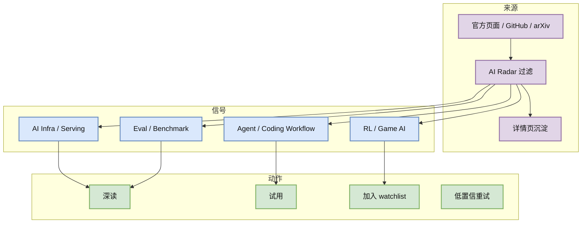
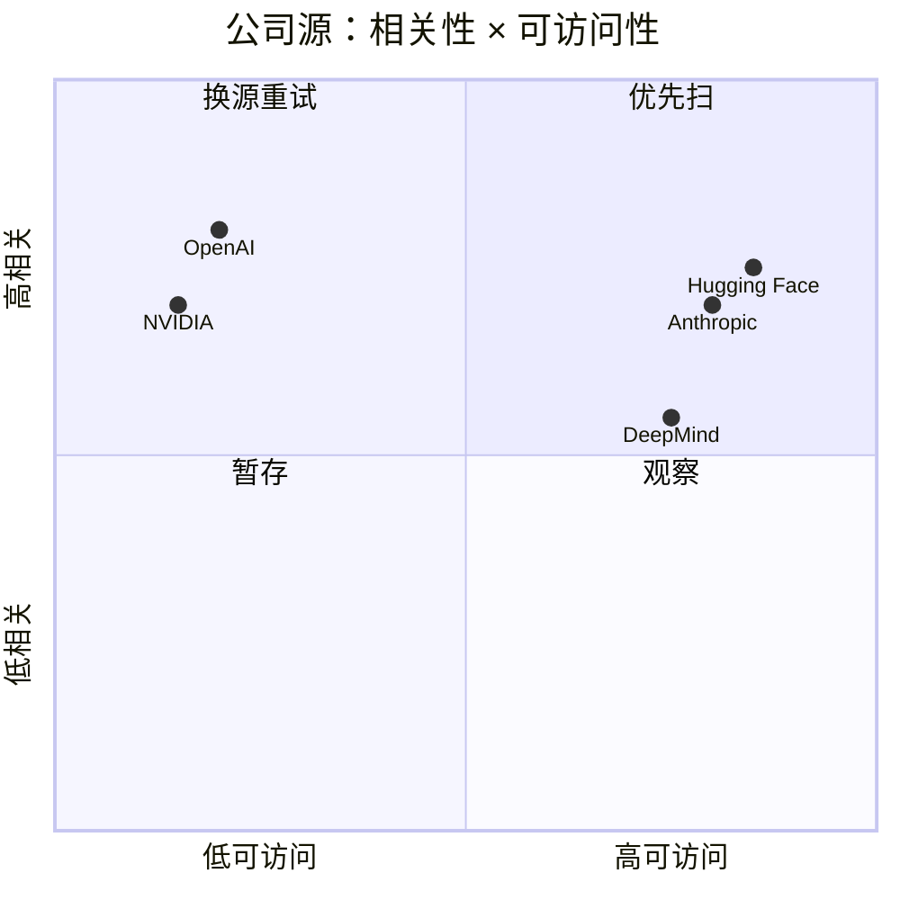

# 公司来源扫描矩阵 - 2026-07-02

> 类型：大厂来源矩阵  
> 返回日报：[[Daily/2026-07-02]]

## 一句话结论
今天公司源可用性分化明显：Hugging Face 与 Anthropic/DeepMind/Meta 页面可访问，OpenAI/Microsoft/NVIDIA 出现 403/404，不能用低置信网页状态伪造新项。

## TL;DR
- Hugging Face 今日保留 ScarfBench / Agent Eval 线索。
- Anthropic 继续作为 Claude Code / Claude Tag / team agent workflow 观察源。
- OpenAI News、Microsoft Research、NVIDIA 配置 URL 访问失败，需要换 RSS/API/站内搜索。
- 腾讯、字节、SpaceAI 保留矩阵覆盖；本轮未确认强相关新文章。

## 信号图

## 辅助图：来源可靠性

## 元信息
| 公司/实验室 | 来源/栏目 | 今日状态 | 高相关条数 | 代表条目 | 备注 |
|---|---|---|---:|---|---|
| OpenAI | News / Research | 访问失败 | 0 | 无 | News 页面 403；Codex changelog 单独在工具板块扫描。 |
| Anthropic | News / Research / Engineering | 页面可访问 / 观察 | 1 | Claude Code / Claude Tag watch | 继续观察团队 agent workflow。 |
| Google DeepMind | Blog / Research | 页面可访问 / 无高相关新项 | 0 | 无 | 未确认今日 AI Infra/RL 强相关单篇。 |
| Meta AI | Blog / Research | 页面可访问 / 无高相关新项 | 0 | 无 | 未确认今日强相关工程文章。 |
| NVIDIA | Technical Blog / AI | 访问失败 | 0 | 无 | 配置分类页 404；需改 RSS 或站内搜索。 |
| Microsoft | Research AI | 访问失败 | 0 | 无 | 页面 403。 |
| Hugging Face | Blog / Papers / Releases | 有高相关候选 | 1 | ScarfBench / Agent Eval watch | 企业迁移 benchmark 对 coding agent eval 有价值。 |
| 腾讯 | AI Lab / 技术博客 | 无高相关新项 | 0 | 无 | 保留固定扫描位。 |
| 字节 | Seed / GitHub | 间接高相关 | 1 | DeerFlow | 使用 6/30 broad snapshot fallback。 |
| SpaceAI | Blog / News | 低置信 / 弱相关 | 0 | 无 | 主线弱相关。 |

## 对我的影响
| 维度 | 影响 | 建议动作 |
|---|---|---|
| AI Infra | 公司博客源不稳定，不能只靠首页抓取。 | 为 OpenAI/NVIDIA/Microsoft 增加 RSS/API fallback。 |
| LLM 工程 | 工具 changelog 比公司 news 更直接。 | Codex/Claude/Cursor 单独监控。 |
| RL / Game AI | 今日大厂源没有新 rummy/game RL 信号。 | 继续依赖 arXiv/GitHub 主题查询。 |
| Agent / Eval | Hugging Face benchmark 线索值得保留。 | 加入 loop engineering eval watchlist。 |

## 可信度与局限性
- 证据强度：中；基于 HTTP 访问与公开页面状态。
- 局限性：部分动态页面可能需要 JS/RSS 才能拿到新项。
- 风险：把访问失败误判为无更新。

## 相关链接
- Hugging Face Blog：https://huggingface.co/blog
- Anthropic News：https://www.anthropic.com/news
- 返回日报：[[Daily/2026-07-02]]

#ai-radar #industry #company-scan
