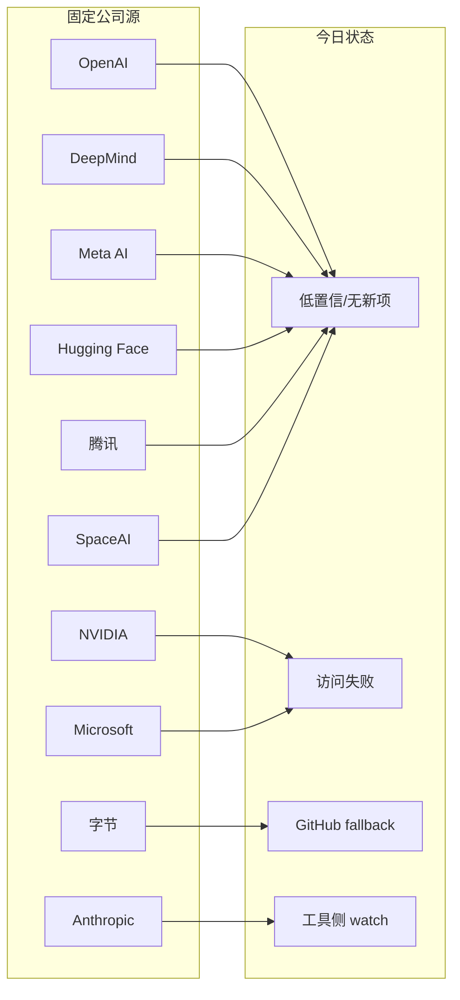

# 公司来源扫描矩阵 - 2026-07-03

> 类型：公司来源扫描  
> 返回日报：[[Daily/2026-07-03]]

## 一句话结论

今日未确认新的大厂 AI Infra / Research 高相关博客；矩阵保留固定覆盖并标注低置信，明确 Qwen Code、Cline 与字节 DeerFlow 属于工具/GitHub 侧信号。

## 扫描矩阵

| 公司/实验室 | 来源/栏目 | 今日状态 | 高相关条数 | 代表条目 | 备注 |
|---|---|---|---:|---|---|
| OpenAI | News / Research | 低置信 / 无高相关新项 | 0 | 无 | Codex 在工具矩阵跟踪。 |
| Anthropic | News / Research / Engineering | 低置信 / 工具相关观察 | 0 | Claude Code watch | 继续观察 Claude Tag、permissions。 |
| Google DeepMind | Blog / Research | 低置信 / 无高相关新项 | 0 | 无 | 未确认今日新项。 |
| Meta AI | Blog / Research | 低置信 / 无高相关新项 | 0 | 无 | 未确认今日新项。 |
| NVIDIA | Technical Blog / AI | 访问失败 / 低置信 | 0 | 无 | 需要改 RSS 或站内搜索。 |
| Microsoft | Research AI | 访问失败 / 低置信 | 0 | 无 | 页面历史 403。 |
| Hugging Face | Blog / Papers / Releases | 低置信 / 无高相关新项 | 0 | 无 | 继续观察 eval / inference。 |
| 腾讯 | AI Lab / 技术博客 | 低置信 / 无高相关新项 | 0 | 无 | 固定扫描位。 |
| 字节 | Seed / 技术博客 / GitHub | 间接高相关 / fallback | 1 | DeerFlow | 2026-06-30 snapshot fallback。 |
| SpaceAI | Blog / News | 低置信 / 弱相关 | 0 | 无 | 主线弱相关。 |

## 信号图

## 标签

#ai-radar #company-scan #industry
